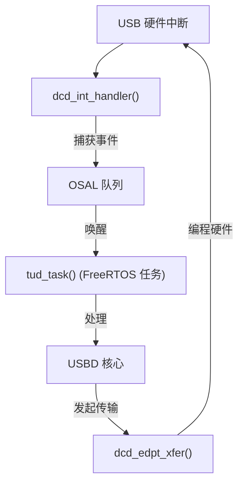

# TinyUSB DCD 设备控制器驱动

## DCD 定位

DCD (Device Controller Driver) 是 TinyUSB 最底层的软件层，直接操作 MCU 的 USB 设备外设寄存器。通过 `src/device/dcd.h` 中定义的统一接口，屏蔽不同 MCU 的硬件差异。

## 核心 DCD API

| 函数 | 职责 |
|------|------|
| `dcd_init(rhport)` | 初始化 USB 控制器，配置引脚，使能中断，D+ 上拉 |
| `dcd_connect(rhport)` / `dcd_disconnect(rhport)` | 控制 D+ 上拉（通知主机设备已连接/断开） |
| `dcd_set_address(rhport, addr)` | 设置分配的 USB 设备地址 |
| `dcd_edpt_open(rhport, ep_desc)` | 根据端点描述符配置硬件端点（类型、方向、最大包大小、FIFO） |
| `dcd_edpt_xfer(rhport, ep_addr, buf, len)` | 在端点上启动数据传输 |
| `dcd_edpt_stall(rhport, ep_addr)` | 端点停止（Stall） |
| `dcd_int_handler(rhport)` | USB 中断服务入口 — 必须从 MCU 的 USB IRQ 调用 |

## 支持的主要 MCU 系列

| MCU 系列 | DCD 文件 | 硬件特性 |
|---------|---------|---------|
| **STM32 FSDEV** (F0/F1/F3/G0/G4/L0/L4) | `stm32_fsdev/dcd_stm32_fsdev.c` | PMA (数据包内存区) 512-2048 字节共享 RAM |
| **STM32 DWC2** (F4/F7/H7) | `synopsys/dcd_dwc2.c` | Synopsys DesignWare USB 2.0 OTG，可配置 FIFO |
| **RP2040** | `rp2040/dcd_rp2040.c` | 专用 USB DPRAM，每端点 64 字节固定缓冲，硬件双缓冲 |
| **ESP32-S2/S3** | `esp32sx/dcd_esp32sx.c` | DWC2 OTG 控制器 |
| **nRF52840** | `nordicsemi/dcd_nrf5x.c` | 端点管理 + DMA 传输 |

## 端点抽象

TinyUSB 将硬件端点映射为逻辑端点（地址 + 方向）：

```c
// 典型端点分配
// 端点 0：双向控制端点（EP0 IN/OUT）
// 端点 1 IN (0x81)：CDC 通知（中断）
// 端点 2 OUT (0x02)：CDC 数据 OUT（批量）
// 端点 2 IN (0x82)：CDC 数据 IN（批量）
// 端点 3 IN (0x83)：HID 报告（中断）
```

## STM32 FSDEV PMA 架构

STM32 F1/F3/G0 等芯片的 USB 外设使用 PMA (Packet Memory Area) — CPU 和 USB 外设之间的共享 RAM：

- 大小：512 字节 (F1/F3 xB/xC) 到 2048 字节 (G0/C0/H5/U5)
- DCD 管理 PMA 分配 — 为每个 IN/OUT 端点对分配对齐块
- 这是嵌入式 USB 最"嵌入式"的设计之一

## RP2040 DPRAM 架构

RP2040 有固定的端点缓冲区布局：
- 每个端点方向 64 字节
- 硬件管理双缓冲 — 当前缓冲区被 USB 使用时，CPU 可处理备用缓冲区
- EP0 OUT 方向为单缓冲（控制传输短数据包问题）

## 与 FreeRTOS 的集成要点

DCD 层通过延迟中断模型与 OS 交互：



ISR 只做最少工作（读寄存器、入队事件），所有协议处理在任务上下文完成。这是嵌入式中断设计的经典模式。
