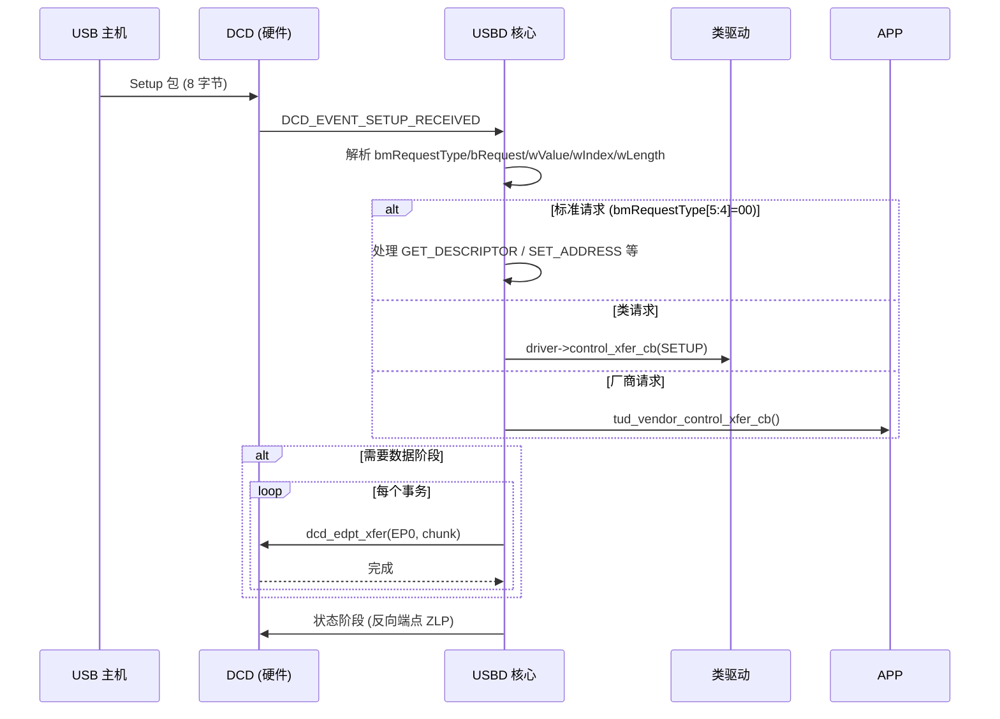

# TinyUSB USBD 设备核心

## 设备状态机

TinyUSB 的 USBD 层实现了 USB 2.0 规范第 9 章的设备框架：

```mermaid
stateDiagram-v2
    [*] --> Powered: VBUS 检测 / 总线供电
    Powered --> Default: 复位 (DCD_EVENT_BUS_RESET)
    Powered --> [*]: 拔下 (DCD_EVENT_UNPLUGGED)
    Default --> Address: SET_ADDRESS
    Default --> [*]: 拔下
    Address --> Configured: SET_CONFIGURATION
    Address --> [*]: 拔下
    Configured --> Address: SET_CONFIGURATION(0)
    Configured --> [*]: 拔下
    Powered --> Suspended: DCD_EVENT_SUSPEND
    Suspended --> Powered: DCD_EVENT_RESUME
```

## 事件驱动循环 (`tud_task_ext`)

| DCD 事件 | 处理 |
|----------|------|
| `DCD_EVENT_BUS_RESET` | `usbd_reset()` — 清除所有端点状态，设备回 Default |
| `DCD_EVENT_UNPLUGGED` | `usbd_reset()` + 调用 `tud_umount_cb()` |
| `DCD_EVENT_SETUP_RECEIVED` | `process_control_request()` — 解析并处理 Setup 包 |
| `DCD_EVENT_XFER_COMPLETE` | EP0: `usbd_control_xfer_cb()`；其他端点: `driver->xfer_cb()` |
| `DCD_EVENT_SUSPEND/RESUME` | 电源管理回调 |

## 控制传输处理

USB 控制传输使用端点 0，分三个阶段：



**关键实现细节**：
- 控制读（IN 数据）：状态阶段在 OUT 端点发送 ZLP
- 控制写（OUT 数据）：状态阶段在 IN 端点发送 ZLP
- 短包（< EP0_SIZE）终止数据阶段

## 标准请求处理

TinyUSB 在 USBD 核心直接处理以下标准请求：

| 请求 | 处理 |
|------|------|
| `GET_DESCRIPTOR` | 分派到 `tud_descriptor_device_cb()` / `configuration_cb()` / `string_cb()` |
| `SET_ADDRESS` | `dcd_set_address()` — 延迟到状态阶段后生效 |
| `SET_CONFIGURATION` | 调用所有驱动 `open()` → 设置 `cfg_num` |
| `GET_CONFIGURATION` | 返回当前 `cfg_num` |
| `SET_INTERFACE` | 切换接口备用设置 |

## 驱动注册与路由

在 `SET_CONFIGURATION` 期间，USBD 构建两个映射数组：
- `itf2drv[interface_num]` → 拥有该接口的驱动索引
- `ep2drv[ep_num][dir]` → 拥有该端点的驱动索引

事件路由时按接口/端点号查表，O(1) 分发到正确的类驱动。

## 编译时描述符模式

这是 TinyUSB 的核心创新 — 在编译时用宏构造完整 USB 描述符：

```c
#define TUD_CONFIG_DESCRIPTOR(config_num, itfcount, stridx, total_len, attr, power_ma) \
    9, TUSB_DESC_CONFIGURATION, U16_TO_U8S_LE(total_len), itfcount, config_num, \
    stridx, TU_BIT(7) | attr, (power_ma)/2

#define TUD_CDC_DESCRIPTOR(itfnum, stridx, ep_notif, ...) \
    /* 接口描述符  */ 9, TUSB_DESC_INTERFACE, ...  \
    /* 中断端点    */ 7, TUSB_DESC_ENDPOINT, ...   \
    /* 数据接口    */ 9, TUSB_DESC_INTERFACE, ...  \
    /* 批量 OUT EP */ 7, TUSB_DESC_ENDPOINT, ...  \
    /* 批量 IN EP  */ 7, TUSB_DESC_ENDPOINT, ...

// 使用时 — 所有字节在 ROM 中，零运行时开销：
const uint8_t desc_configuration[] = {
    TUD_CONFIG_DESCRIPTOR(1, ITF_NUM_TOTAL, 0, CONFIG_TOTAL_LEN, 0x00, 100),
    TUD_CDC_DESCRIPTOR(ITF_NUM_CDC, 0, EPNUM_CDC_NOTIF, 8, ...),
};
```

## 与 FreeRTOS 的对比

| TinyUSB 机制 | FreeRTOS |
|-------------|----------|
| 事件队列 → `tud_task` 处理 | `xQueue` → 守护任务处理 |
| `dcd_int_handler` ISR | `vPortEnterCritical` + 手动处理 |
| 延迟中断模型 | 标准的 ISR → 任务通知模式 |
| `itf2drv` / `ep2drv` 查找表 | — (FreeRTOS 无设备驱动概念) |
