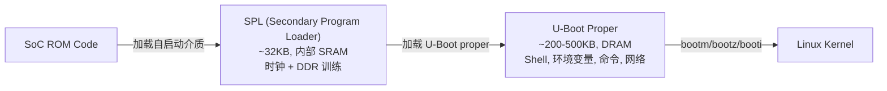

# U-Boot 概述与架构

## 定位

Das U-Boot 是嵌入式 Linux 系统的标准引导加载器。它在 SoC ROM 代码和 Linux 内核之间架起桥梁，提供硬件初始化、Shell 交互、网络启动、文件系统读取等功能。

## 多阶段引导流程



## 源代码树

| 目录 | 功能 |
|------|------|
| `arch/` | CPU 架构特定代码 (arm, arm64, riscv, x86...) — 启动、缓存、MMU、异常 |
| `board/` | 板级代码 — pinmux、时钟树、板级检测 |
| `cmd/` | Shell 命令 — `U_BOOT_CMD()` 宏注册 |
| `common/` | 核心基础设施 — `board_f.c` (pre-reloc), `board_r.c` (post-reloc), `spl/`, `bootm.c`, `cli.c` |
| `drivers/` | 外设驱动 — 串口, GPIO, I2C, SPI, MMC, NAND, 网络, USB, 视频 |
| `fs/` | 文件系统驱动 — FAT, ext4, SquashFS, UBIFS, btrfs |
| `include/` | 头文件 — `common.h`, `command.h`, `dm/device.h` |
| `net/` | 网络栈 — 单线程轮询, TFTP, DHCP, NFS |
| `dts/` | 设备树源文件 |
| `lib/` | 库代码 — `fdtdec.c` (FDT 解析), `sha256.c`, `lz4.c`, `rsa.c` |

## SPL vs U-Boot Proper

| 方面 | SPL | U-Boot Proper |
|------|-----|---------------|
| 运行位置 | 内部 SRAM (或 L2 cache-as-RAM) | 外部 DRAM |
| 大小限制 | 严格 — 通常 16-64 KB | 宽松 — 数百 KB |
| 编译宏 | `CONFIG_SPL_BUILD=y` | 未定义 |
| 输出文件 | `u-boot-spl.bin` | `u-boot.bin` |
| 职责 | 最小化时钟、DDR 训练、加载下一阶段 | 完整 Shell、网络、FS、启动逻辑 |
| 设备树 | `fdtgrep` 过滤子集 (仅 `bootph-pre-ram`) | 完整 DTB |

## 核心设计模式

### 1. 代码重定位 (Relocation)

U-Boot 编译为位置无关代码 (`-fPIC`)，可运行在任意地址：

- `board_init_f()` 计算重定位目标地址 → 预留 malloc、gd、FDT 空间
- `relocate_code()` 将自己 `memcpy` 到 DRAM
- 遍历 ELF 重定位表 `__rel_dyn_start → __rel_dyn_end`，修正所有指向 `.text` 的绝对地址
- 清除 BSS → 跳转到重定位后的 `board_init_r()`

### 2. 全局上下文 `gd_t`

ARM 上通过寄存器 r9 (32-bit) 或 r18 (AArch64) 保持，无需内存加载——对早期启动阶段的性能至关重要。包含 `ram_size`, `relocaddr`, `fdt_blob`, `bd` 等核心状态。

### 3. 链接器段注册

命令和驱动通过 `__attribute__((section(".u_boot_list")))` 自动聚合——无需中央注册表：

```c
#define U_BOOT_CMD(name, maxargs, rep, cmd, usage, help) \
    cmd_tbl_t __u_boot_cmd_##name \
        __attribute__((unused, section(".u_boot_list"))) = { \
        #name, maxargs, rep, cmd, usage, help }
```

### 4. SPL 条件编译

同一源文件通过 `#ifdef CONFIG_SPL_BUILD` 为 SPL 和 U-Boot proper 产生不同代码，避免源文件重复。

## 页面索引

- [[U-Boot/2. U-Boot SPL 与初始化序列]]
- [[U-Boot/3. U-Boot Driver Model]]
- [[U-Boot/4. U-Boot 命令框架与环境变量]]
- [[U-Boot/5. U-Boot Linux 引导与 Falcon 模式]]
