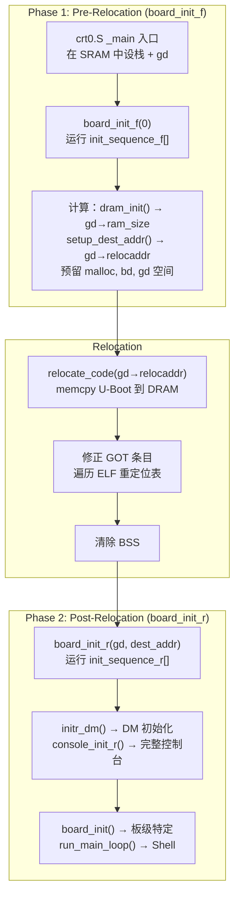

# U-Boot SPL 与初始化序列

## SPL 为何存在

SoC 内部 SRAM 极小（通常 32-256 KB）。完整 U-Boot (200-500 KB) 装不下。SPL 是能塞进 SRAM 的最小 shim：初始化 DRAM → 加载 U-Boot proper。

## SPL 职责

1. 最小化时钟和 PLL 初始化
2. **DDR 训练/校准** — 配置 DDR 控制器，运行训练序列
3. 从启动介质加载 U-Boot proper (SD/eMMC/NAND/SPI NOR/USB/UART)
4. 可选加载额外固件 (ARM Trusted Firmware BL31, RISC-V OpenSBI)
5. 跳转到 U-Boot proper（或 Falcon 模式下直接跳到 Linux）

## 两阶段初始化



### `init_sequence_f[]` 关键函数

| 函数 | 作用 |
|------|------|
| `setup_mon_len` | 计算 U-Boot 代码大小 |
| `arch_cpu_init` | CPU 特定 (cache, CP15) |
| `serial_init` | 早期串口 |
| `dram_init` | **板级填充 gd→ram_size** |
| `setup_dest_addr` | gd→relocaddr = RAM 顶部 - 预留 |
| `reserve_malloc` | 预留 malloc 堆区 |
| `reserve_global_data` | 预留新 gd 位置 |
| `reserve_fdt` | 预留设备树区域 |

### `init_sequence_r[]` 关键函数

| 函数 | 作用 |
|------|------|
| `initr_malloc` | 初始化 malloc 池 |
| `initr_dm` | **Driver Model 初始化** |
| `board_init` | 板级特定：pinmux、外设 |
| `initr_env` | 重定位环境变量 |
| `console_init_r` | 完整控制台 |
| `initr_net` | 网络子系统 |
| `run_main_loop` | **进入 Hush Shell 或自动启动** |

## 重定位细节

- U-Boot 编译为位置无关代码（`-fPIC`）
- 分支指令是 PC 相对的（天然位置无关）
- 全局数据和函数指针通过 GOT (Global Offset Table) 访问
- 重定位后遍历 `__rel_dyn_start → __rel_dyn_end`，对指向 `.text` 范围的条目加 `gd→reloc_off`

## SPL 设备树

SPL 的 DTB 是 `fdtgrep` 过滤的子集：
```
fdtgrep -b bootph-all -b bootph-pre-ram -c /chosen -c /aliases \
    -O dtb -o spl/u-boot-spl.dtb u-boot.dtb
```

只有 pre-relocation 需要的节点保留，保持 SPL DTB 极小。

## 与 FreeRTOS 启动的对比

| U-Boot | FreeRTOS |
|--------|----------|
| `crt0.S` → `board_init_f` → `board_init_r` | 复位向量 → `main()` → `vTaskStartScheduler()` |
| SPL 分离关注点 | FreeRTOS 无多阶段启动概念 |
| gd_t 全局上下文 (寄存器保持) | `pxCurrentTCB` (变量) |
| 重定位修正 GOT | FreeRTOS 无位置无关需求 |
