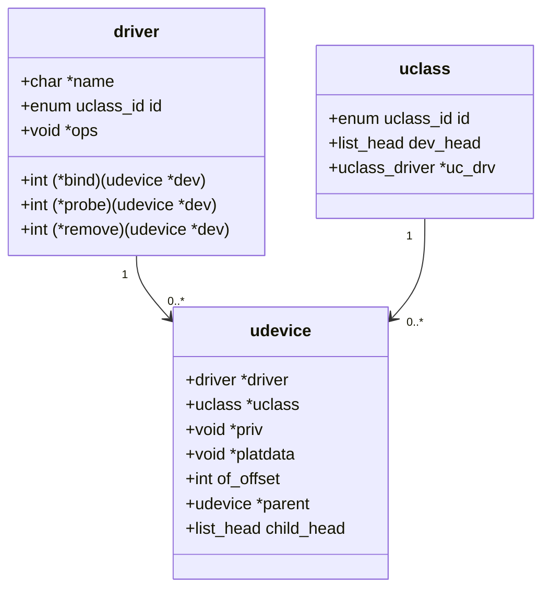

# U-Boot Driver Model

## 三元组架构

U-Boot 的 Driver Model (DM) 是 Linux 设备模型的嵌入式简化版，用 ~3000 行 C 实现：



| 结构 | 职责 |
|------|------|
| **udevice** | 实例 — 特定外设、其地址、其状态 |
| **driver** | 行为 — 如何 probe/remove/操作这类硬件 |
| **uclass** | 接口 — API 契约（如 `putc`/`getc` 对串口） |

## 生命周期

1. **绑定 (Binding)**：DTB 节点匹配 `compatible` 字符串 → `device_bind()` 创建 `udevice`
2. **探测 (Probing)**：`device_probe()` 调用 `ofdata_to_platdata()` → `driver->probe()` → 初始化硬件
3. **访问**：通过 uclass API — 例如 `serial_putc()` 路由到当前活动设备的 `ns16550_serial_putc()`

## 注册宏

```c
U_BOOT_DRIVER(ns16550) = {
    .name   = "ns16550",
    .id     = UCLASS_SERIAL,
    .of_match = ns16550_serial_ids,         // compatible = "ns16550"
    .probe  = ns16550_serial_probe,
    .priv_auto_alloc_size = sizeof(struct ns16550_platdata),
    .ops    = &ns16550_serial_ops,          // 虚函数表
};
```

## 运行时查看

```
=> dm tree
 Class     Index  Probed  Driver        Name
------------------------------------------------
 root          0  [ + ]   root_driver   root_driver
 serial        0  [ + ]   ns16550       serial@fe201000
 gpio          0  [   ]   rockchip_gpio gpio@fe002000
 mmc           0  [ + ]   dwmmc         mmc@fe320000
```

## 两个 DTB 的概念

| DTB | 用途 | 来源 |
|-----|------|------|
| **Control FDT** | U-Boot 自己的硬件描述 | `dts/` 编译，或附在 U-Boot 二进制后 |
| **Kernel FDT** | 传给 Linux | 从存储加载 / TFTP / FIT 镜像中提取 |

U-Boot 在启动前修复 Kernel DTB：
- 添加 `/memory` 节点 (从 bd→bi_dram[])
- 设置 `/chosen/bootargs` (从环境变量)
- 设置 MAC 地址到以太网节点

## 与 FreeRTOS 的对比

U-Boot DM 是 FreeRTOS 没有的抽象层。FreeRTOS 缺乏外设驱动统一模型，每个 BSP 自行管理硬件初始化。U-Boot DM 可视为"嵌入式 Linux 设备模型的最小可行版本"，在嵌入式开发中独树一帜。
