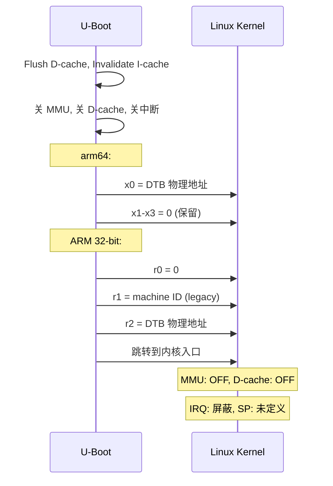
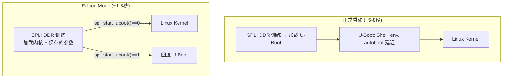

# U-Boot 命令框架、环境变量与 Linux 引导

## 命令框架

### 注册

`U_BOOT_CMD()` 宏将 `cmd_tbl` 结构体放入链接器段 `.u_boot_list`：

```c
struct cmd_tbl {
    char *name;       // 命令名
    int  maxargs;     // 最大参数数
    int  (*cmd)(struct cmd_tbl *, int, int, char *const []);
    char *usage;      // 短帮助
    char *help;       // 长帮助
};

// 运行时 find_cmd() 在连接后的数组中搜索
```

### Hush Shell

启用 `CONFIG_HUSH_PARSER` 后支持：
- 控制流：`if...then...else...fi`, `for...do...done`, `while...do...done`
- 变量替换：`${name}`, `$(command)`
- 命令链接：`;`

### 环境变量

| 方面 | 机制 |
|------|------|
| **默认** | 编译到 U-Boot 中 (`CONFIG_EXTRA_ENV_SETTINGS`) |
| **持久** | 存储在 Flash/SD/eMMC 的 `CONFIG_ENV_OFFSET` |
| **运行时** | 内存哈希表 (`env_htab`) |
| **saveenv** | 写回持久存储 |

关键变量：
```
bootargs=console=ttyS0,115200 root=/dev/mmcblk0p2
bootcmd=mmc read 0x42000000 0x800 0x4000; bootm 0x42000000
```

## Linux 引导

### 引导命令

| 命令 | 内核格式 | 架构 |
|------|---------|------|
| `bootm` | uImage (legacy) 或 FIT image | 任意 |
| `bootz` | zImage (gzip 压缩) | ARM 32-bit |
| `booti` | 原始 Image + arm64 头 | ARM 64-bit |

### bootm 流水线

```
bootm_start()        → 解析镜像头、验证校验和
bootm_load_os()      → 解压缩、镜像修复
boot_prep_linux()    → 修复 DTB (chosen, initrd, memory)
boot_jump_linux()    → 清理缓存、关 MMU、跳转到内核
```

### CPU 状态交接



## Falcon Mode

SPL 直接加载 Linux 内核，**完全跳过 U-Boot proper**，节省 3-5 秒：



**配置方式**：
1. 正常启动 U-Boot → 加载内核 + DTB
2. `spl export fdt <loadaddr> - <fdtaddr>` → 生成修复后的 DTB
3. 将内核和参数区保存到持久存储
4. SPL 后续启动时直接加载并跳转到内核

## 网络子系统

U-Boot 网络栈是**单线程轮询**的 — 无中断、无线程：

```c
net_loop(protocol)  // 驱动事件循环
    while (net_state == NETLOOP_CONTINUE) {
        eth_rx();                              // 轮询网卡
        net_process_received_packet();         // ARP/IP → 协议处理器
        if (timeout) timeHandler();            // 重传/超时
    }
```

支持：TFTP (固件下载)、DHCP/BOOTP (IP 获取)、NFS、PING。
