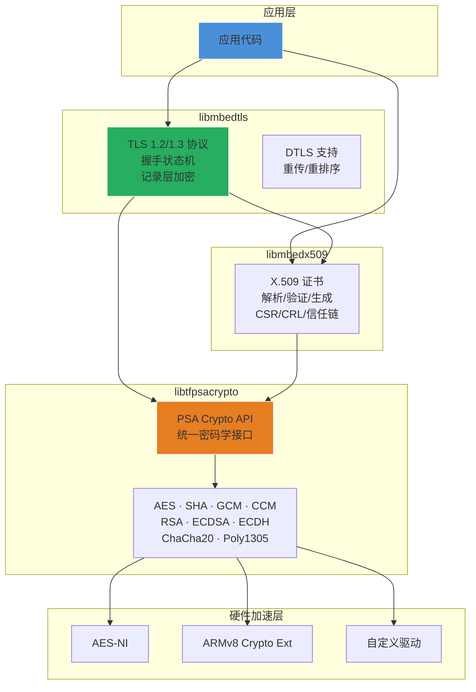

# mbedTLS 概述与架构

## 一句话

> mbedTLS 是一个纯 C 实现的嵌入式 TLS/DTLS 协议栈，包含 PSA 密码学 API、X.509 证书管理和 TLS 1.2/1.3 完整协议栈，通过三库分离架构和编译时宏系统在资源受限 MCU 上实现企业级安全通信。

## 三层库架构



三层之间通过编译时宏隔离依赖，可独立使用：应用可以只链接 `libtfpsacrypto` 做纯密码学运算，或加 `libmbedx509` 做证书验证，再加 `libmbedtls` 做安全通信。

## 源码组织

```
mbedtls/
├── library/                  # TLS + X.509 实现（20 .c）
│   ├── ssl_tls.c             # TLS 握手核心（9,048 行）
│   ├── ssl_msg.c             # 记录层（6,275 行）
│   ├── ssl_tls12_client.c    # TLS 1.2 客户端
│   ├── ssl_tls12_server.c    # TLS 1.2 服务端
│   ├── ssl_tls13_*.c         # TLS 1.3（5 文件）
│   ├── x509_crt.c            # 证书解析（3,278 行）
│   ├── x509_csr.c            # CSR 解析
│   ├── x509_crl.c            # CRL 吊销列表
│   ├── x509write_*.c         # 证书/CSR 生成
│   └── ssl_ciphersuites.c    # 密码套件注册表
├── include/mbedtls/          # 公共 API 头文件
│   ├── ssl.h                 # TLS/DTLS 完整 API
│   ├── x509.h/x509_crt.h     # X.509 公共 API
│   └── mbedtls_config.h      # TLS/X.509 编译配置
└── tf-psa-crypto/ (子模块)   # 密码学实现
    ├── core/psa_crypto.c      # PSA 核心调度（9,820 行）
    ├── drivers/builtin/src/   # 内置密码学驱动
    │   ├── aes.c · sha256.c  · sha512.c  · sha3.c
    │   ├── rsa.c · ecp.c     · ecdsa.c   · ecjpake.c
    │   ├── gcm.c · ccm.c     · chacha20.c · chachapoly.c
    │   ├── bignum.c          · cipher.c  · cmac.c
    │   └── entropy.c         · ctr_drbg.c · hmac_drbg.c
    └── drivers/builtin/include/mbedtls/private/
        └── aes.h · sha256.h · rsa.h · ecp.h · ... (内部头文件)
```

**关键设计点**：密码学头文件放在 `mbedtls/private/` 路径下，表明它们是内部实现细节而非公共 API。应用应通过 PSA Crypto API (`psa/crypto.h`) 调用，而非直接使用 `mbedtls_aes_*` 等低级接口。

## 核心设计原则

### 1. 编译时配置而非运行时

mbedTLS 几乎不做运行时动态分配。所有功能模块通过 `#define` 开关控制：

```c
// mbedtls_config.h 示例
#define MBEDTLS_AES_C           // 启用 AES 模块
#define MBEDTLS_SHA256_C        // 启用 SHA-256
#define MBEDTLS_SSL_TLS_C       // 启用 TLS 协议
#define MBEDTLS_SSL_PROTO_TLS1_3 // 启用 TLS 1.3
// 未定义的模块完全不编译，零 code size 开销
```

通过精心选择宏组合，mbedTLS 可裁剪到 ~60KB Flash（TLS 1.2 PSK-only），也可以启用完整 TLS 1.3 + X.509 ~300KB。

### 2. 无全局状态

所有上下文（SSL 会话、X.509 解析器、密码学操作）通过用户分配的结构体管理：

```c
mbedtls_ssl_context ssl;       // 用户栈上或堆上分配
mbedtls_ssl_init(&ssl);        // 初始化
// ... 使用 ...
mbedtls_ssl_free(&ssl);        // 清理
```

无隐式全局变量，天然支持多实例和无 OS 环境。

### 3. PSA Crypto 统一接口

mbedTLS 4.x 的核心重构是**密码学层统一到 PSA Crypto API**。传统 API (`mbedtls_aes_*`) 降级为内部实现，公共接口统一为 `psa_*` 函数族：

```c
// 新代码推荐写法（PSA API）
psa_crypto_init();
psa_key_attributes_t attr = PSA_KEY_ATTRIBUTES_INIT;
psa_set_key_type(&attr, PSA_KEY_TYPE_AES);
psa_set_key_algorithm(&attr, PSA_ALG_CCM);
psa_import_key(&attr, key_data, key_len, &key_id);
// ... 加密/解密 ...
psa_destroy_key(key_id);
```

### 4. 错误码负值空间

所有错误码为负数，按 0x0080 步进划分模块空间：

| 模块 | 错误码范围 |
|------|-----------|
| SSL | -0x5D80 ~ -0x7F80 |
| X.509 | -0x2080 ~ -0x2F80 |
| AES | -0x0012 ~ -0x0024 |
| RSA | -0x4080 ~ -0x4F80 |
| ECP | -0x4F80 ~ -0x5080 |

部分错误码直接映射到 PSA 标准错误码（如 `MBEDTLS_ERR_SSL_BAD_INPUT_DATA = PSA_ERROR_INVALID_ARGUMENT`）。

## 与 FreeRTOS/LWIP 的架构对比

| 维度 | mbedTLS | FreeRTOS | LWIP |
|------|---------|----------|------|
| 配置方式 | 宏 + `config.py` 脚本 | `FreeRTOSConfig.h` | `lwipopts.h` |
| 内存管理 | 用户提供分配器 | heap_1~5 五种方案 | mem/memp 双轨 |
| OS 依赖 | 零依赖（可选 threading 模块） | 自包含 | NO_SYS 模式零依赖 |
| 模块化 | 三库独立链接 | 单一内核 | 模块但编译在一起 |
| 错误处理 | 负值返回码 + 多级分类 | 很少返回错误 | err_t 枚举 |
| API 风格 | 上下文对象 + init/free 配对 | 句柄 (TaskHandle_t 等) | PCB 结构体 + 回调 |

**mbedTLS 最独特的架构特点**：三库完全独立可单独使用。你可以在没有 TLS 协议栈的情况下只使用 `libtfpsacrypto` 做 AES-GCM 加密，或只用 `libmbedx509` 做证书验证。这种模块化程度在嵌入式 C 库中很少见。

## 参见

- [[mbedTLS/2. mbedTLS Crypto 密码学原语]] — PSA Crypto API 与内置驱动详解
- [[mbedTLS/3. mbedTLS X.509 证书管理]] — 证书链、CSR、CRL
- [[mbedTLS/4. mbedTLS SSL TLS 安全传输]] — 握手状态机与记录层
- [[mbedTLS/5. mbedTLS 配置与移植]] — 编译定制、平台移植、FreeRTOS 集成
