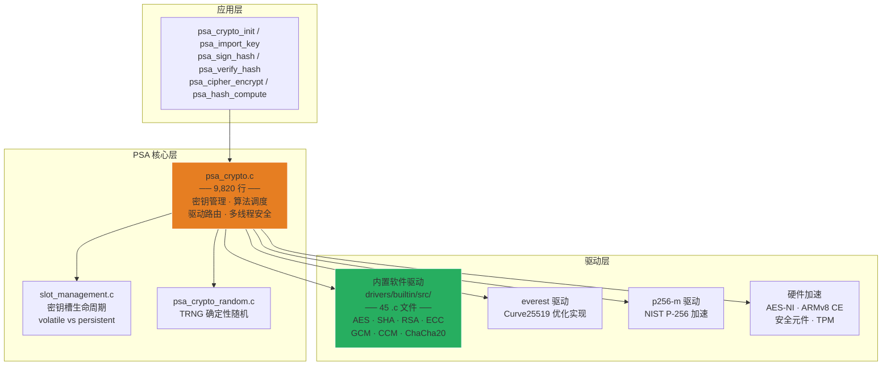
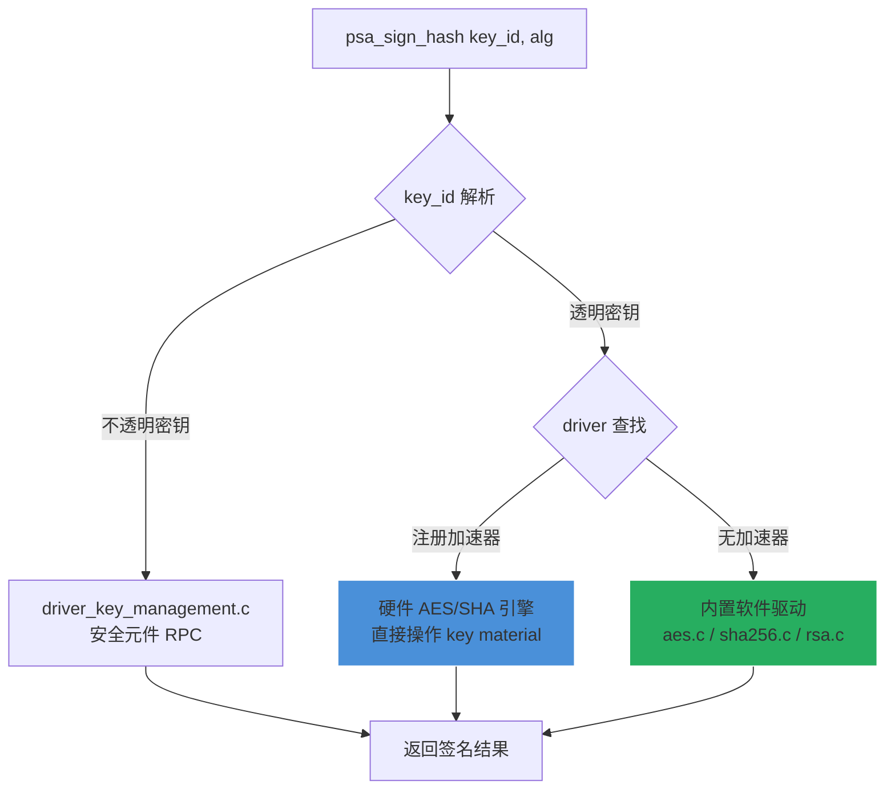

# mbedTLS Crypto 密码学原语

## 一句话

> mbedTLS 通过 PSA Crypto API 统一接口 + 内置软件驱动 + 可替换硬件加速驱动的三层模型，在嵌入式 MCU 上提供 FIPS 合规的 AES、SHA、RSA、ECC、GCM、ChaCha20 等全系列密码学原语。

## PSA Crypto API 架构



**PSA (Platform Security Architecture)** 是 ARM 定义的密码学 API 标准。mbedTLS 4.x 将原有 `mbedtls_aes_*` 等低级 C API 封装在 `mbedtls/private/` 命名空间下，应用层统一使用 `psa_*` 接口。

## 内置密码学原语全集

### 对称加密

| 算法 | 源文件 | 模式 | 硬件加速 |
|------|--------|------|---------|
| **AES** | `aes.c` (2,236 行) | ECB / CBC / CTR / CFB / OFB / XTS | AES-NI (x86_64), ARMv8 Crypto Extension |
| **Camellia** | `camellia.c` | ECB / CBC / CTR | — |
| **ARIA** | `aria.c` | ECB / CBC / CTR | — |
| **ChaCha20** | `chacha20.c` | 流密码 | NEON (ARM) |

AES 实现特点（`aes.c`）：

```c
// ROM 表：S-box 硬编码在 flash 中
MBEDTLS_MAYBE_UNUSED static const unsigned char FSb[256] = {
    0x63, 0x7C, 0x77, 0x7B, ...
};

// 硬件检测：编译时自动选择最优路径
#if defined(MBEDTLS_AESNI_C)
    // x86_64: 使用 AES-NI 指令
#elif defined(MBEDTLS_AESCE_C)
    // ARMv8-A: 使用 ARM Crypto Extension
#else
    // 纯软件查表实现
#endif
```

- `MBEDTLS_AES_ROM_TABLES` — S-box 存储在 ROM 中以节省 RAM
- `MBEDTLS_AES_USE_HARDWARE_ONLY` — 强制硬件实现（编译失败如果没有）
- `MBEDTLS_BLOCK_CIPHER_NO_DECRYPT` — 禁用解密（仅需加密场景，省一半代码）

### 哈希与 HMAC

| 算法 | 源文件 | 输出 | 硬件加速 |
|------|--------|------|---------|
| **MD5** | `md5.c` | 128-bit | — |
| **SHA-1** | `sha1.c` | 160-bit | ARMv8 CE |
| **SHA-224/256** | `sha256.c` (956 行) | 224/256-bit | ARMv8 CE |
| **SHA-384/512** | `sha512.c` | 384/512-bit | — |
| **SHA-3** | `sha3.c` | 可变 | — |
| **RIPEMD-160** | `ripemd160.c` | 160-bit | — |

SHA-256 实现中的 ARMv8 Crypto Extension 检测（`sha256.c`）：

```c
#if defined(__ARM_ARCH) && (__ARM_ARCH_PROFILE == 'A')
#if __ARM_ARCH >= 8
#define MBEDTLS_SHA256_ARCH_IS_ARMV8_A
#endif
#endif
// Clang ≤15 需手动定义 __ARM_FEATURE_CRYPTO 和 __ARM_FEATURE_SHA2
```

### 认证加密 (AEAD)

| 算法 | 源文件 | 特点 |
|------|--------|------|
| **AES-GCM** | `gcm.c` | 并行计算，无需填充 |
| **AES-CCM** | `ccm.c` | 紧凑，适合 IoT（仅 AES 原语） |
| **ChaCha20-Poly1305** | `chachapoly.c` | 纯软件友好，无 AES 指令依赖 |

### MAC

| 算法 | 源文件 | 用途 |
|------|--------|------|
| **AES-CMAC** | `cmac.c` | 基于 AES 的 MAC |
| **HMAC** | （通过 PSA 组合 hash + key） | 基于哈希的 MAC |

### 非对称加密

| 算法 | 源文件 | 操作 | 特点 |
|------|--------|------|------|
| **RSA** | `rsa.c` (2,720 行) | 加解密/签名/验证 | PKCS#1 v1.5 + PSS, CRT 加速 |
| **ECDSA** | `ecdsa.c` | 签名/验证 | secp256r1/secp384r1/secp521r1 |
| **ECDH** | （ecp.c 组合） | 密钥协商 | Weierstrass + Montgomery 曲线 |
| **ECJPAKE** | `ecjpake.c` | 基于 ECC 的 PAKE | Thread 网络密钥协商 |
| **FFDH** | `psa_crypto_ffdh.c` | FFDH 密钥协商 | ffdhe2048~8192 |

### 大数运算与曲线

| 模块 | 源文件 | 功能 |
|------|--------|------|
| **Bignum Core** | `bignum.c` + `bignum_core.c` + `bignum_mod.c` | 多精度整数运算基础库 |
| **ECP** | `ecp.c` (3,478 行) | 椭圆曲线点运算：点加、倍点、标量乘 |
| **ECP Curves** | `ecp_curves.c` | 曲线参数定义（NIST P-256/384/521, Curve25519, etc.） |

### 随机数生成

| 模块 | 源文件 | 功能 |
|------|--------|------|
| **Entropy** | `entropy.c` + `entropy_poll.c` | 熵源收集与累积 |
| **CTR_DRBG** | `ctr_drbg.c` | NIST SP 800-90A AES-CTR DRBG |
| **HMAC_DRBG** | `hmac_drbg.c` | NIST SP 800-90A HMAC DRBG |

PSA 初始化链路：
```
entropy_poll (硬件 TRNG / 定时器抖动)
  → mbedtls_entropy_func (累积到熵池)
    → mbedtls_ctr_drbg_seed (DRBG 种子)
      → mbedtls_ctr_drbg_random (确定性随机输出)
        → PSA API 最终随机源
```

## 密钥管理

PSA Crypto API 将密钥抽象为 **key_id** 句柄，密钥材料对应用透明：

```c
// 密钥导入
psa_key_id_t key_id;
psa_key_attributes_t attr = PSA_KEY_ATTRIBUTES_INIT;
psa_set_key_type(&attr, PSA_KEY_TYPE_AES);
psa_set_key_bits(&attr, 128);
psa_set_key_algorithm(&attr, PSA_ALG_CTR);
psa_set_key_usage_flags(&attr, PSA_KEY_USAGE_ENCRYPT | PSA_KEY_USAGE_DECRYPT);
psa_import_key(&attr, aes_key_data, 16, &key_id);

// 后续操作只需 key_id，无需接触密钥材料
psa_cipher_encrypt(key_id, PSA_ALG_CTR, plaintext, ..., &ciphertext, ...);
```

**密钥存储三种形态**：

| 类型 | 位置 | 生命周期 | 使用场景 |
|------|------|---------|---------|
| `PSA_KEY_LIFETIME_VOLATILE` | RAM | 调用 `psa_destroy_key()` 为止 | 会话密钥 |
| `PSA_KEY_LIFETIME_PERSISTENT` | 安全存储（ITS） | 重启后保留 | 设备私钥、预置密钥 |
| `psa_key_id_t` 句柄 | 应用持有 | 仅标识符 | 所有 API 调用 |

**密钥槽管理**（`psa_crypto_slot_management.c`）：维护一个固定大小的密钥槽数组（`MBEDTLS_PSA_KEY_SLOT_COUNT` 默认为 32），每个槽对应一个加载的密钥。支持透明密钥（应用提供材料）和不透明密钥（存储在安全元件中不可导出）。

## 驱动注册机制

mbedTLS 支持**透明驱动**和**不透明驱动**两种模式：



**驱动优先级**：硬件加速器 > 内置软件驱动。每个算法查询注册的驱动列表，优先使用最高得分的加速器。

## 与 FreeRTOS/LWIP 安全性集成

mbedTLS 在 IoT 协议栈中的典型位置：

```
应用层 (MQTT/HTTP/CoAP)
  → mbedtls (TLS 加密层) ← psa_crypto (密码学)
    → TCP/UDP (LWIP)
      → 以太网/WiFi (硬件)
```

LWIP 的 `altcp_tls` 模块内置对 mbedTLS 的支持，提供透明 TLS 封装。

## 参见

- [[mbedTLS/1. mbedTLS 概述与架构]] — 整体架构
- [[mbedTLS/4. mbedTLS SSL TLS 安全传输]] — TLS 握手如何调用密码学原语
- [[mbedTLS/5. mbedTLS 配置与移植]] — 编译配置中密码学模块的选择
