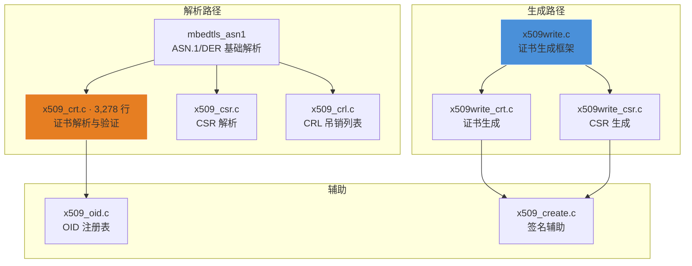

# mbedTLS X.509 证书管理

## 一句话

> mbedTLS 的 X.509 模块提供符合 RFC 5280 的完整证书生命周期管理——从 ASN.1/DER 解析、信任链验证、CRL 吊销检查，到证书和 CSR 的生成，全部通过用户管理的上下文结构体实现零动态内存依赖。

## X.509 模块组成



**三个库的分工**：`libmbedx509` 是独立的库，不依赖 `libmbedtls`。`mbedtls_x509_crt_verify()` 只需要 `libmbedx509` + `libtfpsacrypto`（密码学验证签名）。

## 证书解析 API (`mbedtls_x509_crt`)

### 核心结构体

```c
// ssl.h 中引用的关键类型（定义在 x509_crt.h）
typedef struct mbedtls_x509_crt {
    mbedtls_x509_buf raw;              // 原始 DER 数据
    mbedtls_x509_buf tbs;              // To-Be-Signed 部分
    int version;                        // X.509 v1/v2/v3
    mbedtls_x509_buf serial;           // 证书序列号
    mbedtls_x509_name subject;         // Subject DN
    mbedtls_x509_name issuer;          // Issuer DN
    mbedtls_x509_time valid_from;      // 有效期起始
    mbedtls_x509_time valid_to;        // 有效期截止
    mbedtls_pk_context pk;             // 公钥上下文
    mbedtls_x509_buf issuer_id;        // Issuer Unique ID
    mbedtls_x509_buf subject_id;       // Subject Unique ID
    mbedtls_x509_buf v3_ext;           // X.509 v3 扩展
    mbedtls_x509_sequence subject_alt_names; // SAN
    // ... 更多字段 ...
    struct mbedtls_x509_crt *next;     // 证书链表（单向）
} mbedtls_x509_crt;
```

**设计特点**：证书通过 `next` 指针组成单向链表，支持证书链的完整加载和遍历。`mbedtls_x509_buf` 是指针+长度对，不复制数据——所有字段指向原始 DER buffer 的切片。

### 解析流程

```c
// 1. 初始化
mbedtls_x509_crt cert;
mbedtls_x509_crt_init(&cert);

// 2. 从 DER 解析单证书
mbedtls_x509_crt_parse_der(&cert, der_buf, der_len);

// 3. 从 PEM 解析（自动 Base64 解码 → DER）
mbedtls_x509_crt_parse(&cert, pem_buf, pem_len);

// 4. 信任链验证
uint32_t flags;
mbedtls_x509_crt_verify(&cert,          // 待验证证书链
                         ca_chain,       // 信任的 CA 列表
                         ca_crl,         // CA 吊销列表
                         NULL,           // 期望的 CN (可选)
                         &flags,         // 验证结果标志
                         NULL, NULL);    // 回调（可选）

// 5. 检查结果
if (flags != 0) {
    char buf[512];
    mbedtls_x509_crt_verify_info(buf, sizeof(buf), "", flags);
    // buf: "  ! The certificate has expired"
}

// 6. 清理
mbedtls_x509_crt_free(&cert);
```

### 信任链验证标志

| 标志 | 含义 |
|------|------|
| `MBEDTLS_X509_BADCERT_EXPIRED` | 证书已过期 |
| `MBEDTLS_X509_BADCERT_REVOKED` | 证书已吊销 |
| `MBEDTLS_X509_BADCERT_CN_MISMATCH` | CN 不匹配 |
| `MBEDTLS_X509_BADCERT_NOT_TRUSTED` | 不在信任链中 |
| `MBEDTLS_X509_BADCRL_EXPIRED` | CRL 已过期 |
| `MBEDTLS_X509_BADCERT_MISSING` | 证书缺失 |
| `MBEDTLS_X509_BADCERT_SKIP_VERIFY` | 跳过验证（用户回调） |

## CSR 证书签名请求

```c
// 生成 CSR
mbedtls_x509write_csr csr;
mbedtls_x509write_csr_init(&csr);
mbedtls_x509write_csr_set_subject_name(&csr, "CN=device001,O=MyOrg,C=CN");
mbedtls_x509write_csr_set_key(&csr, &my_key);  // 关联私钥
mbedtls_x509write_csr_set_md_alg(&csr, MBEDTLS_MD_SHA256);
mbedtls_x509write_csr_pem(&csr, buf, sizeof(buf), rng_func, rng_ctx);
mbedtls_x509write_csr_free(&csr);
```

## CRL 证书吊销列表

```c
mbedtls_x509_crl crl;
mbedtls_x509_crl_init(&crl);
mbedtls_x509_crl_parse(&crl, crl_der, crl_der_len);
// CRL 包含序列号列表，验证时自动检查
mbedtls_x509_crl_free(&crl);
```

## 证书生成

mbedTLS 支持自签名 CA 证书和终端实体证书的生成：

```c
// 生成自签名 CA 证书
mbedtls_x509write_crt crt;
mbedtls_x509write_crt_init(&crt);
mbedtls_x509write_crt_set_subject_key(&crt, &ca_key);
mbedtls_x509write_crt_set_issuer_key(&crt, &ca_key);
mbedtls_x509write_crt_set_subject_name(&crt, "CN=MyCA,O=MyOrg,C=CN");
mbedtls_x509write_crt_set_issuer_name(&crt, "CN=MyCA,O=MyOrg,C=CN"); // 自签名
mbedtls_x509write_crt_set_serial(&crt, &serial);
mbedtls_x509write_crt_set_validity(&crt, "20260101000000", "20360101000000");
mbedtls_x509write_crt_set_basic_constraints(&crt, 1, -1); // CA=true, pathlen=unlimited
mbedtls_x509write_crt_set_md_alg(&crt, MBEDTLS_MD_SHA256);
mbedtls_x509write_crt_pem(&crt, buf, sizeof(buf), rng, NULL);
```

## OID 注册表

`x509_oid.c` 维护 mbedTLS 支持的 OID 到算法名称的映射，用于：

- 证书签名算法识别（OID 1.2.840.113549.1.1.11 → `sha256WithRSAEncryption`）
- 公钥类型识别（OID 1.2.840.10045.2.1 → EC 公钥）
- 扩展字段解析（OID 2.5.29.19 → Basic Constraints）

## TLS 集成

X.509 模块在 TLS 握手中的角色：

```
ClientHello →
              ← ServerHello + Certificate (mbedtls_x509_crt 解析)
              ← ServerKeyExchange
              ← ServerHelloDone
Client:
  mbedtls_x509_crt_verify(cert_chain)
  → 验证签名链
  → 检查有效期
  → 检查 CRL
  → 检查 CN/SAN
  → 提取公钥用于密钥协商
```

TLS 配置中指定 CA 链和客户端证书：

```c
mbedtls_ssl_conf_ca_chain(&ssl_conf, &ca_cert, &ca_crl);
mbedtls_ssl_conf_own_cert(&ssl_conf, &client_cert, &client_key);
```

## 参见

- [[mbedTLS/1. mbedTLS 概述与架构]] — 三库分离架构
- [[mbedTLS/4. mbedTLS SSL TLS 安全传输]] — 握手过程中的证书验证
- [[通讯网络/CANopenNode 协议栈分析]] — 嵌入式安全的另一典型场景
