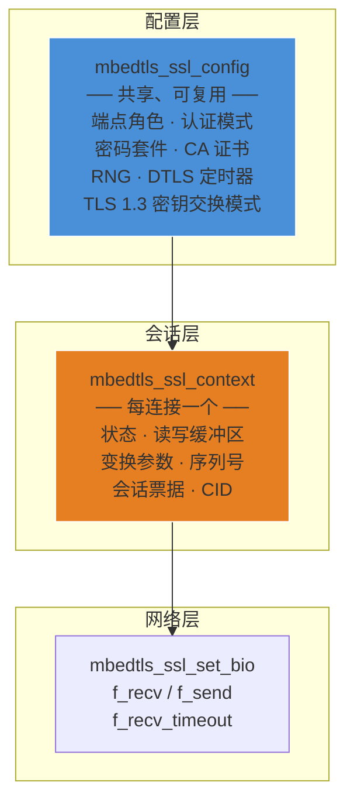
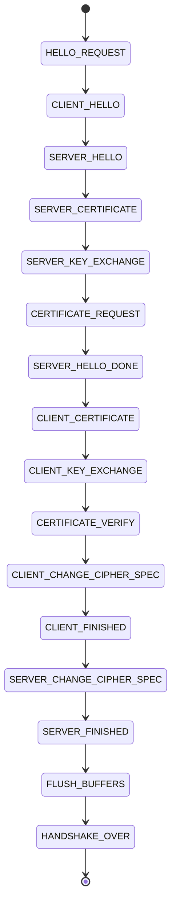
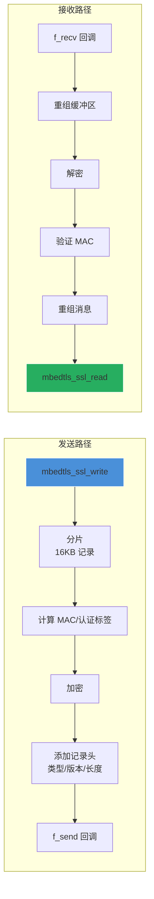

# mbedTLS SSL/TLS 安全传输

## 一句话

> mbedTLS 以纯 C 状态机实现完整的 TLS 1.2/1.3 和 DTLS 协议，用户在应用层循环调用 `mbedtls_ssl_handshake()` 即可驱动握手流程，非阻塞 I/O 通过 `MBEDTLS_ERR_SSL_WANT_READ/WANT_WRITE` 与底层网络解耦。

## SSL 上下文与配置分离



配置一次，多连接复用：

```c
mbedtls_ssl_config conf;
mbedtls_ssl_config_init(&conf);
mbedtls_ssl_config_defaults(&conf,
    MBEDTLS_SSL_IS_CLIENT,
    MBEDTLS_SSL_TRANSPORT_STREAM,
    MBEDTLS_SSL_PRESET_DEFAULT);

// 一个配置，多个连接
mbedtls_ssl_context ssl1, ssl2;
mbedtls_ssl_init(&ssl1);
mbedtls_ssl_init(&ssl2);
mbedtls_ssl_setup(&ssl1, &conf);  // 共享 conf
mbedtls_ssl_setup(&ssl2, &conf);  // 共享 conf
```

## 握手状态机



核心实现（`ssl_tls.c:4279`）：

```c
int mbedtls_ssl_handshake(mbedtls_ssl_context *ssl)
{
    // 主握手循环 —— 每次迭代推进一个状态
    while (ssl->state != MBEDTLS_SSL_HANDSHAKE_OVER) {
        ret = mbedtls_ssl_handshake_step(ssl);
        if (ret != 0) break;
    }
    return ret;
}
```

`mbedtls_ssl_handshake_step()` 是状态机调度器（`ssl_tls.c:4190`）：

```c
int mbedtls_ssl_handshake_step(mbedtls_ssl_context *ssl)
{
    if (ssl->conf->endpoint == MBEDTLS_SSL_IS_CLIENT) {
        switch (ssl->state) {
            case MBEDTLS_SSL_CLIENT_HELLO:
                ret = mbedtls_ssl_write_client_hello(ssl);
                break;
            // TLS 1.2 client dispatch:
            //   ret = mbedtls_ssl_handshake_client_step(ssl);
            // TLS 1.3 client dispatch:
            //   ret = mbedtls_ssl_tls13_handshake_client_step(ssl);
        }
    }
    // Server side: 类似的 dispatch
}
```

### 非阻塞模式

在嵌入式系统中，网络 I/O 通常是非阻塞的。mbedTLS 通过特殊返回码支持：

```c
do {
    ret = mbedtls_ssl_handshake(&ssl);
    if (ret == MBEDTLS_ERR_SSL_WANT_READ) {
        // 等待 socket 可读
        select(sockfd+1, &rfds, NULL, NULL, NULL);
    } else if (ret == MBEDTLS_ERR_SSL_WANT_WRITE) {
        // 等待 socket 可写
        select(sockfd+1, NULL, &wfds, NULL, NULL);
    }
} while (ret != 0 && ret != MBEDTLS_ERR_SSL_HANDSHAKE_FAILURE);
```

`WANT_READ`/`WANT_WRITE` 表示内部状态已保存，下次调用可从同一点继续。

## 记录层（Record Layer）



记录层实现在 `ssl_msg.c`（6,275 行），负责：

| 职责 | 实现 |
|------|------|
| **分片** | 单记录最大 16KB (`MBEDTLS_SSL_MAX_CONTENT_LEN`) |
| **压缩** | 可选（TLS 1.2 已不推荐） |
| **加密+MAC** | AEAD（GCM/CCM/ChaCha20-Poly1305）或 Encrypt-then-MAC |
| **序列号** | 64-bit 隐式序列号，重放保护 |
| **DTLS** | 显式序列号 + 重排序 + 重传定时器 |

记录类型（`ContentType`）：

| 值 | 类型 | 说明 |
|----|------|------|
| 20 | ChangeCipherSpec | 切换加密状态（TLS 1.3 中已移除） |
| 21 | Alert | 警告或错误通知 |
| 22 | Handshake | 握手消息 |
| 23 | ApplicationData | 加密的应用数据 |

## TLS 1.2 vs TLS 1.3

| 特性 | TLS 1.2 | TLS 1.3 |
|------|---------|---------|
| **握手往返** | 2-RTT（完整）| 1-RTT（ECDHE）|
| **密钥协商** | RSA 或 (EC)DHE | 仅 (EC)DHE + PSK |
| **对称密码** | CBC/GCM/CCM | AEAD only |
| **SNI** | 明文 | 加密的 encrypted_extensions |
| **0-RTT** | 不支持 | 支持（PSK 恢复） |
| **代码量 (mbedTLS)** | ssl_tls12_client.c + server.c | 5 文件 (client/server/keys/generic) |
| **向后兼容** | — | 通过 supported_versions 扩展协商 |

TLS 1.3 实现分布在 5 个源码文件中：
- `ssl_tls13_client.c` — 客户端握手状态机
- `ssl_tls13_server.c` — 服务端握手状态机
- `ssl_tls13_keys.c` — 密钥派生（HKDF-Extract/Expand）
- `ssl_tls13_generic.c` — 共享逻辑
- `ssl_tls13_generic.c` — 密钥调度表

## DTLS 支持

启用 `MBEDTLS_SSL_PROTO_DTLS` 后，mbedTLS 在 TLS 基础上增加：

| 特性 | 实现 |
|------|------|
| **重传** | 定时器回调 `f_set_timer` / `f_get_timer` |
| **重排序** | 记录层按序列号缓冲乱序消息 |
| **HelloVerifyRequest** | 防 DoS（stateless cookie） |
| **CID** | DTLS 1.2 Connection ID 扩展，支持 IP 地址变更 |

```c
// DTLS 必须设置定时器回调
mbedtls_ssl_set_timer_cb(&ssl, &timer_ctx,
    my_timer_set,    // 设置定时器（绝对时间）
    my_timer_get);   // 检查定时器是否到期
```

## 密码套件注册表

`ssl_ciphersuites.c` 维护所有注册的密码套件，格式为 IANA 编号映射：

```
TLS-ECDHE-ECDSA-WITH-AES-128-GCM-SHA256 (0xC02B)
TLS-ECDHE-RSA-WITH-AES-128-GCM-SHA256   (0xC02F)
TLS-DHE-RSA-WITH-AES-128-GCM-SHA256     (0x009E)
TLS-PSK-WITH-AES-128-CCM-8              (0xC0A8)
```

通过 `mbedtls_ssl_conf_ciphersuites()` 限制使用的套件列表。

## 会话管理与恢复

```c
// 保存会话
mbedtls_ssl_session session;
mbedtls_ssl_session_init(&session);
mbedtls_ssl_get_session(&ssl, &session);
// ... 持久化 session ...

// 恢复会话（TLS 1.2 会话 ID 或 TLS 1.3 PSK）
mbedtls_ssl_set_session(&ssl, &session);

// 会话票据（RFC 5077）
// 需要注册 ticket write/parse 回调
mbedtls_ssl_conf_session_tickets_cb(&conf,
    ticket_write_cb, ticket_parse_cb, &ticket_ctx);
```

## 嵌入式优化要点

1. **只用 PSK 认证**：省去 X.509 证书链 + RSA/ECDSA 签名，Flash 减少 ~100KB
2. **只用 TLS 1.2**：TLS 1.3 增加 ~50KB 额外代码
3. **限制密码套件**：只保留 `TLS-PSK-WITH-AES-128-CCM-8` 单套件
4. **降低 `MBEDTLS_SSL_MAX_CONTENT_LEN`**：从默认 16KB 降到 2~4KB（如果应用数据小）
5. **使用 `MBEDTLS_SSL_IN_CONTENT_LEN` / `MBEDTLS_SSL_OUT_CONTENT_LEN`**：分离输入输出 buffer 大小

## 参见

- [[mbedTLS/1. mbedTLS 概述与架构]] — 整体架构
- [[mbedTLS/2. mbedTLS Crypto 密码学原语]] — 握手如何调用 PSA Crypto
- [[mbedTLS/3. mbedTLS X.509 证书管理]] — 证书验证
- [[mbedTLS/5. mbedTLS 配置与移植]] — 编译配置与平台移植
