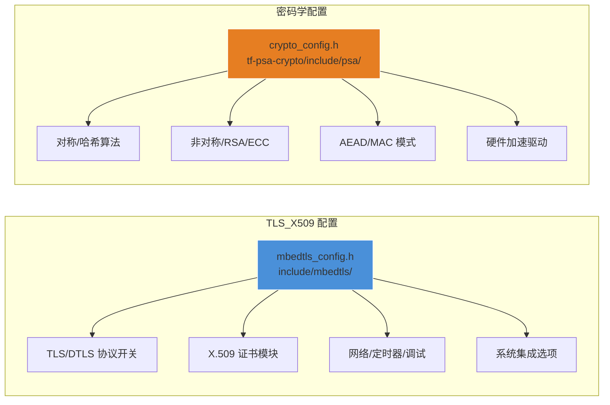

# mbedTLS 配置与移植

## 一句话

> mbedTLS 通过两个配置文件（`mbedtls_config.h` + `crypto_config.h`）实现编译时功能定制——从 60KB 的 PSK-only TLS 1.2 到 400KB+ 的全功能 TLS 1.3+X.509——通过宏开关精确控制每个模块的编译，零运行时开销。

## 双配置体系



配置通过 `config.py` 脚本可程序化操作：

```bash
# 启用 TLS 1.3
python3 scripts/config.py set MBEDTLS_SSL_PROTO_TLS1_3

# 禁用不需要的算法以缩小体积
python3 scripts/config.py unset MBEDTLS_RSA_C
python3 scripts/config.py unset MBEDTLS_ECDSA_C
```

## 裁剪策略与体积对比

### 极小配置（IoT 传感器节点，~60KB Flash）

```c
// 仅 TLS 1.2 PSK + AES-128-CCM
#define MBEDTLS_PSA_CRYPTO_C
#define MBEDTLS_AES_C
#define MBEDTLS_CCM_C
#define MBEDTLS_SHA256_C
#define MBEDTLS_SSL_TLS_C
#define MBEDTLS_SSL_CLI_C
#define MBEDTLS_SSL_PROTO_TLS1_2
#define MBEDTLS_KEY_EXCHANGE_PSK_ENABLED
#define MBEDTLS_SSL_MAX_FRAGMENT_LENGTH
// 全部其他宏未定义
```

**移除的模块**：RSA (~15KB)、ECC (~20KB)、X.509 (~30KB)、TLS 1.3 (~50KB)、GCM (~5KB)、会话票据等。

### 标准配置（IoT 网关，~200KB Flash）

```c
// TLS 1.2 全功能 + X.509
#define MBEDTLS_AES_C
#define MBEDTLS_GCM_C
#define MBEDTLS_CCM_C
#define MBEDTLS_SHA256_C
#define MBEDTLS_SHA512_C
#define MBEDTLS_ECDSA_C
#define MBEDTLS_ECDH_C
#define MBEDTLS_ECP_C
#define MBEDTLS_SSL_TLS_C
#define MBEDTLS_SSL_PROTO_TLS1_2
#define MBEDTLS_X509_CRT_PARSE_C
#define MBEDTLS_X509_USE_C
#define MBEDTLS_PK_PARSE_C
```

### 全功能配置（Linux/MPU，~350KB+ Flash）

启用所有模块，包括 TLS 1.3、DTLS、会话恢复、证书生成等。

## 平台抽象层 (PAL)

### 网络 I/O（BIO 回调）

mbedTLS 不自带网络栈，通过回调与任何传输层对接：

```c
// 发送/接收回调签名
typedef int (*mbedtls_ssl_send_t)(void *ctx, const unsigned char *buf, size_t len);
typedef int (*mbedtls_ssl_recv_t)(void *ctx, unsigned char *buf, size_t len);
typedef int (*mbedtls_ssl_recv_timeout_t)(void *ctx, unsigned char *buf,
                                           size_t len, uint32_t timeout);

// 绑定（LWIP 示例）
mbedtls_ssl_set_bio(&ssl, &socket_fd,
    mbedtls_net_send,    // → lwip_send()
    mbedtls_net_recv,    // → lwip_recv()
    mbedtls_net_recv_timeout);
```

`net_sockets.c` 提供基于 BSD socket 的参考实现，在嵌入式系统上通常替换为 LWIP 或自定义接口。

### 内存分配

```c
// 自定义分配器
#define MBEDTLS_PLATFORM_MEMORY
#define MBEDTLS_PLATFORM_FREE_MACRO   pvPortFree
#define MBEDTLS_PLATFORM_CALLOC_MACRO my_calloc
```

或使用 PSA 内置分配器（`LV_MEM_CUSTOM` 变体）：

```c
int mbedtls_platform_set_calloc_free(
    void *(*calloc_func)(size_t, size_t),
    void (*free_func)(void *));
```

### 时间与随机数

```c
// 定时器（DTLS 必须）
mbedtls_ssl_set_timer_cb(&ssl, &timer_ctx,
    my_timer_set_cb,    // void (*)(void *, uint32_t int_ms, uint32_t fin_ms)
    my_timer_get_cb);   // int  (*)(void *)

// 随机数
mbedtls_ctr_drbg_seed(&ctr_drbg,
    mbedtls_entropy_func,  // 用户提供的熵源函数
    &entropy_ctx,
    NULL, 0);
```

在 FreeRTOS 上，熵源通常来自 ADC 噪声或硬件 TRNG。

## FreeRTOS 集成

### 线程安全

mbedTLS 本身是**线程安全**的（通过 `MBEDTLS_THREADING_C`），但需要用户提供互斥锁：

```c
// FreeRTOS 互斥量包装
#define MBEDTLS_THREADING_C
#define MBEDTLS_THREADING_ALT  // 使用自定义实现

// 提供给 mbedTLS 的互斥锁函数
void threading_mutex_init(mbedtls_threading_mutex_t *mutex) {
    *mutex = xSemaphoreCreateMutex();
}
void threading_mutex_free(mbedtls_threading_mutex_t *mutex) {
    vSemaphoreDelete(*mutex);
}
int threading_mutex_lock(mbedtls_threading_mutex_t *mutex) {
    return xSemaphoreTake(*mutex, portMAX_DELAY) ? 0 : -1;
}
int threading_mutex_unlock(mbedtls_threading_mutex_t *mutex) {
    return xSemaphoreGive(*mutex) ? 0 : -1;
}

// 注册
mbedtls_threading_set_alt(
    threading_mutex_init,
    threading_mutex_free,
    threading_mutex_lock,
    threading_mutex_unlock);
```

### FreeRTOS 任务中的典型使用

```c
void tls_task(void *pvParameters)
{
    mbedtls_ssl_context ssl;
    mbedtls_ssl_config conf;
    mbedtls_ctr_drbg_context ctr_drbg;
    mbedtls_entropy_context entropy;

    // 初始化
    mbedtls_ssl_init(&ssl);
    mbedtls_ssl_config_init(&conf);
    mbedtls_ctr_drbg_init(&ctr_drbg);
    mbedtls_entropy_init(&entropy);

    // 配置 PSA Crypto
    psa_crypto_init();

    // 配置 SSL
    mbedtls_ssl_config_defaults(&conf,
        MBEDTLS_SSL_IS_CLIENT,
        MBEDTLS_SSL_TRANSPORT_STREAM,
        MBEDTLS_SSL_PRESET_DEFAULT);
    mbedtls_ssl_conf_rng(&conf, mbedtls_ctr_drbg_random, &ctr_drbg);
    mbedtls_ssl_setup(&ssl, &conf);

    // 网络绑定
    mbedtls_ssl_set_bio(&ssl, &sock,
        mbedtls_net_send, mbedtls_net_recv, NULL);

    // 握手循环（非阻塞）
    int ret;
    do {
        ret = mbedtls_ssl_handshake(&ssl);
        if (ret == MBEDTLS_ERR_SSL_WANT_READ ||
            ret == MBEDTLS_ERR_SSL_WANT_WRITE) {
            vTaskDelay(pdMS_TO_TICKS(10));  // 让出 CPU
        }
    } while (ret != 0);

    // 安全通信
    mbedtls_ssl_write(&ssl, data, len);
    mbedtls_ssl_read(&ssl, buf, sizeof(buf));
}
```

### 堆栈与优先级建议

| 参数 | TLS 1.2 PSK | TLS 1.2 X.509 | TLS 1.3 |
|------|------------|---------------|---------|
| 任务堆栈 | ~4KB | ~6KB | ~8KB |
| 优先级 | medium | medium | medium-high |
| `MBEDTLS_SSL_MAX_CONTENT_LEN` | 4096 | 16384 | 16384 |

## LWIP + mbedTLS 集成（altcp_tls）

LWIP 内置了 mbedTLS 适配层 `altcp_tls`，提供透明 TLS：

```c
// LWIP altcp 透明 TLS
altcp_tls_config *tls_config = altcp_tls_create_config_client_2wayauth(
    &client_cert, &client_key, NULL, &ca_cert);
struct altcp_pcb *pcb = altcp_tls_new(tls_config, IPADDR_TYPE_V4);

// 之后使用标准 altcp API，自动经过 TLS
altcp_connect(pcb, &addr, port, connected_cb);
altcp_write(pcb, data, len, TCP_WRITE_FLAG_COPY);
```

`altcp_tls` 内部处理 `WANT_READ/WANT_WRITE` 重试、DTLS 定时器、证书验证——对应用层完全透明。

## 调试与错误诊断

```c
// 启用调试输出
#define MBEDTLS_DEBUG_C
mbedtls_ssl_conf_dbg(&conf, my_debug_cb, stdout);
mbedtls_debug_set_threshold(3);  // 0=off, 5=verbose

// 错误码转字符串
char err_buf[256];
mbedtls_strerror(ret, err_buf, sizeof(err_buf));
// err_buf: "SSL - The handshake negotiation failed"

// 证书验证失败详情
char verify_buf[512];
mbedtls_x509_crt_verify_info(verify_buf, sizeof(verify_buf), "  ! ", flags);
// verify_buf:
//   "  ! The certificate has expired"
//   "  ! The certificate Common Name (CN) does not match"
```

## 与 FreeRTOS/LWIP 的移植复杂度对比

| 维度 | mbedTLS | FreeRTOS | LWIP |
|------|---------|----------|------|
| 移植接口 | 6 个回调 + 3 个分配器 | `port.c` ~500 行汇编 | `sys_arch.c` + netif 驱动 |
| 配置方式 | 2 个 config.h | 1 个 FreeRTOSConfig.h | 1 个 lwipopts.h |
| OS 耦合 | 零（threading 可选） | 自包含 | NO_SYS 模式零耦合 |
| 典型移植时间 | 1-2 天 | 3-5 天 (新架构) | 1-2 天 |
| 调试复杂度 | 中等（错误码清晰） | 低 | 中等（多模块交互） |

## 参见

- [[mbedTLS/1. mbedTLS 概述与架构]] — 架构概览
- [[mbedTLS/4. mbedTLS SSL TLS 安全传输]] — 握手与记录层
- [[嵌入式软件/FreeRTOS/1. FreeRTOS 概述与架构]] — FreeRTOS 对比参考
- [[嵌入式软件/LWIP/1. LWIP 概述与架构]] — LWIP altcp_tls 集成
