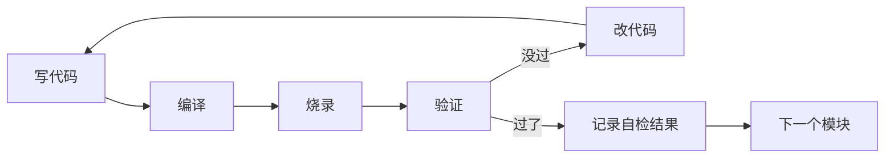

# 嵌入式固件开发流程

## 九段概览

```
1. 需求规格          → 外设清单 + 接口协议 + 实时性约束
2. 架构设计          → 任务划分 + IPC 拓扑 + 模块接口
3. HAL 初始化        → CubeMX 生成，不动手改
4. 模块开发（循环）   → 写→编译→烧→调→过，BSP→中间件→APP
5. 编译质量门        → -Wall -Wextra，0 warnings
6. 自检全跑通        → #ifdef SELF_TEST，[STATUS] ALL_PASS
7. 集成测试          → 压力/异常/长时间，所有模块一起跑
8. 优化              → Flash/RAM/功耗/中断延迟
9. 版本与发布        → version.h + CRC + release note
```

CI/CD 不是一步——贯穿全流程的并行自动化线。每个节点的 CI 行为标注在各段中。

---

## 1. 需求规格

**不写代码。** 两个核心问题必须先答：

| 必须明确 | 示例 |
|---------|------|
| 外设清单 + 协议 | IMU (I2C, 400kHz)、OLED (SPI, 10MHz)、MicroSD (SDIO) |
| 通信接口 | UART ×2、CAN ×1、USB-C |
| 实时性约束 | IMU 采样 200Hz，截止时间 1ms；电机控制 10kHz PWM |
| MCU | STM32F407VET6（Cortex-M4 / 168MHz / 512KB Flash / 192KB SRAM） |
| RTOS | FreeRTOS / 裸机 |
| 功耗约束 | 电池供电 → 空闲时进入 STOP 模式，唤醒 < 100μs |

---

## 2. 架构设计

**纸上画完再写代码。** 三个输出物：

### 任务划分

```
优先级 5: IMU 采样任务 (200Hz, 1ms 截止)
优先级 4: 电机控制任务 (10kHz PWM)
优先级 3: 通信协议栈任务
优先级 2: 数据记录任务 (SD 卡写入)
优先级 1: 日志任务（最低优先级，空闲跑）
```

### IPC 拓扑

```
IMU 任务 → 消息队列 → 姿态解算任务 → 信号量 → 通信任务
SD 记录任务 ← 队列 ← 通信任务
```

### 模块接口

每个模块的头文件定义清楚输入、输出、依赖：

```c
// imu.h
int  imu_init(void);                    // 返回 0 成功
int  imu_read(float *accel, float *gyro); // 返回 0 成功
void imu_self_test(void);               // #ifdef SELF_TEST 使用
```

### 分层约束

```
App/                  → 算法/状态机/协议，不 import HAL 头文件
BSP/                  → 封装 HAL，提供统一接口给 App
Core/Inc/ Core/Src/   → 用户代码，USER CODE 区（main.c 等）
Drivers/              → CMSIS + HAL，CubeMX 生成，不手改
Middlewares/          → FreeRTOS/LWIP/cJSON，只调不改库源码
```

---

## 3. HAL 初始化

CubeMX 生成即用。验证点：

- 系统时钟配对了（HSE + PLL 跑在目标频率）
- 每个外设的引脚不冲突（CubeMX 自动检查）
- SWD 留了调试引脚
- 生成代码编译通过 + 串口打出 "hello world"

---

## 4. 模块开发

**编译和烧录不是单独一步——是每个模块内的循环。**



### 开发顺序

**BSP 驱动先走**——每个外设独立：

- LED → 亮灭
- UART → 有日志输出
- I2C → 读到 WHO_AM_I 寄存器
- SPI → 读到设备 ID
- PWM → 示波器量到波形

**中间件逐个加**：

- FreeRTOS → 两个任务能切换
- LWIP → ping 通
- FatFS → 能读写文件
- cJSON → 解析一段测试 JSON

**APP 最后**——依赖 BSP + 中间件：

- 状态机 → 输入 A → 状态转移到 B
- 控制算法 → 给定输入，输出正确
- 通信协议 → 收发对得上

### 每步顺手自检

```c
// bsp_imu.c
#ifdef SELF_TEST
void imu_self_test(void) {
    if (imu_read_id() == 0xEA) {
        printf("[TEST] IMU_WHOAMI:PASS\n");
    } else {
        printf("[TEST] IMU_WHOAMI:FAIL\n");
    }
}
#endif
```

**[CI 节点]** 每次 push 自动编译——验证改一个模块不破坏其他模块。

---

## 5. 编译质量门

全部模块开发完成后，全工程开最高警告等级：

```
GCC:  -Wall -Wextra -Werror
Keil: C/C++ → Warnings → All, Warnings as Errors
```

**0 warnings 才能进入下一阶段。** Warning 的意义：编译器觉得你写的可能不是你想的——忽略它 = 赌编译器猜错了。

**[CI 节点]** 质量门自动跑在 CI 上，不通过标红、阻断合并。

---

## 6. 自检全跑通

在 `-DSELF_TEST` 下编译，固件启动后不走正常逻辑，跑完所有自检函数：

```
=== SELF TEST START ===
Firmware: 1.2.3
Build: Jul 26 2026
[TEST] LED:PASS
[TEST] UART_ECHO:PASS
[TEST] I2C_SCAN:PASS (3 devices)
[TEST] IMU_WHOAMI:PASS
[TEST] SD_CARD:PASS (FAT32, 7.6GB free)
[TEST] MOTOR1:PASS (encoder feedback OK)
=== SELF TEST END ===
[RESULT] 6/6 passed
[STATUS] ALL_PASS
```

`[STATUS] ALL_PASS` 出现 = 所有模块的自检函数过——硬件层验证完成。

**[CI 节点]** CI 编译 `SELF_TEST` 版本确认源码级自检逻辑无编译错误。QEMU 可选——有板级支持时仿真跑自检日志。

---

## 7. 集成测试

自检全过 ≠ 集成没问题。自检测试的是单个模块，集成测试测的是**模块间交互**。

| 测试类型 | 做什么 | 跑多久 |
|---------|--------|--------|
| 压力测试 | CPU 满载、消息队列塞满、ISR 轰炸 | 1 小时 |
| 异常输入 | 传感器断线、通信超时、SD 卡弹出 | 逐项过 |
| 长时间运行 | 正常负载跑一晚上 | 8+ 小时 |
| 掉电恢复 | 上电→下电→上电→状态恢复正确 | 反复 100 次 |

重点抓：死锁、竞争条件、内存泄漏、栈溢出。自检发现不了的都在这一阶段暴露。

**[CI 节点]** 集成测试涉及真实硬件交互——不挂 CI，手动跑。

---

## 8. 优化

| 维度 | 工具/方法 | 目标 |
|------|----------|------|
| Flash 占用 | `arm-none-eabi-size firmware.elf` | < 可用 Flash 的 80% |
| RAM 占用 | map 文件 + `uxTaskGetStackHighWaterMark` | 每个任务的栈余量 > 20% |
| 中断延迟 | 逻辑分析仪抓 GPIO → ISR 的时间 | < 约束值 |
| 功耗 | 万用表串联量电流 | Sleep 模式低于目标 |
| 编译优化 | `-Os`（尺寸优先）或 `-O2`（速度优先） | 固件不过 Flash 上限 |

---

## 9. 版本与发布

```c
// version.h —— 构建脚本生成，不手写
#define FW_VERSION    "1.2.3"
#define FW_GIT_HASH   "abc1234"
#define FW_BUILD_DATE __DATE__
```

Bootloader 场景额外验证：固件 CRC 自检 → 版本号写入指定 Flash 区 → 复位 → 新固件启动成功。

Release note：版本号、改动摘要、已知问题、烧录方法。

**[CI 节点]** CD：自动打 git tag + 生成 `.bin`/`.hex`。OTA 可选——设备有无线连接时可配自动推送。

---

## CI/CD 并行线汇总

| 流程节点 | CI 行为 | 触发 |
|---------|--------|------|
| 阶段 4 模块开发 | 每次 push 自动编译 | 自动 |
| 阶段 5 质量门 | `-Wall -Wextra` + `-Werror`，不通过阻断 | 自动 |
| 阶段 6 自检 | 编译 `SELF_TEST` 版本 + QEMU 仿真（可选） | 自动 |
| 阶段 7 集成测试 | 不挂 CI——手动在真实硬件跑 | 手动 |
| 阶段 9 发布 | CD：自动 tag + 生成固件 + OTA（可选） | 自动 |

**前提**：第 1-3 层工程化（目录统一、自检规范、构建标准化）就绪后 CI/CD 才有效。没有 `#ifdef SELF_TEST`，CI 跑不了测试；没有 Makefile，CI 不知道编译命令。

---

## 流程铁律

1. 架构没画不写代码——任务划分和接口定义必须纸上先过
2. 编译警告就是 bug——忽略一条 warning = 留下一个隐蔽故障
3. 自检不是测试——自检是单模块验证，测试是多模块交互验证。两者不替代
4. 版本可追溯——每个烧录的固件必须能回溯到 git commit

## 提取完整性

| 类别 | 请求项 | 已提取 | 存疑 | 未找到 |
|------|--------|--------|------|--------|
| 流程阶段 | 9段 | 9 | 0 | 0 |
| CI 节点 | 5节点 | 5 | 0 | 0 |
