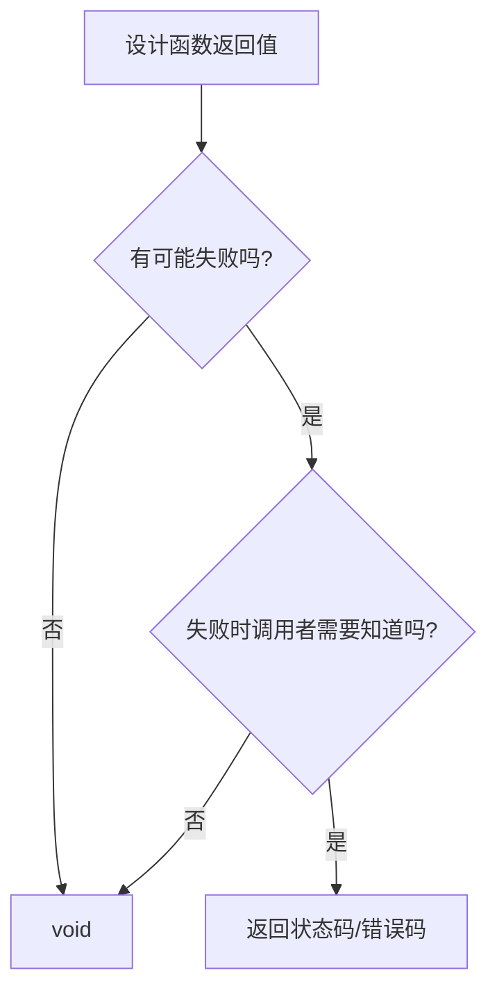

# 4. 嵌入式C函数设计

> 对应工程化第 2 层（代码质检），与 [项目结构与自检规范](../../../知识/嵌入式软件/工程化标准/2.%20嵌入式项目结构与自检规范.md) 互为补充。
> ⚠️ 来源文章所有代码示例均为截图，本页仅收录文字明确表述的规则；图片中的代码细节以原文为准。

## 核心问题

函数是 C 语言最基本的组织单元，也是嵌入式工程师每天写得最多的东西。典型痛点：接手一个三四百行、七八个参数、函数名 `Process()`、无返回值、全局变量满天飞的函数，"想改不敢改，读又读不懂"。设计一个函数时要回答四个问题：

1. 要不要入参？入参怎么设计？
2. 要不要返回值？返回什么？
3. 多长合适？做多少事合适？
4. 什么样的函数算"好函数"？

这些问题的经验值见下文——它们不是标准答案，但经过大量项目验证。

## 入参设计

入参的本质：**调用者对函数说的话——"这是你需要知道的信息，拿去干活"**。核心问题只有一个：函数完成它的工作，最少需要知道哪些信息？

### 显式依赖优于隐式依赖

常见反模式：`void Protocol_Parse(void)` 无入参，实际依赖两个全局变量（数据指针和长度）。问题有二：函数与全局变量绑死，换个场景无法复用；看函数声明完全猜不到它依赖什么。

**规则：函数所需的数据全部通过参数传入**。函数自己说清楚"我需要什么"，换一个串口的数据也能直接复用。判断标准：你过两个月回来看这个代码还能看懂。

### 参数个数

经验值：**控制在 3 个以内，最多不超过 5 个**。超过 3 个参数，大概率说明函数要么做的事太多，要么参数该打包了。

典型场景：发送一帧协议数据需要 7 个参数（帧头、命令字、数据指针、长度、CRC、超时、重试次数），调用时反复翻定义确认第 5 个参数是 timeout 还是 retry_cnt。**用结构体打包**的额外好处：以后加新字段（如优先级）只需改结构体，函数签名不动，所有调用方代码不用改。

### 值传递 vs 指针传递

C 语言只有值传递和指针传递两种方式：

| 场景 | 方式 | 原因 |
|------|------|------|
| 简单类型（int、uint8_t、float 等） | 传值 | 几个字节，传值效率高，函数内无法意外修改原始数据 |
| 结构体、数组、需要修改原始数据 | 传指针 | 嵌入式栈空间宝贵，几十字节的结构体按值传递浪费栈且多一次拷贝 |

**`const` 是契约**：入参加 `const` 是在告诉调用者"放心，我不会改你的数据"。多人协作项目中，这种契约能省掉大量不必要的沟通。

### 入参校验

嵌入式系统最常见的非法参数是**空指针**和**越界值**。空指针解引用轻则 HardFault，重则系统跑飞，现场无法定位。

规则：**在函数入口做防御性检查，但不要过度**——模块内部私有函数（static）若能确保调用方参数一定合法，可省掉检查以减少开销；**对外暴露的接口函数，参数校验不能省**。

## 返回值设计

入参是调用者告诉函数"你需要什么"，返回值是函数告诉调用者"事情办得怎么样"。嵌入式系统没有 try-catch、没有异常机制——函数出了问题如果不通过返回值告诉上层，上层就真的不知道。

### 必须返回值的三类场景

| 场景 | 失败方式 | 上层处理 |
|------|----------|----------|
| 硬件操作（I2C 读写、Flash 擦写、ADC 转换） | NACK、超时、转换未完成——硬件从来不是 100% 可靠 | 重试、报警或进入降级模式 |
| 数据解析与协议处理 | CRC 错误、帧长异常、命令字不支持 | 避免拿着一堆脏数据继续处理 |
| 资源获取（内存分配、队列创建、互斥锁获取，RTOS 环境） | 分配失败 | 不检查则后续空指针操作就是 HardFault |

### 可以用 void 的场景

- **必定成功的简单操作**——拉高一个 GPIO 不存在失败可能，硬加返回值是画蛇添足
- **回调函数**——框架和 RTOS 的回调签名本身就是 void，改不了也没必要改
- **纯通知/触发类操作**——软件复位、刷新看门狗，"发出去就完了"，不需要结果

**判断标准**：这个函数有没有可能失败？如果失败了，调用者需要知道吗？两个问题都回答"否"，就用 void；其他情况给返回值。

### 返回值的类型选择

**返回状态/错误码：用枚举或整数**。建议项目统一定义一套错误码，所有模块共用。惯例是 **0 表示成功、负数表示错误**——符合 C 语言社区惯例（POSIX 标准即如此）。

**返回数据本身：用具体类型**（如 `uint16_t ADC_Read()` 返回转换值）。但有个隐患：ADC 转换失败时返回值已被"正常数据"占用，没有地方放错误信息。解决办法是**数据通过指针参数带出，返回值只负责表示成败**——调用者既能拿到数据，又能知道数据是否有效。

### 有返回值却不检查，比没有还危险

调用 `I2C_Write`、`Queue_Send` 等有返回值的函数却不检查，比一开始写 void 更糟——它给人"我设计过错误处理"的假象，实际什么都没处理。

- MISRA-C 规范明确要求：**非 void 函数的返回值必须被使用**
- PC-lint、cppcheck 等静态分析工具能自动检出此类问题
- 确实不需要的返回值（如 `printf`），用 `(void)` 显式标记——既消除静态分析告警，也让读代码的人知道这是有意为之，不是忘了

## 好函数六条标准

### 1. 单一职责：一个函数只干一件事

典型反模式：一个三四百行的初始化函数把所有外设初始化全塞进去。问题：某一步失败定位费劲、无法单独测试单个外设、改一个配置要在几百行里大海捞针。拆开后每个子函数各管一件事，主函数只负责"编排调用顺序"和"处理错误"。

**判断方法：试着给函数取名字。如果要用"和"字或"并且"才能描述清楚它做了什么，多半需要拆。**

### 2. 函数长度

经验值：**嵌入式函数控制在 50 行以内**，超过 80 行就要认真想想能不能拆。

依据：嵌入式 IDE（Keil、IAR、CubeIDE）编辑区通常一屏 40~50 行，一个函数一屏内看完，阅读负担最低。不是死规矩——协议分发函数（二三十个命令）、大量寄存器配置的外设初始化天然较长，强行拆分反而让逻辑更碎。关键是可读性，不是死守行数。

### 3. 命名：让名字替你写注释

两种极端都不可取：极度简略（`proc()`、`do_it()`、`func1()`——必须点进实现才知道干什么）；极度冗长（`Process_UART1_Receive_Data_And_Check_CRC_Then_Parse_Protocol_Frame()`——大概率违反单一职责）。

三个要点：

- **动词开头**——说明函数在做什么动作
- **模块前缀**——C 语言没有命名空间，嵌入式项目尤其重要
- **准确用词**——不同的动词表达不同语义（如 get/read/fetch 各有所指）

### 4. 副作用可控

副作用 = 函数除了计算结果和返回值之外，还偷偷干了别的事。最典型的是修改全局变量：一个"读传感器"的函数偷偷改了错误计数器，若另一处也在操作同一变量，RTOS 或中断环境下就可能出现竞态条件。

不是绝对不能有副作用，而是**副作用要显而易见**：函数会修改全局状态，要么在函数名中体现，要么在注释里明确说明；最好把状态管理集中到一个地方，而非散落各函数。

### 5. 函数出口：提前返回

MISRA-C 要求单一出口（每个函数只有一个 return），但严格执行往往导致大量嵌套 if-else，反而降低可读性。折中做法：**在函数开头用"提前返回"处理错误情况，末尾统一返回正常结果**。异常情况在开头就被过滤掉，主逻辑不需要嵌套在 if 里。

### 6. 分层：该调用谁，不该调用谁

原则：**上层调用下层，下层不要反向调用上层**。下层需要通知上层时（如串口收到数据通知应用层），用回调函数或事件机制——而不是在驱动层里直接 `#include "app.h"` 再调用应用层函数。遵守此原则，驱动层就能在不同项目中复用，而不是跟特定应用绑死。

> 与 [项目结构与自检规范](../../../知识/嵌入式软件/工程化标准/2.%20嵌入式项目结构与自检规范.md) 的 app/bsp/hal 分层规则同源：app 层调 `led_on()`，由 bsp 层实现并调用 `HAL_GPIO_WritePin`。

## 嵌入式环境特殊考量

### 栈空间：函数不能太"贪心"

MCU 栈空间通常很有限——一个 Cortex-M0 项目整个栈可能就 1KB~2KB。函数里定义一个大数组，调用层级一深，栈溢出就来了。嵌入式栈溢出不会像 PC 那样弹错误框，表现往往是：程序莫名其妙跑飞、变量值被"鬼改"、进入 HardFault——定位极其痛苦。

应对措施：

- 局部大数组改用 static 或全局变量（注意可重入性，见下）
- 减少不必要的调用层级，避免递归调用
- 大块数据通过指针传入，而不是在栈上拷贝
- 开发阶段用工具检测栈使用（Keil 的 Call Graph 能分析最大栈深度）

### 中断上下文：有些事不能在中断里做

ISR 的严格限制：执行时间尽可能短、不能调用可能阻塞的函数、不能调用不可重入的函数、RTOS 环境中只能调用带 `FromISR` 后缀的 API（见 [FreeRTOS 中断管理](../../../知识/嵌入式软件/FreeRTOS/11.%20FreeRTOS%20中断管理.md)）。

环形缓冲区是典型例子：单生产者（中断里写）+ 单消费者（主循环里读）模式下，只要 head/tail 操作是原子的（ARM Cortex-M 的 32 位对齐变量通常满足），就不需要额外加锁；但生产者和消费者都可能在任意上下文执行时，就需要关中断保护。

**设计原则：中断里只做最少的事情，把复杂处理留给主循环。**

### 可重入性：同一个函数能被同时调用吗？

函数执行到一半被中断打断，中断里又调用了同一个函数——如果函数内部使用 static 局部变量或全局变量就可能出问题。经典陷阱 `IntToStr()`：`buf` 是 static 的，所有调用共享同一块内存；主循环调用 `IntToStr(42)` 得到 `"42"` 还没来得及用，中断里调用 `IntToStr(100)` 把 `buf` 覆盖成 `"100"`，主循环拿到的结果就变了。

让函数可重入的办法：

- 避免使用 static 和全局变量（或用锁保护）
- 所有数据通过参数传入和传出
- 不调用其他不可重入的函数

这也是"入参传指针而非依赖全局变量"的重要原因之一。

## 重构方法论：从"问题函数"到"好函数"

典型案例：读取温湿度传感器数据并通过协议上报。

**原始代码的问题清单**（四项职责揉在一个函数里）：

- **职责不清**：读传感器、校验数据、拆解数据、组帧发送四件事全在一个函数
- **全局变量泛滥**：`g_sensor_buf`、`g_send_buf`、`g_temp_h` 等 5 个全局变量
- **没有返回值**：I2C 通信失败、校验失败，上层完全不知道
- **不可复用**：换一个传感器或换一种协议，整个函数要推倒重来
- **不可测试**：依赖硬件 I2C，无法脱离硬件做单元测试

**重构后的结构**：

- `Sensor_Read()` — 只管读传感器，换传感器只改这一个函数
- `Protocol_BuildSensorReport()` — 只管组帧，换协议只改这一个函数
- `SensorTask_Run()` — 只管编排调用顺序和处理错误
- 全局变量全部消除，数据通过参数在函数间流动
- 每一步都有错误检查，任何环节出问题都能及时发现

**通用模式**：按职责拆分为"执行具体操作的函数"+"编排调用的任务函数"，前者可复用可测试，后者集中错误处理。

## 自检清单

每写完一个函数或 review 代码时快速过一遍：

1. 这个函数的**入参够不够？多不多**？
2. 它**需要告诉调用者结果吗**？
3. 它是不是**在干不止一件事**？

坚持思考这三个问题，代码质量就会有肉眼可见的提升。

> ⚠️ 图片读取：原文另有一张完整的函数设计自检清单截图（第六节），包含的更多细项无法从图片可靠提取，请回原文确认。

## 与其他页面的关系

- 函数设计是 [工程化四层模型](../../../知识/嵌入式软件/工程化标准/1.%20嵌入式软件工程化总论.md) 中第 2 层（代码质检）的落地手段之一
- 分层调用规则与 [项目结构规范](../../../知识/嵌入式软件/工程化标准/2.%20嵌入式项目结构与自检规范.md) 的 app/bsp/hal 分层一致
- ISR 约束中的 FromISR API 见 [FreeRTOS 中断管理](../../../知识/嵌入式软件/FreeRTOS/11.%20FreeRTOS%20中断管理.md)
- 函数级规范是 [固件开发流程](../../../知识/嵌入式软件/嵌入式固件开发流程.md) 中"模块开发"与"质量门"环节的支撑
