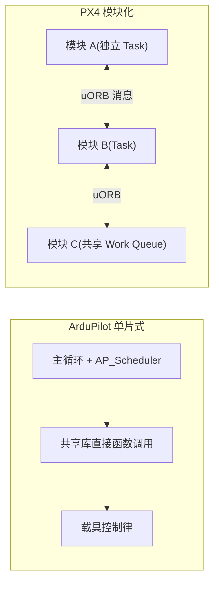

# ArduPilot vs PX4

ArduPilot 与 PX4 同源于早期开源无人机社区,是当今事实上的两大开源自动驾驶仪软件。二者曾同属 2015 年成立的 Dronecode Foundation,2016 年 9 月 ArduPilot 因治理与许可证路线分歧退出,此后走上截然不同的技术路线。

## 综合对比

| 维度 | ArduPilot | PX4 |
|------|-----------|-----|
| 总体架构 | 单片式二进制,面向对象,载具顶层目录 + 共享 AP_* 库 | 模块化,独立模块 + uORB 发布/订阅消息总线,反应式设计 |
| RTOS | ChibiOS/RT(STM32);另有 Linux/ESP32(经 AP_HAL) | NuttX(主);POSIX 环境(Linux/macOS)、QuRT |
| 调度模型 | 主循环 + 表驱动 AP_Scheduler,以 IMU 采样为节拍,协作式分片 | 抢占式多任务;模块以独立 Task 或共享 Work Queue 运行,消息驱动 |
| 构建系统 | waf | Make 封装 + CMake(Kconfig 板级配置) |
| 估计器 | EKF3(默认):lane + affinity 自动切换,封装度高 | EKF2(ECL 库):EKF2_MULTI_IMU/MAG 参数矩阵,可调项多 |
| 控制分配 | 混控在各载具代码内(Copter Motors Library 等) | 独立 control_allocator 模块(v1.13+ 取代 mixer)+ 输出函数抽象 |
| 载具广度 | 6 类一等公民(含 Heli/Blimp/Tracker 深度维护) | 3 类主力(MC/FW/VTOL)+ 多类实验性(Rover/飞艇/旋翼机/气球/航天器/水下) |
| 许可证 | GPLv3(衍生必须开源) | BSD-3-Clause(可闭源商用);硬件 CC-BY-SA 3.0 |
| 治理 | 独立社区(ardupilot.org)+ Partners 计划 | Dronecode Foundation(Linux Foundation 旗下) |
| 硬件覆盖 | Pixhawk 全系 + 数十块 FPV 级 F4/F7/H7 板(下探 1MB flash) | Pixhawk 标准板为核心(FMUv2–v6X),1MB 板基本退场 |
| ROS 2 集成 | AP_DDS 桥接(4.2+ 逐步增强) | uXRCE-DDS 桥接为一等特性,消息版本化对齐 ROS 2 |
| 发布节奏 | 约 13~14 个月一个大版本(4.7 为 2026-07) | 约半年一大版本(1.17 stable / 1.18 beta) |
| 典型定位 | 爱好者/消费级/多载具现场部署/快速迭代 | 研究/学术/商业 VTOL 与认证市场 |

## 架构路线:单片 vs 模块化

- **PX4 的反应式设计**:功能划分为可交换组件,官方声明模块可"被快速替换,甚至在运行时替换";uORB 基于共享内存,多实例 topic 支持同名传感器,v1.16 起消息版本化以兼容 ROS 2。
- **ArduPilot 的协作式分片**:任务在单一主循环内按表执行,任务约定"不阻塞、不 sleep、最坏时间可预测",以 IMU 采样节拍天然对齐控制律确定性。
- **RTOS 选择是架构的镜像**:PX4 依赖 NuttX 的 POSIX 兼容(VFS、线程、可加载模块)支撑模块化;ArduPilot 单片架构不需要 POSIX,从 ChibiOS 更轻的内核获得更低资源占用,得以把完整栈(含多 IMU/EKF)跑在低端 STM32F4 上(⚠️ 社区论断,非官方数据)。
- **Bootloader 差异**:ArduPilot 自研 ChibiOS bootloader(协议与 PX4 bootloader 兼容但板 ID 体系不同,H7 板带 PX4 bootloader 直接跑 ArduPilot 会因 RAM 初始化差异崩溃,需 `USE_ALT_RAM_MAP` 规避)。

## 估计器对比

- **ArduPilot EKF3**:lane + affinity + 自动切换封装成少数高层决策,官方立场"大多数用户不需要修改任何 EKF 参数"(详见 [无人机飞控/ArduPilot EKF3 姿态估计](ArduPilot%20EKF3%20姿态估计.md))。
- **PX4 EKF2(ECL)**:把组合逻辑摊开成参数矩阵(EKF2_GPS_CTRL / EKF2_BARO_CTRL / EKF2_RNG_CTRL / EKF2_HGT_REF 等),附加 GSF yaw 多假设滤波器。
- 两者殊途同归:都做多实例冗余与源选择,差异在于**封装哲学**。

## 许可证与治理:2016 年分裂

- 2016-09:tridge 公开声明称 Dronecode Platinum 成员(3DR、Intel、Qualcomm)策划"政变"——将顶级开源项目移出 TSC,要求各项目交出商标、账号与域名控制权;PX4 接受条件留下,ArduPilot 拒绝并退出,独立成立 ardupilot.org。
- **许可证是分裂的根源**:GPLv3(ArduPilot)强制回馈 vs BSD(Platinum 成员意图打造可闭源商业化平台)。
- **商业生态分化**:PX4 侧 Auterion(作者 Lorenz Meier 联合创办)贡献占比 52.7%(2022),提供企业版 AuterionOS 与认证化 PX4 Pro 路线;ArduPilot 侧以开源硬件厂商(CubePilot/Holybro/mRo/Blue Robotics)为主,闭源整机商走"飞控开源 + companion computer 闭源"路径。

## 生态定位

- **PX4**:模块可替换 + BSD + ROS 2 一等集成 → 学术论文平台与商业整机首选(多个研究组明确因"模块可替换 + ROS 2 + 文档整洁"选 PX4)。
- **ArduPilot**:载具/硬件广度 + GPL 社区 + 快速迭代 → 爱好者、现场部署、BVLOS/恶劣环境场景声誉强。社区共识:"开发者偏爱 PX4,试飞员偏爱 ArduPilot"。
- 双方在估计器多实例冗余、控制分配抽象、MAVLink 2 签名等方向上正在**趋同**。

## 相关页面

- [无人机飞控/ArduPilot 架构总览](ArduPilot%20架构总览.md) — ArduPilot 侧架构细节
- [无人机飞控/ArduPilot EKF3 姿态估计](ArduPilot%20EKF3%20姿态估计.md) — EKF3 机制
- [无人机飞控/MAVLink 协议](MAVLink%20协议.md) — 双方共享的通信标准
- [无人机飞控/ArduPilot 治理与生态](ArduPilot%20治理与生态.md) — 治理细节与商业生态
