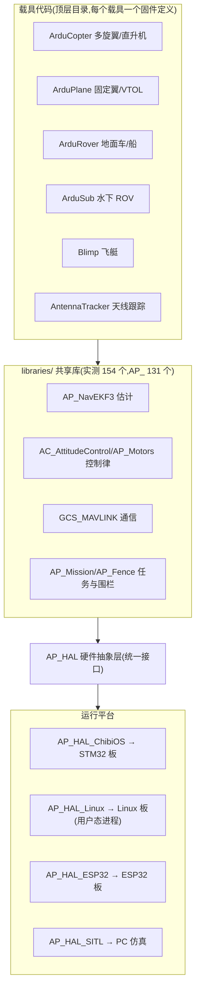

# ArduPilot 架构总览

ArduPilot 是全球装机量最大的开源自动驾驶仪软件(官网自述超 100 万台 ⚠️ 厂商口径),GPLv3 许可。核心 git 树约 70 万行代码(官方文档口径),一套 C++ 代码库同时驱动 6 类载具,仓库规模实测 15.7k stars / 73,442 次提交 / 312 名有 commit 计数的贡献者(2026-08 实测)。

## 分层架构



架构要点:

- **载具目录只保留载具专属控制律与参数表**,一切可共享逻辑收敛进 `libraries/`;每个载具目录内的 `wscript` 声明其库依赖。
- **AP_HAL** 是可移植性根基:2012 年由 Pat Hickey 引入,每类板卡一个实现后端,上层代码不感知硬件差异。
- **外部支持代码以 git submodule 导入**:ChibiOS(RTOS)、mavlink(协议)、DroneCAN(CAN 外设)、waf、gtest 等共 15 个 submodule。

## 调度与线程模型

ArduPilot 保留了 Arduino 的 `setup()/loop()` 外壳,但内部是真正的多线程系统:

- **AP_Scheduler 表驱动调度**:主循环以 `ins.wait_for_sample()`(等待新 IMU 采样)为节拍器,在相邻 IMU 采样之间依表调用任务。每个任务带两个数字 —— 调用频率(以调度步为单位)和预估最坏执行时间(超时则本轮跳过)。
- **任务约定**:不阻塞、飞行中不 sleep、最坏时间可预测。
- **HAL 线程**:UART 线程(串口/USB 收发)、timer 线程(承载 1kHz 定时器,`hal.scheduler->register_timer_process()` 注册回调)、IO 线程(写 microSD/EEPROM/FRAM,低实时优先级——慢速存储 IO 通过 `register_io_process()` 挂载,避免阻塞高速传感器处理)。
- **并发保护**:AP_HAL 信号量(如 I2C 总线互斥)+ 无锁数据结构(环形缓冲)。

> [!note] 与通用 RTOS 的关系
> ArduPilot 自己实现了一套"协作式分片 + 少量系统线程"的调度哲学,而非依赖通用 RTOS 的任务模型。ChibiOS 只提供内核与驱动,上层调度策略完全由 ArduPilot 掌控。这与 [FreeRTOS](../../知识/嵌入式软件/FreeRTOS/1.%20FreeRTOS%20概述与架构.md) 的抢占式多任务、以及 [Zephyr](../../知识/嵌入式软件/Zephyr/2.%20Zephyr%20内核深度.md) 的双优先级+EDF 模型形成有趣的对照 —— 飞控场景用"IMU 采样节拍"天然对齐了控制律的确定性需求。

## 构建系统:waf

统一使用 waf(Python 编写)构建,一条命令覆盖全目标:

```bash
./waf configure --board CubeOrange   # 选板卡(./waf list_boards 列出支持列表)
./waf copter                          # 构建载具目标
```

- 构建目标:`copter` / `heli`(直升机,基于 Copter 代码)/ `plane`(含 VTOL)/ `rover` / `sub` / `antennatracker` / `AP_Periph`(外设固件);`--board sitl` 构建软件在环仿真。
- 另有 Custom Firmware Build Server(custom.ardupilot.org):无需本地工具链即可定制功能集生成固件。

## 运行平台

| 平台 | 方式 | 备注 |
|------|------|------|
| STM32(F4/F7/H7) | 单二进制直接运行在 ChibiOS/RT 上 | 2018 年起主线(Plane 3.9 / Copter 3.6),此前为 PX4/NuttX 栈 |
| Linux 板 | AP_HAL_Linux 用户态进程 | Navio2、BeagleBone Black、Bebop 等 |
| ESP32 | AP_HAL_ESP32 | Copter 4.4 起支持 |
| SITL | PC 原生可执行文件 | 桌面 C++ 全工具链(调试器/静态分析)可用 |

## 工程实践

- **分支策略**:无长期开发分支,所有 PR 从 fork 直接合 master;commit 必须单库单事、首行 <72 字符、禁 merge commit。
- **CI 矩阵**(30 个 workflow 实测):每载具独立 SITL 功能测试(test_sitl_copter/plane/rover/sub/tracker/periph/blimp)、全板卡编译矩阵(test_chibios/test_size/test_linux_sbc 等)、固件体积回归、单元测试 + 覆盖率、日志回放(Replay)、Lua/DDS 专项测试、pre-commit 与分支规范检查;已启用 GitHub Copilot PR 评审。
- **autotest 框架**:Python 驱动的 SITL 端到端测试,始于 2011 年,公开看板 autotest.ardupilot.org。
- **发布节奏**:大版本约 13~14 个月(4.5.0 → 4.6.0 → 4.7.0,2024-04 → 2025-05 → 2026-07);每载具独立 tag;发布后先密集修补(点版本初期约每月 1 个)。

## 扩展机制

- **Lua 机载脚本**(AP_Scripting):沙箱化 Lua 5.3.5,脚本放 SD 卡 `APM/scripts/`,低优先级时间片执行;可监视/操纵载具状态、发 MAVLink 命令、与 DroneCAN 外设通信,甚至为新硬件提供 Lua 驱动。2MB flash / 80kB 内存以上板支持,F4 板不支持。
- **AP_Periph**:把 ArduPilot 支持的小板刷成 DroneCAN 外设固件(GPS、空速计、电池监测、ESC 遥测节点),2019 年 Plane 4.0 引入,有独立发布线。
- **AP_DDS**:ROS 2 集成桥,配合 Micro-XRCE-DDS。

## 载具类型一览

| 载具 | 定位 | 特色功能示例 |
|------|------|--------------|
| Copter | 多旋翼 + 传统直升机 | 25 种飞行模式、避障、Throw 抛投起飞、Turtle 翻转自救 |
| Plane | 固定翼/飞翼/QuadPlane VTOL | 自动起降、地形跟随、舰船动平台起降、自主滑翔 |
| Rover | 地面车/水面艇 | 滑移转向、全向轮、帆船、平衡车;L1 导航控制器 |
| Sub | 水下 ROV | 3~8 推进器构型、深度控制、声学定位、BlueOS 配套 |
| Blimp | 轻于空气飞行器 | 低速场景,必须装罗盘(航向估计才收敛) |
| AntennaTracker | 地面天线跟踪 | 按载具与地面站 GPS 计算方位/仰角驱动云台 |

## 相关页面

- [无人机飞控/ArduPilot EKF3 姿态估计](../../知识/无人机飞控/ArduPilot%20EKF3%20姿态估计.md) — 姿态/位置估计中枢
- [无人机飞控/MAVLink 协议](../../知识/无人机飞控/MAVLink%20协议.md) — 通信协议
- [无人机飞控/ArduPilot vs PX4](../../知识/无人机飞控/ArduPilot%20vs%20PX4.md) — 与 PX4 的路线对比
- [无人机飞控/ArduPilot 治理与生态](../../知识/无人机飞控/ArduPilot%20治理与生态.md) — 历史、治理与硬件生态
- [嵌入式系统/STM32H7 域架构与存储体系](../../知识/嵌入式系统/STM32H7%20域架构与存储体系.md) — 飞控主控芯片平台
