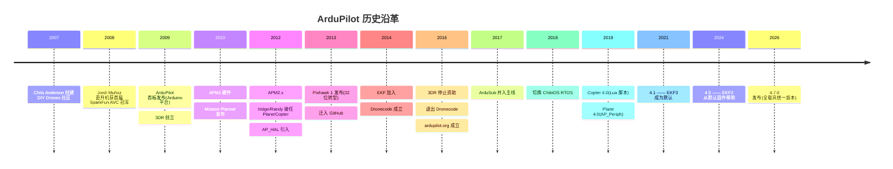

# ArduPilot 治理与生态

## 历史沿革

起源细节:Chris Anderson(时任《WIRED》主编)与 Jordi Muñoz 创立 3D Robotics(3DR);「Ardu」源于最初运行在 Arduino 平台。2015 年 3DR 发布消费级无人机 Solo,在 DJI 竞争下惨败(⚠️ 存疑:截至 2015 年底仅售出约 22,000 台,数字来自 Forbes 二手转述),2016-03 裁员(350+ → 约 70 人)并停止对社区的直接资助。

## 治理结构

- **Lead maintainers 分工制**(2012 年确立至今):Copter — Randy Mackay;Plane/Tracker — tridge(Andrew Tridgell,Samba 作者);Rover — gmorph;Sub — williangalvani;Bug Master — oxinarf。
- **Funding Committee**:3 人(现任 Andrew Tridgell、James Pattison、Andy Piper),开发团队每年 12 月选举;提案制——任何人可提交 ≤2 页开发提案,$2,000 以下委员会自批,以上须全体开发团队投票。
- **Partners Program**(2016 年起,最主要资金来源):最低 US$1,500/年,现有 80+ 家(CubePilot、Holybro、CUAV、mRobotics、MatekSys、Blue Robotics、LightWare、ModalAI、Flytrex 等);回报为私有支持频道、月度电话会参与优先级讨论、Partner 徽标;经费用于服务器、3 名兼职支持工程师、文档维护者。
- **法人实体**:Software in the Public Interest(SPI,美国 501(c)(3),2016 年 5 月起列为 associated project,托管服务器等固定开销)+ ArduPilot Foundation(澳大利亚非营利,捐款接收方;⚠️ 注册年份未载明)。
- **行为准则**(2018-01):"为所有人的和平福祉",不以任何形式支持将 ArduPilot 武器化;仅约束开发团队成员,GPLv3 本身无法禁止军事用途(2025 年乌克兰"蜘蛛网行动"曾用 ArduPilot 集群,BBC Verify 报道)。

## 硬件谱系

| 世代 | 代表板 | 主控 | 要点 |
|------|--------|------|------|
| 1(2009) | ArduPilot v1/v2 | ATmega328(Arduino) | 热电堆地平线感知 |
| 2(2010–2013) | APM1 / APM2.x | ATmega2560 | MPU-6000 + MS5611;2012 Outback Challenge 冠军 |
| 3(2013–2016) | Pixhawk 1(FMUv2) | STM32F427(Cortex-M4,168MHz) | 双 MCU(STM32F103 IO 协处理器);早期芯片缺陷致 1MB flash 可用——「1MB 板」由来 |
| 3.5(2015–) | Pixhawk 2 / The Cube | Cube Black:F427;Cube Orange(2019):STM32H753 | 三冗余 IMU + 加热恒温;80-pin 载板接口;CubePilot 制造 |
| 4(2022–) | Holybro Pixhawk 6X/6C(FMUv6x/v6c) | STM32H753 / H743 | 100-pin Autopilot Bus 模块化;Ethernet 接 companion computer |
| Linux 系 | Navio2 / Navigator / BeagleBone | Cortex-A + Linux | AP_HAL_Linux 用户态 |
| 新兴(2023–) | ESP32 系列 | 双核 Tensilica | Copter 4.4 起 |

飞控主控的 H7 平台细节见 [嵌入式系统/STM32H7 域架构与存储体系](../嵌入式系统/STM32H7%20域架构与存储体系.md)。

- **Pixhawk 标准**:名称源自 ETH 学生团队,现为 Dronecode 注册商标,由 Pixhawk SIG 维护 FMU/Autopilot Bus/Connector(Pixhawk Standard 连接器)等开放标准;ArduPilot 与 PX4 双固件共享该硬件生态。
- **固件分级**:完整固件超 1MB;1MB flash 板发布自动裁剪固件(无 Lua/ADSB/FFT 等),2MB 板全功能;Custom Firmware Build Server 可自助裁剪;实测 Copter stable 有 636 个构建变体(2026-08)。

## 外设生态

- **GPS/RTK**:uBlox 系(M8/M9/M10 → F9 RTK),Here3/Here4、ArduSimple;GPS-for-yaw 双天线定向。
- **CAN/DroneCAN**:AP_Periph 体系把小板刷成 GPS/空速/ESC 遥测节点(物理层即 [CAN 总线](../通讯网络/CAN%20总线协议基础.md))。
- **感知**:LightWare/Benewake/TeraRanger 激光雷达(避障/定高/精密降落)、光流、Intel RealSense、ModalAI VOXL。
- **其他**:ADS-B IN(uAvionix)、EFI 燃油发动机(DroneCAN/PiccoloCAN)、DShot/bdshot 双向电调遥测、Gremsy 云台。

## 社区规模(2026-08 实测)

| 指标 | 数值 |
|------|------|
| GitHub stars / forks | 15,736 / 21,273 |
| 贡献者(有 commit 计数) | 312 |
| 论坛主题 / 用户 | 58,879 / 43,789 |
| 论坛 30 天活跃 | 882 |
| GSoC | 2017 年起持续作为导师组织 |
| 开发者大会 | Unconference(2017–2023)→ Developer Conference(2024 加贺、2025 约克郡、2026 渥太华) |

## 与 MAVLink 的关系

MAVLink 协议 2009 年由 Lorenz Meier 以 LGPL 发布;ArduPilot 是最早的实现方之一(2010-07 其 HIL 测试逻辑即被整合进 MAVLink),MAVLink 官方指南将 ArduPilot 列为第一实现,`ardupilotmega.xml` 是其专用方言;ArduPilot 团队同时维护 pymavlink 与 MAVProxy 两个工具链核心件。协议细节见 [无人机飞控/MAVLink 协议](MAVLink%20协议.md)。

## 相关页面

- [无人机飞控/ArduPilot 架构总览](ArduPilot%20架构总览.md) — 软件架构
- [无人机飞控/ArduPilot vs PX4](ArduPilot%20vs%20PX4.md) — 与 PX4 的治理与路线对比
