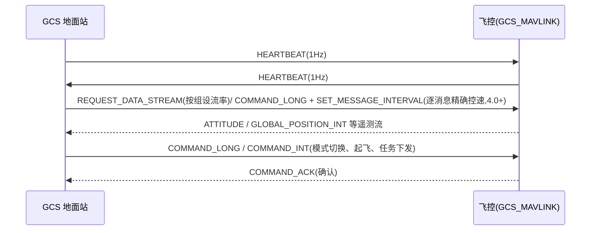

# MAVLink 协议

MAVLink(Micro Air Vehicle Link)是飞控与地面站(GCS)/机载电脑之间的轻量二进制消息协议,2009 年初由 Lorenz Meier(ETH Zürich)以 LGPL 发布,面向资源受限系统设计为 header-only 消息编组库。不依赖底层传输:串口、900MHz 数传、WiFi、以太网均可承载。

## 帧格式

| 字段 | v1 | v2 |
|------|----|----|
| 起始符 | 0xFE | 0xFD |
| 负载长度 | 1 B | 1 B |
| 兼容/不兼容标志 | — | 2 B(v2 新增) |
| 包序号 | 1 B(丢包检测) | 1 B |
| System ID | 1 B(载具默认 1,GCS 常用 255) | 1 B |
| Component ID | 1 B(飞控/GCS 通常 1;同系统内机载电脑/云台用其他值) | 1 B |
| Message ID | 1 B(HEARTBEAT=0;v2 支持 >255) | 3 B |
| 负载 | 0–255 B | 0–255 B |
| 校验(CRC) | 2 B | 2 B |
| 签名(可选) | — | 13 B(link_id + 时间戳 6B + 签名 6B) |
| 每包开销 | 8 B | 12 B(+13 B 签名) |
| 最大包长 | 263 B | 280 B |

## 通信流程

- 消息不保证送达,上层需检查 ACK/状态确认执行结果。
- 任务指令(MAV_CMD 子集)存储在飞控 EEPROM,切到 Auto 模式逐条执行;Copter 的 Guided 模式支持 `SET_POSITION_TARGET_LOCAL_NED`(需持续发送,超时 `GUIDED_TIMEOUT` 回退)、`SET_ATTITUDE_TARGET`;Plane 用 `MISSION_ITEM_INT`(current=2)实现 goto。
- 机载电脑(Raspberry Pi/Jetson)经串口/USB/以太网接入,可通过 `ODOMETRY` / `VISION_POSITION_ESTIMATE` 消息向飞控提供外部导航信息。

## 消息集与方言

- 通用消息定义在 `common.xml`;ArduPilot 的专用方言是 `ardupilotmega.xml`(消息/命令全集按载具分类)。ArduPilot 维护自有 mavlink fork 作为 submodule。
- MAVLink 2 相对 v1:消息签名、Message ID 扩展到 24 位、为既有消息追加扩展字段(向后兼容 v1);飞控串口设 `SERIALx_PROTOCOL=2` 启用。

## 在 ArduPilot 中的实现

- `GCS_MAVLINK` 类处理解析、路由、消息调度与协议逻辑,`GCS` 提供高层抽象;支持多条 MAVLink 通道、可配置流率与协议版本。
- 签名默认关闭,需显式开启;⚠️ 未启用签名时存在未认证链路注入风险(参考 CVE-2026-1579:PX4 未签名时 SERIAL_CONTROL 可被未认证调用——同为 MAVLink 生态的安全教训)。

## 生态关系

- **实现方**:ArduPilot 与 PX4 是最主要的两大实现;地面站 Mission Planner、QGroundControl、MAVProxy 全部以 MAVLink 为接口。
- **工具链**:pymavlink(Python 库,由 ArduPilot 的 tridge 开发)、MAVSDK(Dronecode 旗下,主要与 PX4 生态绑定)。
- **DroneCAN**:与 MAVLink 互补 —— MAVLink 用于飞控↔地面站/机载电脑链路,DroneCAN 用于飞控↔外设(CAN 物理层,基于 [CAN 总线](../通讯网络/CAN%20总线协议基础.md))。
- 底层物理承载最常用 [UART 串口](../通讯网络/UART%20串行通信.md) 数传电台(SiK 433/915MHz),协议本身与物理层解耦。

## 相关页面

- [无人机飞控/ArduPilot 架构总览](ArduPilot%20架构总览.md) — GCS_MAVLINK 在架构中的位置
- [无人机飞控/ArduPilot vs PX4](ArduPilot%20vs%20PX4.md) — 两项目 MAVLink 立场对比
- [通讯网络/CAN 总线协议基础](../通讯网络/CAN%20总线协议基础.md) — DroneCAN 的物理层基础
- [通讯网络/UART 串行通信](../通讯网络/UART%20串行通信.md) — 最常见承载链路
