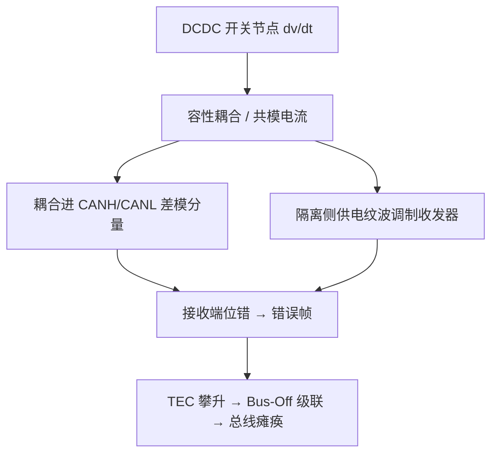

# DCDC 开关噪声对 CAN 总线的干扰

> [!danger] EMC 核心教训
> DCDC 开关电源噪声耦合到 CAN 总线会造成**看似随机、实则确定性**的通信故障:随机节点失联、持续错误帧、运行一段时间后整条总线瘫痪。这类故障极易被误判为协议/固件问题,浪费数天排查。**遇到 CAN 异常,第一件事做电源路径 A/B 测试。**

⚠️ 工程经验:本页症状与诊断方法来自 2026-08-21 现场调试记录,机理为通用 EMC 原理推断,非文献实验数据。

## 症状(实测)

1. **帧在固定位位置被破坏**:逻辑分析仪位级解码显示,每个错误帧在相同 bit 位置(如数据场前部)被打断 — 噪声与位流耦合是确定性的,不是随机接触问题;
2. **错误风暴 + 随机子集响应**:某个节点持续对每帧发错误标志,总线被错误帧淹没;偶尔侥幸通过的帧让部分节点工作 → "随机驱动随机个节点";
3. **级联 Bus-Off**:错误帧推高各节点发送错误计数(TEC),节点逐个进入 Bus-Off 停止应答,一段时间后整条总线静默;
4. **电源 A/B 判据**:切换供电路径(板载 DCDC 输入 → 外部稳压输入)后故障全部消失。

## 机理

关键路径:

- **总线直耦**:开关节点的高 dv/dt 通过寄生电容注入 CANH/CANL,在收发器采样点造成位错;
- **供电纹波**:隔离 CAN 的隔离侧电源(VDD2)若来自未经滤波的 DCDC,纹波直接调制收发器输出级,严重时收发器输出自激(总线上表现为无帧结构的周期振荡)。

## 诊断方法(按序执行)

1. **电源路径 A/B 测试**(最快):板载 DCDC 供电 vs 外部稳压供电,对比总线行为;
2. 逻辑分析仪位级解码:统计错误帧的 bit 死亡位置分布 — **固定位置 = 确定性耦合(电源/噪声类);随机位置 = 接触类故障**;
3. 无通信时测总线波形:若出现与 DCDC 开关频率同频段的周期脉冲串,实锤耦合路径;
4. 节点逐台断电隔离,排除单节点故障。

## 设计对策(按优先级)

1. **开关环路最小化**,开关节点远离 CAN 走线,必要时地线屏蔽;
2. **隔离侧供电质量**:收发器/隔离器电源用 LDO 或 π 型 LC 滤波,去耦电容就近放置 — 这是隔离 CAN 最薄弱的环节;
3. 总线两端正确终端(60 Ω)+ 共模扼流圈(CMC);
4. 展频降低峰值谱密度(辅助手段);
5. PCB 评审时把 CAN 走线按模拟敏感信号对待。

## 相关页面

- [展频谱与EMI抑制](../../知识/电源电子/展频谱与EMI抑制.md)
- [电磁屏蔽原理与工程设计](../../知识/电源电子/电磁屏蔽原理与工程设计.md)
- [DC-DC降压转换器](../../知识/电源电子/DC-DC降压转换器.md)
