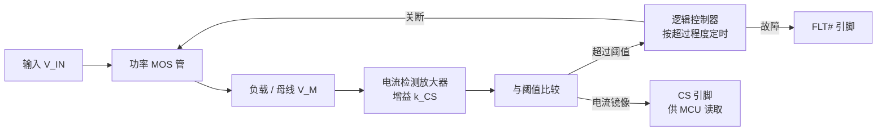

# e-Fuse 电子保险丝

e-Fuse（electronic fuse，电子保险丝）是**板级的可编程过流保护器件**：由功率 MOS 管、电流检测放大器和逻辑控制器构成，实时监测负载电流，按超过阈值的程度在相应时间内关断 MOS 管——**电流越大，关得越快**。

它与传统熔断式保险丝的根本差异在于：传统保险丝到达熔断点即**物理断开**（一次性、不可恢复）；e-Fuse 到达阈值只是**关断 MOS 管**，可由 MCU 重新打开。传统保险丝**没有"熔断阈值"这个概念**，只有熔断点。

## 定位：它保护的是什么

e-Fuse 属于**板级/母线级保护**，与开关电源 IC 的**片内保护**是两个层次：

| 层次 | 保护对象 | 典型手段 | 相关页面 |
|------|---------|---------|---------|
| **片内保护** | 电源 IC 自身功率级 | OCP / OVP / UVLO / OTP，由 IC 内部逻辑实现 | [电源保护机制](电源保护机制.md) |
| **板级保护** | 母线、线束、负载、下游电路 | 熔断器 / 断路器 / **e-Fuse** / 热插拔控制器 | 本页 |

片内保护在芯片**已经受损的边缘**才动作；母线级保护要回答的是另一个问题：**当电机堵转、线束短路或 MOS 管击穿时，谁来切断整条通路**。传统功率保险丝是这个位置的历史答案，e-Fuse 是它的可编程替代。

## 1. 架构与工作原理



工作流程：

1. 实时采样负载电流，经 SENSE 放大器放大
2. 与预设熔断阈值比较
3. **根据超过的程度，在不同时间内关断** —— 超得越多，断得越快
4. 关断期间可由 MCU 控制重新打开

这一条"按超过程度决定时间"的行为，正是传统保险丝的反时限（inverse-time）特性，但由电路而非热熔断实现——**因而可编程、可恢复、可诊断**。

## 2. 与传统保险丝的全维度对比

| 维度 | 传统熔断保险丝 | e-Fuse | 差距 |
|------|--------------|--------|------|
| **响应速度** | 过载 10 倍时典型**几毫秒** | 短路保护**微秒级** | **三个数量级** |
| **精度** | ±20% | ±10% | 2× |
| **可恢复性** | 一次性，断了即废 | 关断后可由 MCU 恢复 | 定性差异 |
| **诊断能力** | 无 | FLT# / TS（温度）/ CS（电流）可实时读取 | 定性差异 |
| **待机** | 无待机概念，永远在线 | 支持低 IQ 模式与 shutdown | 定性差异 |
| **体积** | 汽车保险丝 + 底座约 30×25mm | QFN-30 封装 5×6mm | **面积差 ~20 倍** |
| **成本** | 约 2~5 元 | 约 8~15 元 | e-Fuse 贵 |

**三个数量级的响应速度差**是核心：电机堵转或线束短路的瞬间，传统保险丝还在热熔断的延迟中，MOS 管或板子可能已经烧完。

> **成本口径**：不应只比单价。e-Fuse 置于前端可**保护整条线束**；且免除备货、更换与售后。但"总成本未必更高"属定性判断，**做设计决策前应自行核算**。

## 3. 可编程保护的两个维度

e-Fuse 的保护行为由**两个外接无源件**定义：一个定**多大的电流算过流**，一个定**过流后多久断开**。

### 3.1 电流阈值：CS 引脚 + 外接电阻

CS 引脚输出与负载电流成正比的检测电流（增益 $K_{CS}$，单位 μA/A），外接下拉电阻 $R_{CS}$ 把它转成电压供 MCU 读取：

> $V_{CS} = I_{CS} \times R_{CS} = K_{CS} \times I_O \times R_{CS}$　**A 级** — MPQ5884 手册式(2)，p.17

**CS 内部钳位在 $V_{ILIM}$**。这意味着无论电流多大，CS 电压最高只到该值——**超出的那部分检测电流改从 FUSE 引脚流出**，去给外接电容充电计时。

因此**熔断电流阈值就是让 CS 电压刚好顶到 $V_{ILIM}$ 的那个电流**：

> $I_{FUSE\_CL} = \dfrac{V_{ILIM}}{K_{CS} \times R_{CS}}$　**A 级** — MPQ5884 手册式(3)，p.17

反解——想让它在多大电流下才开始熔断，就反推 $R_{CS}$（由式(3)直接变形）：

> $R_{CS} = \dfrac{V_{ILIM}}{K_{CS} \times I_{FUSE\_CL}}$

**两个常数的实测值**（来自 MPQ5884 手册电气特性表，p.7）：

| 常数 | 典型值 | 范围 | 页码 |
|------|--------|------|------|
| $V_{ILIM}$ | **3.05 V** | 2.85–3.25 V | p.7 |
| $K_{CS}$ | **220 μA/A** | 176–264 μA/A（条件 2A ≤ $I_O$ ≤ 5A） | p.7 |
| $I_{SCP}$（短路限流） | **50 A** | 45–55 A | p.7 |

> [!warning] 文章给的 $k_{CS}=90\mu A/A$ 与官方手册不符
> 本页原作者在算例中用的是 90 μA/A，而 MPQ5884 手册的典型值是 **220 μA/A**。
> 该差异**可能是器件差异**——文章母线用的是 MPQ5882，本页未取得其手册，无法证实；也**不排除是文章有误**。
> **做设计时必须以你所选器件的官方手册为准**，不要沿用任何二手数值。

**关键认知**：$-3V$ 钳位是"电流阈值"与"熔断计时"之间的**物理接口**——同一个 3V，既是钳位的天花板，也是计时的起点。

### 3.2 熔断时间：FUSE 引脚 + 外接电容

FUSE 外接电容 $C_{fuse}$，容量越大熔断越慢。内部逻辑**不是模拟计时，而是数字计数**：

```
过流 → 给 C_fuse 充电到 3V → 放电到 0V 算一次 → 内部计数器 +1
     → 累计到 32 次 → 关断 MOS 管 + 拉低 FLT# 报故障
```

关断时间与**超出多少电流**有关。设 $\Delta I_O = I_O - I_{FUSE\_CL}$，室温下分三段：

**① $\Delta I_O < 3A$** —— 缓变段：

> $T_{fuse}(s) = C_{fuse}(nF) \times (0.2 - \Delta I_O(A) \times 0.052)$　`⚠️ 图片读取`

**② $3A \le \Delta I_O \le 15A$** —— 陡降段，反时限幂律：

> $T_{fuse}(s) = C_{fuse}(nF) \times 194 \times \Delta I_O(A)^{-3.4}$　`⚠️ 图片读取`

**③ $\Delta I_O > 15A$** —— 基本不再缩短，进入"秒断"区间。

> [!note] 单位约定（易错点）
> 两式中 $C_{fuse}$ 以 **nF** 代入、结果 $T_{fuse}$ 以**秒**为单位。若误用 F 代入，结果差 $10^9$ 倍。

> [!warning] ⚠️ 这两条公式与官方手册**不一致**，勿用
> 经与 MPS 官方 MPQ5884 手册逐项比对（见下节），本组公式的**系数、指数、分段边界全部对不上**。
> 例：同样取 $C_{fuse}=100nF$、$\Delta I_O=8A$，本式给出 **≈16.5 秒**，官方手册给出 **≈8.6 毫秒**——差约 **1900 倍**。
> **本组公式的数值不可用于任何计算。** 出处存疑：文章母线用的是 MPQ5882（本页未取得其手册），故可能是 MPQ5882 的数值，也可能是文章本身有误 —— 两者**都无法证实**。

### 3.3 计数器回退：为什么"烧不死"

若过流只是"一阵一阵"的（如电机的周期性冲击电流），电流掉回阈值以下时**计数器会自行回减，减到 0 即完全恢复**：

> $I_{fuse-}(\mu A) = 59.6(\mu A/A) \times \left(1 - \dfrac{I_O}{I_{FUSE\_CL}}\right) + 2.3\mu A$　`⚠️ 图片读取`

回退电流随负载电流接近阈值而减小（贴近阈值时仅 2.3μA 底值）——即**越是贴着阈值运行，越容易累积到触发**。这个设计使 e-Fuse 能容忍电机的正常冲击电流，而不像熔断器那样被反复冲击消耗寿命。

## 3.4 官方手册的熔断时间公式（A 级）

MPQ5884 官方手册（Rev 1.0, 2025-10-23）给出的对应公式如下，**与此前从文章图片读出的数值不一致**。下列为可直接引用的版本：

**① $\Delta I_O < 1.5A$**（p.18，式 5）：

> $t_{FUSE}(s) = C_{FUSE}(nF) \times (0.2 - \Delta I_O(A) \times 0.128)$

**② $1.5A < \Delta I_O < 8A$**（p.18，式 6）：

> $t_{FUSE}(s) = C_{FUSE}(nF) \times 0.067 \times \Delta I_O(A)^{-3.2}$

**③ $\Delta I_O > 8A$** —— $I_{FUSE+}$ 接近最大值，关断时间**不再显著缩短**（p.18）。

**④ 计数器回退**（p.18，式 7）：

> $I_{FUSE-}(\mu A) = 64.7 \times (1 - I_O / I_{FUSE\_CL}) + 9\mu A$，最大值 40 μA

**手册自述的两个端点值（可作独立校核）**：$C_{FUSE} = 100nF$、熔断限流 15A 时，最长关断时间约 **15s**，最短约 **10ms**（p.18）。

> [!note] 用手册自述值反查式(6) —— 这构成了本页唯一一次**真正成立的**交叉验证
> 取 $C_{FUSE}=100nF$、$\Delta I_O=8A$：$100 \times 0.067 \times 8^{-3.2} = 8.6\,ms$，与手册自述「最短约 10ms」吻合。
> 同一组数字代入文章那组公式会得到 **≈16.5 秒**，相差约 1900 倍 —— 这是判定文章公式不可用的直接依据。

### 文章数值 vs 官方手册（逐项）

| 项 | 文章（图片读数） | MPQ5884 手册 | 判定 |
|----|----------------|-------------|------|
| CS 电压式 | $V_{CS}=k_{CS} I_O R_{CS}$ | 式(2) 同形 | ✅ 结构一致 |
| 熔断阈值式 | $I=3V/(k_{CS}R_{CS})$ | 式(3) $V_{ILIM}$ | ✅ 结构一致 |
| $K_{CS}$ | 90 μA/A | **220 μA/A**（176–264） | ❌ 存疑（可能器件差异） |
| $V_{ILIM}$ | 3 V | **3.05 V** | ✅ 基本一致 |
| 段①上界 | 3 A | **1.5 A** | ❌ |
| 段①系数 | 0.052 | **0.128** | ❌ |
| 段②区间 | 3–15 A | **1.5–8 A** | ❌ |
| 段②前系数 | 194 | **0.067** | ❌ 差 ~2900 倍 |
| 段②指数 | −3.4 | **−3.2** | ❌ |
| 段③上界 | 15 A | **8 A** | ❌ |
| 回退系数 | 59.6 | **64.7** | ❌ |
| 回退常数 | 2.3 μA | **9 μA** | ❌ |
| 计数器阈值 | 32 次 | 32 次（p.18） | ✅ |
| $C_{FUSE}$ 下限 | ≥10 nF | >10 nF（p.18） | ✅ |

> [!important] 这一节是本页最重要的一课
> 文章的公式**结构**是对的（同族同形），**常数级事实**（32 次计数、≥10nF、$V_{ILIM}\approx3V$）也对，但**定量系数几乎全错**。
> 结构对而系数错，是最难靠"看起来合理"发现的一类错误 —— 必须回原厂手册逐项核对。

## 4. 温度特性

| 条件 | 关断时间（相对常温） |
|------|------------------|
| 芯片 105°C | **~40%** |
| 芯片 −40°C | **~60%** |

温度越低关断越慢（−40°C 时 60%），温度越高关断越快（105°C 时 40%）。

> [!tip] 这对**做时间计算时的温度条件**提出了要求——按常温算出的熔断时间，在高温端会显著缩短。安全裕度评估应按**最高工作温度**取系数。

## 5. 超越保护本身的功能

| 功能 | 引脚 | 价值 |
|------|------|------|
| **开路负载检测** | OLD | EN 关闭时检测负载是否开路（如连接器未插），主动拉低 FLT# 通知 MCU"负载不在" |
| **温度监控** | TS | 输出与 **MOS 结温成正比**的电压，MCU 用 ADC 读取 → 可**过热降功率而非硬关断**，甚至实时绘制时间-电流-功率曲线 |
| **低功耗模式** | EN + OLD | 低 IQ 模式静态电流 **25μA**（**需 EN 与 OLD 同时拉高**才进入，此时输入输出导通）；EN 为低则进 shutdown，耗电 **1μA 但不能导通** |

**这三项是传统保险丝在原理上无法提供的**——保险丝是纯无源热器件，没有状态、没有接口、没有待机。

> TS 引脚的**降功率而非硬关断**是有价值的系统级取舍：硬关断会让系统掉线，降功率维持了功能连续性。这与 [电源保护机制](电源保护机制.md) 里提到的"热调节（降电流不停机）"是同一思路。

## 6. 设计要点

| # | 要点 | 原因 |
|---|------|------|
| 1 | $C_{fuse}$ **至少 10nF，选 C0G/NP0 材质**，尽量贴近 FUSE 与 GND | C0G/NP0 容值随温度稳定，否则熔断时间随温度漂移 |
| 2 | **熔断阈值建议设在 20A 以上** | 阈值设得太低时，**内部充电电流会跟着变化**，时间无法算准 |
| 3 | **短路是独立保护通道** | 电流冲到约 80A 时**直接秒断，不走计数器计时**，专门保护 MOS 管不被瞬态大电流损坏 |

> [!warning] 第 2 条常被忽略
> "阈值设低一点更安全"是直觉，但在这里会破坏时间模型的准确性。**阈值高低与时间精度是耦合的**——低阈值区间的充电电流不可预测。

## 7. 算例：母线保护的参数推算

以一条 60V / 1800W 无刷电机驱动的电池母线为例：

| 量 | 值 | 来源 |
|----|-----|------|
| 母线正常工作电流 | 1800W ÷ 60V ≈ **30A** | 计算 |
| 额定值 | 约 15A | 原文 |
| 堵转电流 | 可能 **>100A** | 原文 |
| 选用 $R_{CS}$ | 1 kΩ | 原文 |
| 增益 $K_{CS}$ | ⚠️ 原文用 90 μA/A；MPQ5884 手册为 220 μA/A | 见 §3.1 注 |
| **推算熔断阈值** | **≈33A**（按 90 μA/A） | 见下 |

$$
K_{CS} \times R_{CS} = 90\,\mu A/A \times 1\,k\Omega = 0.09\,V/A
$$
$$
I_{FUSE\_CL} = \frac{3V}{0.09\,V/A} \approx 33A
$$

> [!warning] 该算例的数值不可直接套用
> 上式沿用文章给的 $K_{CS}=90\mu A/A$。若改用 **MPQ5884 手册的 220 μA/A**，同样的 $R_{CS}=1k\Omega$ 得到的是：
> $$I_{FUSE\_CL} = \frac{3.05V}{220\mu A/A \times 1k\Omega} = \frac{3.05}{0.22} \approx 13.9A$$
> 与文章结论 33A 相差 **2.4 倍**。**$K_{CS}$ 必须按你所选器件的官方手册取值**——它直接线性地决定熔断阈值，取错则整个保护点错位。

即负载电流冲过 33A 左右芯片才开始"计时"，**并非一过流就立刻断**。

> 把阈值设在 33A 而非 15A（额定值）是有道理的：**额定电流与保护阈值不是同一个量**。额定值描述连续工作能力，阈值描述"开始累积计时"的门槛——设得过于贴近额定值，电机的正常启动/加速冲击就会触发误保护。

## 8. 应用与选型考量

**驱动因素**：新能源汽车电子的 OTA 升级、状态监控、故障诊断等需求，正在推动 e-Fuse 快速替代传统保险丝和继电器。在 **BCU（车身控制模块）、OBC（车载充电器）、DC-DC 转换器**中 e-Fuse 出现的频率越来越高。

**选型时需权衡**：

| 考量 | 说明 |
|------|------|
| 额定电压 / 电流 | 须覆盖母线的最大稳态电流与瞬态冲击 |
| 导通阻抗 | 直接决定通态损耗（如 2.5mΩ @ 25A → 约 1.6W） |
| 车规认证 | AEC-Q100 是上车的前提 |
| 封装与散热 | 6×8mm / 5×6mm 级别可直接放在控制板上，**改变了"保险丝必须在板外"的传统约束** |
| 是否需要 MCU 参与 | OLD/TS/恢复控制都需要 MCU，纯保护场景可只用 FLT# |

> [!note] 与热插拔控制器的关系
> e-Fuse 与热插拔控制器（hot-swap controller）功能高度重叠，区别在于集成度：e-Fuse 通常把功率 MOS 一并集成，热插拔控制器多为外置 MOS 的控制器。此处未展开，是本页的一个待补方向。

## 提取完整性

| 类别 | 请求项 | 已提取 | A 级（手册） | B 级（文章图片） | 未找到 |
|------|--------|--------|------------|----------------|--------|
| 工作原理 | 4 | 4 | 0 | 4 | 0 |
| 对比维度 | 7 | 7 | 0 | 7 | 0 |
| 设计公式 | 6 | 6 | **6**（手册式 2/3/5/6/7 + 自述端点） | 0（**已判定不可用**） | 0 |
| 器件参数 | 8 | 7 | 6（$V_{ILIM}$/$K_{CS}$/$I_{SCP}$/15A/4.5mΩ/80V） | 1 | 1（MPQ5882 参数） |
| 设计要点 | 3 | 3 | 1（>10nF） | 2 | 0 |
| 温度系数 | 2 | 2 | 0 | 2 | 0 |
| 扩展功能 | 3 | 3 | 0 | 3 | 0 |

> [!warning] 本页的证据等级 —— 已在核对中发生一次降级
> **初版曾把文章的 6 个图片公式标为"B 级，但经分段连续性交叉验证，读数无误"。该"交叉验证"是错的** —— 源于一处心算错误（把 $194 \times 3^{-3.4}$ 误算为 0.0454，实为 4.63）。真实比值是 **105 倍**，两段根本不衔接。
> 取得 MPQ5884 官方手册后逐项比对，确认**文章的定量系数几乎全错**（见 §3.4 对照表）。相关公式已全部标注「勿用」。
>
> **A 级**：$V_{ILIM}$、$K_{CS}$、$I_{SCP}$、15A/4.5mΩ/80V/QFN-30、以及全套 $t_{FUSE}$ 公式 —— 均来自 MPQ5884 官方手册，带页码。
> **B 级**：文章独有的工程经验（20A 阈值下限、80A 短路阈值、温度系数 40%/60%），原文未给出处。
> **C 级（未找到）**：MPQ5882 的官方手册 —— 母线器件，其参数无法证实。

## 相关页面

- [电源保护机制](电源保护机制.md) — **片内保护**层次：开关电源 IC 的 OCP/SCP/OVP/UVLO/OTP 与打嗝模式；本页是其**板级**对应物
- [BMS保护锁存与恢复机制](BMS保护锁存与恢复机制.md) — 保护动作后的锁存与恢复策略，与本页的"C65 计数器回退"可对照
