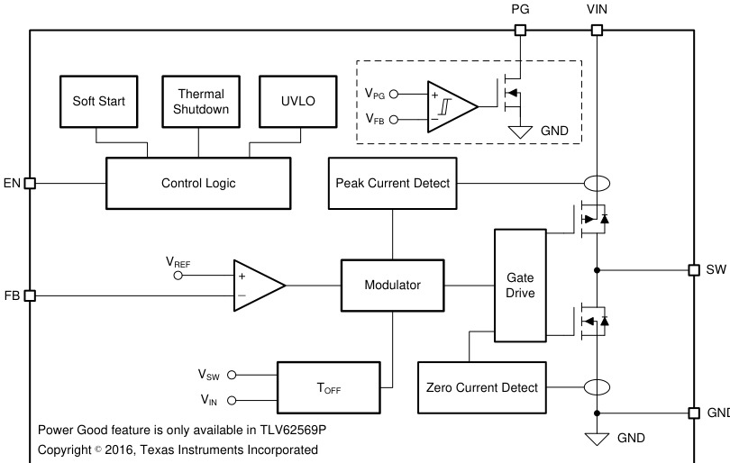

# 恒定导通时间控制

Constant On-Time（COT）是一种用于 DC/DC 转换器的控制方案，以其超快瞬态响应和无需复杂补偿著称。

## 工作原理

1. 当输出电压下降使反馈电压（VFB）低于内部参考时，比较器触发一个**固定时长**的导通脉冲
2. 高边 MOSFET 在该脉冲内导通，电感电流上升
3. 脉冲结束后，低边 MOSFET 导通，电感电流下降
4. 重复此循环

## 与 PWM 的区别

| 特性 | 传统电压模式 PWM | 电压模式 COT |
|------|----------------|-------------|
| 开关频率 | 固定（时钟驱动） | 随 VIN/VOUT 变化 |
| 环路补偿 | 需要 Type II/III | 相对简单 |
| 瞬态响应 | 受限于误差放大器带宽 | 超快（逐周期响应） |
| 纹波要求 | 低 | 需要足够纹波幅度 |

## 纹波注入（VRAMP）

COT 架构需要足够的纹波幅度来保证稳定。对于低 ESR 陶瓷输出电容，需要通过外部 **RC 网络**（Rx、Cx、Cy）在 VSNS 引脚叠加纹波信号，称为 VRAMP。

最小 VRAMP 幅度建议 **100 mV**，最大 **900 mV**，以兼顾稳定性和瞬态性能。

## 典型应用

*TLV62569 的 DCS-Control 架构（准 COT 变体）：纹波直接参与调制，无误差放大器主导的慢速环*

[SiC46x](../../元件/电源管理/SiC46x.md) 系列降压转换器即采用电压模式 COT 控制，支持外部纹波注入、可编程开关频率（100 kHz - 2 MHz），以及三种工作模式（强制连续、省电、超声波）。

## See Also

- [电源电子/DC-DC降压转换器](DC-DC降压转换器.md) — 降压转换器基础
- [SiC46x](../../元件/电源管理/SiC46x.md) — 采用 COT 的器件实体页
