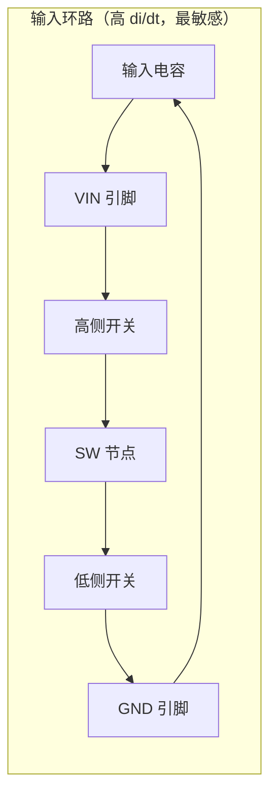
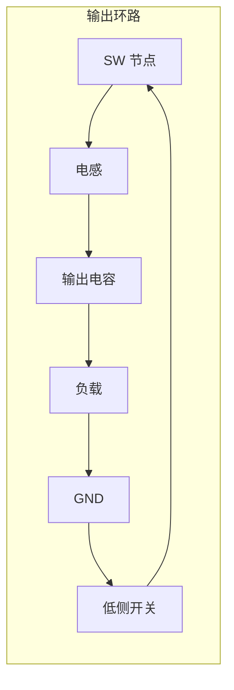
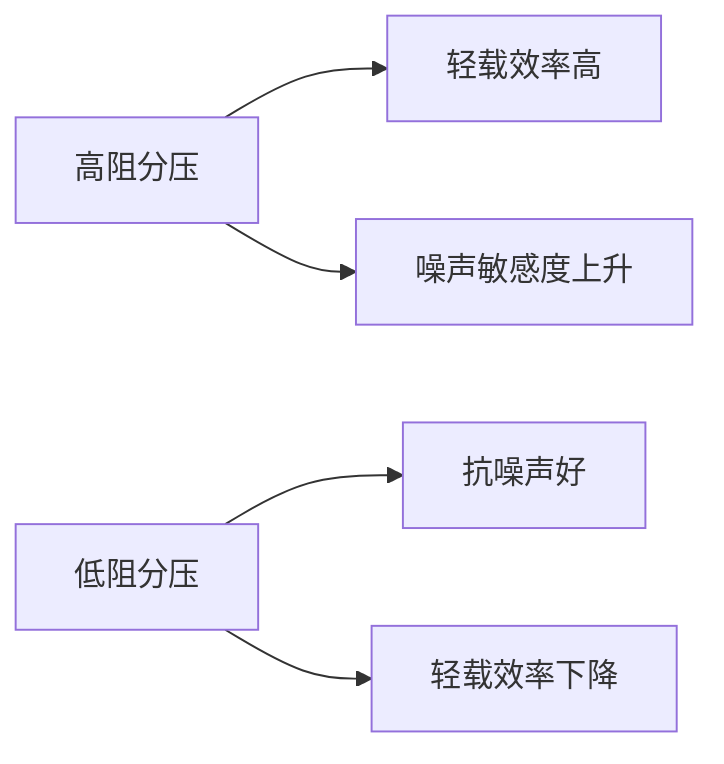

# 降压转换器 PCB 布局

开关稳压器的电流环路布局极大影响稳压器稳定性以外的性能——布局不当的环路是噪声与 EMI 的主要来源。本篇以 TPS561208（1A 同步降压）设计实例（7–14V 入、5V/1A 出）说明降压转换器 PCB 布局的原则与改进流程。拓扑原理见 [电源电子/DC-DC降压转换器](DC-DC降压转换器.md)。

## 电流环路：布局的核心对象

降压转换器工作时有两个关键电流环路：

环路设计原则：

- **短**：走线尽可能短，缩小环路面积 = 缩小辐射天线
- **宽**：宽走线减小寄生电感与电阻，最大限度减少辐射发射
- **圆**：环路形状紧凑，避免细长回路
- **同向**：输入与输出环路的电流流向相同方向（文中强调的改进要点）
- 输入/输出电容的两个引脚都要有返回稳压器的简单路径

> [!warning] 初始设计典型错误（文中实例）
> ① 没有参考数据手册中推荐的布局和设计提示
> ② 电感和开关路径（环路）没有正确布线 → 过度串扰和 EMI 问题
>
> 数据手册的布局示例是免费且权威的起点，先抄再改。

## 原理图元件选型（TPS561208 实例）

| 元件 | 取值 | 依据 | 备注 |
|------|------|------|------|
| 反馈分压 R2 | 10 kΩ | 数据手册推荐表（⚠️ 图片读取：推荐表为图片） | 低阻抗噪好/轻载效率差，高阻反之 |
| 反馈分压 R1 | 56.2 kΩ | 计算值 55.104kΩ 取标准值 | 输出 5.08V（⚠️ 存疑：Vref 原文未给出） |
| 输入电容 | 22 µF | 数据手册建议 ≥10µF，加大以应对墙插噪声 | 影响输入纹波与传导噪声/EMC |
| 电感 | 数据手册推荐值 | ⚠️ 图片读取：推荐表为图片 | 见下方警示 |
| 输出电容 | 47 µF | 建议 20–68µF 取中值 | 负载快变需更大容值 |
| 自举电容 | 0.1 µF 陶瓷 | 高侧栅驱动供电 | — |

**反馈分压电阻的选择权衡**：

> [!warning] 电感额定电流
> 原文称"选择饱和电流和额定电流不大于 1A 的电感"——⚠️ 存疑：按工程常识应为 **不小于**（1A 满负载输出时电感电流峰值 >1A，需留裕量），疑为翻译错误。切勿照搬原文表述。

## 布局改进四步流程

1. **元件放置** — 参考数据手册推荐布局放置组件（可稍作修改，但环路结构不变）
2. **手动布线** — 不用自动布线；手动跟踪流经输入/输出环路的电流，观察环路长度与电流方向。文中实例：手动布线后输入环路变化不大，输出环路大幅改善
3. **环路包边** — 为输入和输出环路添加边框（guard ring 式包铜），实现低阻抗
4. **铺铜** — 添加顶层和底层铺铜

改进后的结果：输出电流环路更小，输入与输出环路流向相同。

### 环路逐段分析（⚠️ 本节为工程实践展开）

输入环路（高 di/dt、EMI 最敏感，按文中蓝色环路展开）分四段走：

| 段 | 路径 | 布线要点 |
|----|------|----------|
| ① | Cin 正 → VIN 引脚 | 宽短直接相连 |
| ② | 内部：VIN → 高侧开关 → SW | 芯片内部，不可控 |
| ③ | SW → 低侧开关 → GND 引脚 | 芯片内部，不可控 |
| ④ | GND 引脚 → Cin 负 | **最短返回路径**；SW 节点铜皮在此最小化 |

输出环路（文中红色环路）：

| 段 | 路径 | 布线要点 |
|----|------|----------|
| ① | SW → 电感 | 宽走线，铜皮面积在载流允许下最小（高 dv/dt） |
| ② | 电感 → Cout 正 | 短粗走线 |
| ③ | Cout 负 → GND 引脚 | 与输入环路共用 GND 回流路径时注意方向一致 |
| ④ | 内部：低侧开关（或续流二极管）导通 | 不可控 |

> [!note] 输入输出环路共用 GND 回流段时，文中"流向相同方向"原则让两环路的磁场方向一致，避免涡流抵消造成的局部电流集中。

### 环路包边的具体做法（原文只有一句"添加边框实现低阻抗"）

**包边对象**：输入环路和输出环路的外围，包住环路走线但不改环路结构。

**做法**：

- 沿环路走线外围敷一圈 GND 铜皮（原文本例在两环路外侧加边框铜），在环路分段处用过孔与内层/底层 GND 平面缝合
- 包边铜皮与环路走线之间留合理间距（⚠️ 经验值：0.3~0.5mm，避免耦合过强影响信号完整性，原文未给数值）
- 包边本身**不承载环路电流**——其作用是把环路磁场的回流面压低、整体阻抗降低，等效于给环路一个更近的镜像回流平面

**原理**（⚠️ 本节为原理推断）：高频下电流沿最小阻抗路径回流，环路走线正下方/旁边的接地铜皮会感应镜像电流，缩小等效环路面积 → 降低辐射与串扰。这与高速信号参考平面的逻辑一致（见 [硬件设计/高速PCB设计通用规范](../硬件设计/高速PCB设计通用规范.md)）。

**注意事项**：

- 包边不能替代环路本身走短——先短宽，再包边
- 包边过近或过宽会增大 SW 节点寄生电容（与 [电源电子/PCB板级散热设计](PCB板级散热设计.md) 的 SW 铜皮最小化原则冲突），SW 段包边应保持距离
- 包边要与 GND 平面可靠缝合，悬空铜皮反而可能成为辐射体

### 铺铜的要点（⚠️ 本节为工程实践展开）

文中第 4 步"添加顶层和底层"铺铜的作用与注意：

- **顶层铺铜**：填充剩余面积，给环路更完整的参考平面；SW 节点区域铺铜必须挖空或保持距离（散热页的 SW 原则）
- **底层铺铜**：与顶层 GND 过孔缝合后形成完整回流平面，进一步缩小环路面积
- 铺铜不接 GND 的孤立铜片（死铜）必须删除或加过孔缝合，否则成为浮空辐射体

## 布局顺序（⚠️ 本节为工程实践综合）

降压转换器布局的推荐顺序（由紧到松，先定敏感件再定外围）：

1. **输入环路优先**：先放 Cin 于 IC VIN/GND 引脚旁（数据手册通常要求 <5mm 量级，以具体手册为准），这是整个布局的锚点
2. **IC 与 SW 节点**：IC 位置由 Cin 决定；SW 节点铜皮最小化，远离敏感信号
3. **电感**：紧邻 SW 引脚，方向避免环路绕行
4. **输出环路**：Cout 靠近电感输出端，返回 GND 短直
5. **反馈分压**：FB 引脚敏感，分压电阻靠近 FB 引脚，采样点接 Cout 正端
6. **自举电容**：BOOT 引脚就近
7. **输入/输出连接器与其余器件**：最后放，不影响核心环路

## 与其它设计的权衡关系

- **SW 节点铜皮**：SW 是高 dv/dt 节点，铜皮面积以载流为限尽量小，散热靠 GND/输出路径而非扩大 SW 铜皮（见 [电源电子/PCB板级散热设计](PCB板级散热设计.md)）
- **热与 EMI 的冲突**：散热希望铜多、环路 EMI 希望面积小——功率器件的散热铜皮应放在 GND 网络侧解决（见 [电源电子/PCB板级散热设计](PCB板级散热设计.md)）
- **传导噪声**：输入电容影响电源线上传导噪声 → 传导到电缆可能导致 EMC 认证失败；输出电容影响输出轨传导噪声（抑制手段见 [电源电子/展频谱与EMI抑制](展频谱与EMI抑制.md)）

## 设计检查清单

- [ ] 布局是否参考了数据手册推荐布局？
- [ ] 输入环路（Cin→VIN→SW→GND）是否最短最宽？
- [ ] 输出环路（SW→L→Cout）是否最短且与输入环路同向？
- [ ] 输入/输出电容引脚到稳压器是否有直接返回路径？
- [ ] 环路是否包边/铺铜实现低阻抗？
- [ ] 包边铜是否与 GND 平面缝合（无浮空死铜）？SW 段包边是否保持距离？
- [ ] SW 节点铜皮是否在载流允许下最小化？
- [ ] 布局顺序是否按 输入环路 → IC/SW → 电感 → 输出环路 → 反馈 执行？
- [ ] 电感饱和电流是否 ≥ 峰值电流（留裕量）？
- [ ] 分压电阻取值是否在效率与抗噪间平衡？

## 数值与置信度

| 数值 | 级别 | 依据 |
|------|------|------|
| TPS561208：4.5–17V 入、0.76–7V 出、1A | A | 文字 |
| R2=10k、R1=56.2k、Vout=5.08V | B | R1 计算值与 5.08V 为文字，但 Vref 未给出；按 5.08V 反推 Vref≈0.768V ⚠️ 未与数据手册核对 |
| Cin≥10µF（选 22µF） | A | 文字 |
| Cout 20–68µF（选 47µF） | A | 文字 |
| 电感推荐值 | C | ⚠️ 图片读取：数据手册推荐表为图片，未提取 |
| 电感"不大于 1A" | B | ⚠️ 存疑：原文如此，疑为翻译错误（应为不小于） |
| 自举电容 0.1µF | A | 文字 |

## 参见

- [电源电子/DC-DC降压转换器](DC-DC降压转换器.md) — 拓扑原理与选型
- [元件选型/电感分类与选型](../元件选型/电感分类与选型.md) — 功率电感任务/材料/结构分类与饱和电流选型
- [电源电子/PCB板级散热设计](PCB板级散热设计.md) — 散热铜皮与 SW 节点面积、EMI 权衡
- [电源电子/展频谱与EMI抑制](展频谱与EMI抑制.md) — 开关电源 EMI 抑制手段
- [电源电子/DCDC开关噪声对CAN总线的干扰](DCDC开关噪声对CAN总线的干扰.md) — 布局不当→噪声耦合的实测教训
