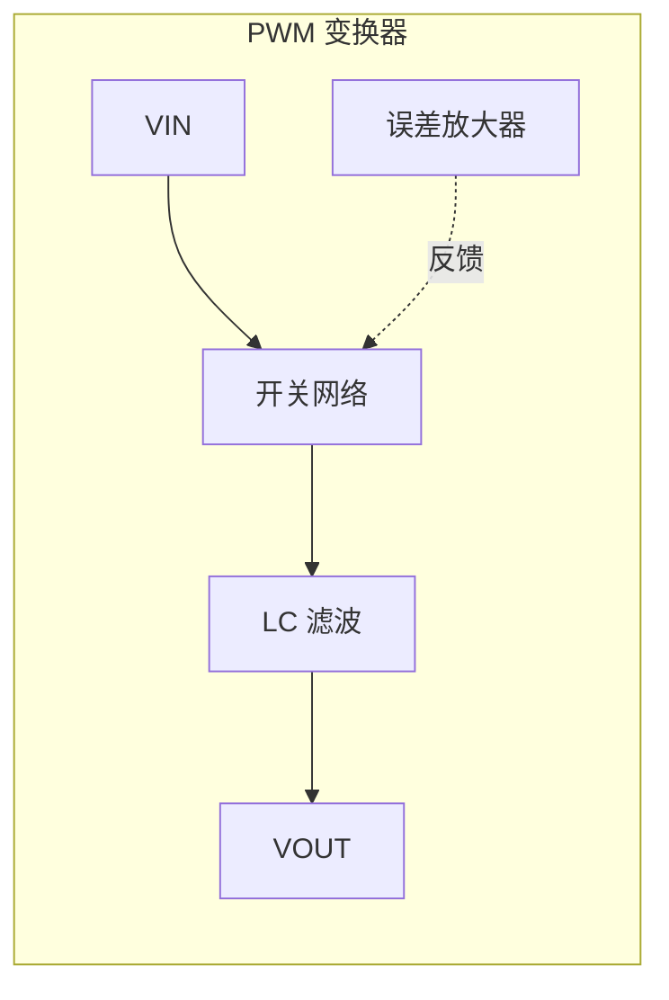
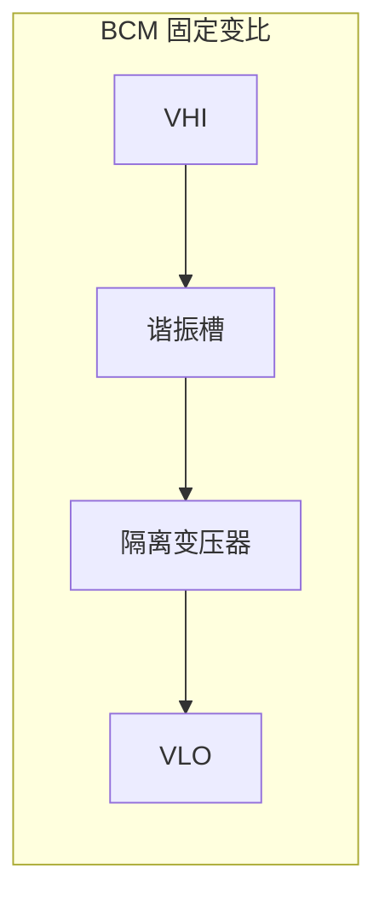
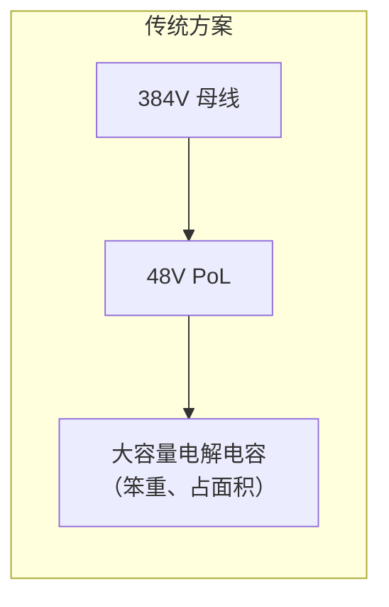
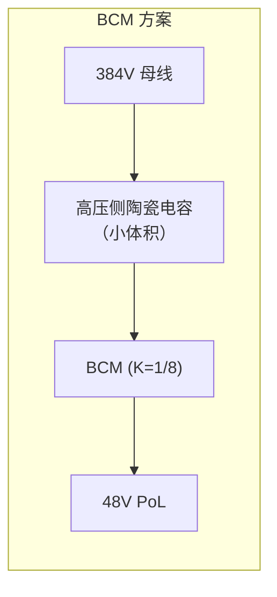

# 隔离固定变比总线转换器

**隔离固定变比总线转换器**（Isolated Fixed-Ratio Bus Converter，VICOR 称为 BCM®）是一种工作在 MHz 频率的开环谐振 DC-DC 变换器，通过固定匝数比的隔离变压器将高压直流母线转换为低压直流母线——不需要反馈环路。

## 基本原理

传统 PWM DC-DC 变换器通过调节占空比来稳定输出电压，需要误差放大器、补偿网络和输出滤波电感。BCM 则完全不同：





BCM 内部的谐振 LC 槽在高频（>1MHz）下以幅度调制方式工作：高压侧电压和低压侧电流通过谐振槽调制能量传输。因为谐振频率远高于环路带宽，输出跟随输入按固定 K 因子缩放——不需要任何闭环控制。

### DC 变压器模型

在直流层面，BCM 可以简化为一个理想变压器串联输出阻抗：

$$V_{LO} = V_{HI} \cdot K - I_{LO} \cdot R_{LO}$$

$$I_{LO} = \frac{I_{HI} - I_{HI\_Q}}{K}$$

其中：
- **K** — 变换比（匝数比），由变压器绕组决定
- **RLO** — 输出阻抗，由 MOSFET RDS(on) 和绕组电阻组成
- **IHI_Q** — 静态电流，代表控制器/栅极驱动/磁芯损耗

> [!note] 开环 ≠ 不精确
> RLO 很小（mΩ 级），且具有正温度系数。负载变化时 VLO 的压降 ΔVLO = ΔILO × RLO 可预测且稳定。对于高压直流配电到 48V PoL 的应用场景，PoL 稳压器负责精确调压，BCM 只需提供高效的电压缩放——这正是固定变比的用武之地。

## K 因子与电容倍增

BCM 最独特的优势来自 **K² 阻抗映射**。

### 阻抗反射

当高压侧串联电阻 R 时，从低压侧看到的等效电阻为：

$$V_{LO} = V_{HI} \cdot K - I_{LO} \cdot R \cdot K^2$$

R 被 **K² 缩小**。K=1/8 时，高压侧 1Ω 等效低压侧仅 15.6mΩ——这对低压大电流供电至关重要。

### 电容倍增

同理，高压侧并联电容 C 从低压侧看被放大：

$$I_{LO}(t) = \frac{C}{K^2} \cdot \frac{dV_{LO}}{dt}$$

高压侧电容 C 在低压侧的等效值为 **C/K²**。

| K | K² | 高压侧 1µF → 低压侧 |
|---|------|---------------------|
| 1/4 | 1/16 | 16µF |
| 1/8 | 1/64 | 64µF |
| 1/12 | 1/144 | 144µF |
| 1/16 | 1/256 | 256µF |

### 为什么电容倍增重要





BCM 方案将储能电容放在高压侧（小容值、小体积），通过 K² 效应在低压侧获得大等效电容。这在物理尺寸、成本和可靠性上都有优势。

**频率依赖性**：此映射在 <500kHz（即低于 BCM 的 MHz 级带宽）范围内有效。对于高频纹波（>5MHz），低压侧仍需低 ESL 陶瓷电容直接旁路。

> [!note] 源阻抗要求
> 要充分利用 BCM 的动态响应，高压侧从 DC 到 ~5MHz 必须呈现低阻抗。若互连电感 >100nH，需要 RC 阻尼器（如 1µF + 0.3Ω）防止振荡。这是 BCM 系统设计中最容易被忽视的要点。

## 与传统 DC-DC 变换器的对比

| 特性 | PWM 降压变换器 | BCM 固定变比 |
|------|---------------|--------------|
| 控制方式 | 闭环反馈 (PID/补偿) | 开环（无反馈环路） |
| 输出滤波 | 需要 LC 输出滤波器 | 谐振槽内置滤波 |
| 开关频率 | 100kHz–2MHz | 1–1.5MHz |
| 效率 | 90–98%（取决于 VIN/VOUT 比） | 95–97.9%（与电压比无关） |
| 输出电压 | 可调（分压电阻设定） | 固定（K × VIN） |
| 瞬态响应 | 受环路带宽限制 | MHz 级带宽，极快 |
| 补偿网络 | 需要外部 RC 或内部固定 | 不需要 |
| 输出阻抗 | 取决于环路增益 | 固定 mΩ 级 |
| 并联 | 需有源均流 | 天然正温度系数均流 |
| 隔离 | 需要额外变压器 | 内置增强绝缘 |
| 典型场景 | PoL 稳压器 | 高压母线到中间总线 |

## 并联阵列设计

BCM 的正温度系数 RLO 使其天然适合并联。热模块阻抗升高→自动减载→负反馈均衡。

### 阵列设计原则

1. **对称 PCB 布局**：每个模块到负载的路径阻抗尽量一致
2. **独立输入滤波器**：每个 BCM 需要专用输入滤波器，防止环流
3. **EN 同步**：所有模块的 EN 互连，确保同时启动
4. **交错启动**：利用 TON_DELAY 命令错开各模块的启动时间，减少浪涌
5. **输出电容降额**：并联阵列的总输出电容上限 = N × 0.5 × 单模块 CLO_OUT_MAX

### 电流共享机制

```
 ZIN_1 ─── BCM#1 ─── ZOUT_1 ──┐
 ZIN_2 ─── BCM#2 ─── ZOUT_2 ──┤
   ⋮          ⋮         ⋮      ├──→ Load
 ZIN_n ─── BCM#n ─── ZOUT_n ──┘
```

每个支路的阻抗（输入端+BCM+输出端）构成天然阻抗分压器，负载电流按阻抗反比分配。关键是要让各支路阻抗匹配——这就是对称布局的意义。

## PMBus 遥测

BCM 的 PMBus 接口（低压侧参考）提供完整的系统监控能力：

| 遥测量 | 更新速率 | 典型应用 |
|--------|----------|----------|
| VHI (READ_VIN) | 100µs | 母线电压监测、UV/OV 预警 |
| VLO (READ_VOUT) | 100µs | 输出电压监测 |
| ILO (READ_IOUT) | 100µs | 负载电流、过载检测 |
| 温度 (READ_TEMPERATURE_1) | 100ms | 热管理、降额控制 |
| PLO (READ_POUT) | 100µs | 功率监测 |
| EOUT (READ_EOUT) | 102.4ms/采样 | 平均功率计算、能效统计 |

> [!note] PMBus 写入保护
> 可写参数（OT_FAULT_LIMIT、TON_DELAY 等）仅在模块禁用时可写，且需在禁用后保持 ≥3ms 以完成 EEPROM 写入。

## 保护机制

BCM 内置完整的保护链：

| 保护 | 触发条件 | 响应时间 | 恢复方式 |
|------|----------|----------|----------|
| HI UVLO | VHI < VHI_UVLO– (190V typ) | 200µs | VHI > VHI_UVLO+ (260V typ) |
| HI OVLO | VHI > VHI_OVLO+ (445V typ) | 200µs | VHI < VHI_OVLO– (425V typ) |
| LO OCP | ILO > ILO_OUT_OCP (94A typ) | 8ms | 自动重试 (2s) |
| LO SCP | ILO > ILO_OUT_SCP (145A typ) | 1µs | 自动重试 (2s) |
| 过热 OTP | TINT > TOTP+ (100°C) | — | TINT < TOTP– (90°C) |

所有保护均为**非锁存**——故障清除后自动重试。持续故障每 2 秒自动重试一次。

## 关键设计考量

### 1. 源阻抗

BCM 的 MHz 级带宽意味着高压侧输入阻抗从 DC 到 ~5MHz 必须保持低值。长走线/高电感互连会导致振荡。

### 2. 滤波

不需要输出滤波电感（谐振槽内置），但可能需要：
- **高压侧**：RC 阻尼器（互连电感 >100nH 时）
- **低压侧**：高频陶瓷电容（>5MHz 纹波旁路）

### 3. 外部输出电容限制

CLO_OUT ≤ 100µF（单模块）。过多电容会阻碍模块启动——软启动期间需要将 COUT 充电。并联阵列时按 N × 0.5 × CLO_OUT_MAX 降额。

### 4. 双向功率

BCM 谐振拓扑天然支持双向功率流，但数据手册的规格仅覆盖正向（HV→LV）。反向运行（LV→HV）需咨询 VICOR。

## 参见

- [BCM6135CD1E5165yzz](BCM6135CD1E5165yzz.md) — 具体器件参数与选型
- [2026-07-31 - BCM6135CD1E5165yzz 数据手册](2026-07-31---BCM6135CD1E5165yzz-%E6%95%B0%E6%8D%AE%E6%89%8B%E5%86%8C.md) — 数据手册来源摘要
- [DC-DC降压转换器](DC-DC%E9%99%8D%E5%8E%8B%E8%BD%AC%E6%8D%A2%E5%99%A8.md) — 传统 PWM 降压拓扑对比
- [电源保护机制](%E7%94%B5%E6%BA%90%E4%BF%9D%E6%8A%A4%E6%9C%BA%E5%88%B6.md) — 各保护机制的详细对比
