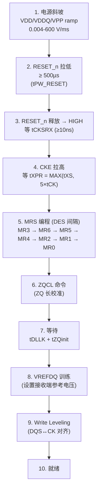
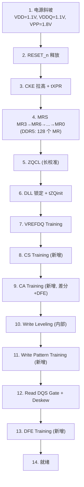

# DDR 初始化与训练序列

> DDR4/DDR5 从上电到可用的完整初始化流程。现代 DDR 不是"上电就能用"的——需要经过 RESET → MRS 编程 → ZQ 校准 → DLL 锁定 → Write Leveling → Read Training → DFE (DDR5) 一系列步骤，功耗和时序在每一步都不同。

## 1. DDR4 上电初始化全流程



### 每一步详解

| 步骤 | 参数 | 时间 | 说明 |
|------|------|------|------|
| 1. 电源斜坡 | VDD=1.2V, VDDQ=1.2V, VPP=2.5V | — | 300mV→VDD_min 需 <200ms |
| 2. RESET 拉低 | tPW_RESET | ≥500 µs | 同时 CKE 必须为 LOW（至少 RESET 释放前 10ns 起） |
| 3-4. RESET 释放 → CKE 拉高 | tCKSRX + tXPR | 取决于 tCK | tXPR = MAX(tXS, 5×tCK) |
| 5. MRS 编程 | tMRD=8tCK, tMOD=MAX(24tCK,15ns) | 几百 ns | 见下方 MRS 编程顺序 |
| 6-7. ZQCL + 等待 | tDLLK≈597tCK, tZQinit≈512tCK | ~1-2 µs | DLL 锁相环建立锁定 |
| 8. VREFDQ 训练 | MR6 RTT[5]=1, MR1 A[7]=1 | 控制器决定 | 扫描 Vref 找最佳采样点 |
| 9. Write Leveling | MR1 A[7]=1, MR2 A[6]=1 | 取决于 DRAM 数量 | 见 §2 |

### MRS 编程顺序

```
CMD: MR3 → tMRD → MR6 → tMRD → MR5 → tMRD → MR4 → tMRD
     → MR2 → tMRD → MR1 → tMRD → MR0 → tMOD → ZQCL
```

每个 MRS 之间必须插入 **DES (Deselect)** 命令，保证 tMRD 最小间隔。

## 2. Write Leveling

### 为什么需要

Fly-by 拓扑下，CLK 到达每片 DRAM 的时间不同。Write Leveling 调整 DQS 的发送时刻，使 DQS 边沿与每片 DRAM 的 CLK 边沿对齐。

```
控制器发出 DQS ───→ 到达 DRAM: DQS 和 CLK 之间的相位差
                                ↓
DRAM 采样 DQS 电平 (CLK 上升沿)，反馈给控制器
                                ↓
控制器调整 DQS 延迟 → 重复 → 直到 DQS 对齐 CLK
```

### DDR4 Write Leveling 流程

1. MR1 设置 Write Leveling Enable (A[7]=1)
2. 控制器发出 DQS 脉冲
3. DRAM 在 CLK 上升沿采样 DQS 电平 → 输出到 DQ 线
4. 若 DQ=0: DQS 还没到 → 控制器增加 DQS 延迟
5. 若 DQ=1: DQS 已经到达 → DQS 延迟合适
6. 找到 DQ 从 0→1 的跳变点 → DQS 对齐到 CLK 中心
7. 对每片 DRAM 重复

### 关键参数

| 参数 | 说明 | DDR4-3200 值 |
|------|------|-------------|
| tWLS | Write Leveling Setup | ≥ 325 ps |
| tWLH | Write Leveling Hold | ≥ 235 ps |
| tDQSS | DQS 到 CLK 偏差 | ±0.25 tCK (156ps) |
| 可补偿范围 | ~0.6 tCK | ≤ 375 ps |

### DDR5 改进

DDR5 引入了**内部 Write Leveling**——DRAM 内部有硬件自动调整 DQS→CLK 相位，减少对控制器 training firmware 的依赖。但控制器仍需要做 CS Training 和 CA Training。

## 3. Read Training

DDR4 读训练包含子步骤：

### 3.1 DQS Gate Training

```
目的: 找到 DQS 前导码的位置（知道什么时候 DQS 开始有效）
方法: 控制器在预期 DQS 到达窗口内采样
      扫描 DQS 延迟，找有效数据的区间
      设置 DQS Gating Window = 数据有效区域
```

### 3.2 Read DQ/DQS Deskew

```
目的: DQ 组内 8 根数据线的各自相位对齐
方法: 控制器发送连续 READ 命令
      每根 DQ 线独立扫描相位
      将所有 DQ 对齐到 DQS 中心
容差: DDR4 ±10mil, DDR5 ±3mil (PCB 走线)
```

### 3.3 Read DQS Centering

```
目的: 将 DQS 边沿放到数据眼图的中心
方法: 扫描 DQS 延迟 → 找到左右边界 → 取中点
```

### 3.4 VREFDQ Training

```
目的: 优化接收端参考电压, 最大化数据眼图的垂直裕量
方法: 扫描 VREFDQ 电压 (MR6 控制)
      每个电压做多次读操作
      找到误码率最低的电压点
```

## 4. ZQ Calibration

### 作用

校准 DRAM 的 **输出阻抗** (RON) 和 **终端电阻** (RTT)，确保信号完整性。

```
ZQ pin ──[240Ω ±1% 外部电阻]── VSS
          ↑
    内部校准电路: 调整片上电阻网络, 匹配 240Ω 参考
```

### 两种模式

| | ZQCL (Long) | ZQCS (Short) |
|------|-----------|-----------|
| 触发 | 上电初始化、RESET 后 | 运行期间周期执行 |
| 耗时 | tZQinit = 512 tCK | tZQoper = 256 tCK |
| 校准范围 | RON + RTT_PARK + RTT_NOM | 仅 RON + RTT_NOM |
| 何时用 | 必须执行 (初始化) | 温度/电压变化或定时 |

### DDR4 vs DDR5 ZQ

| 特性 | DDR4 | DDR5 |
|------|------|------|
| 外部参考 | 240Ω ±1% | 240Ω ±1% |
| 校准目标 | RON, RTT_NOM, RTT_WR | RON, RTT_NOM, RTT_WR, RTT_PARK |
| RTT_PARK | 不支持 | 支持 (空闲时的终端值) |
| Dual ZQ | 不支持 | 支持 (两个独立 ZQ pin) |

## 5. DDR5 新增训练

### 5.1 DFE Training

```
Phase 1: DFE 初始化 (CTLE 粗调 + DFE 旁路)
Phase 2: 训练 Pattern (已知的 PRBS 序列) → DFE tap 系数收敛
Phase 3: 系数锁定 + 眼图监测启动
Phase 4: Hold (温度/电压变化时自适应微调)
耗时: +2~3 ms (在 Read Training 后半段)
```

### 5.2 Write Pattern Training

DDR4 只做 Write Leveling (时序对齐)。DDR5 新增：

```
控制器发送已知 Pattern → DRAM 内部检测 → 反馈误码统计
                                           ↓
                              调整 DQ 相位 (per-bit) + 电压
                                           ↓
                              重复直到误码率达标
```

### 5.3 CA Training

DDR5 的 CA 总线从单端改为差分，且引入 DFE：

```
控制器发 CA Training Pattern → DRAM 内部 Loopback → 
控制器读回 → 调整 CA 相位 + Vref → 重复
```

### 5.4 CS Training

每片 DRAM 的 CS_n 信号因 Fly-by 延迟不同而到达时间不同：

```
控制器逐一训练每片 DRAM 的 CS_n 有效窗口
→ CS_n Setup/Hold 时间优化
→ 确保 DDR5 更高频率下 CS_n 能正确锁存
```

## 6. 完整 DDR5 初始化序列



> DDR5 初始化时间显著长于 DDR4——DFE Training 和 Write Pattern Training 是新增大头。

## 7. 训练失败排查

| 症状 | 可能原因 | 检查 |
|------|----------|------|
| Write Leveling 超范围 | Fly-by 延迟 >0.6 tCK | 缩短 Fly-by 总长；检查分支对称 |
| DQS Gate 找不到窗口 | DQS 前导码被截断 | 检查 DQS preamble 设置 (MR4) |
| Read Deskew 某 lane 失败 | 该 lane 走线过长/过短 | 检查 PCB 等长 (±3~10mil) |
| VREFDQ 训练无最佳点 | VDDQ 纹波过大 | 检查 PDN 解耦；加 0.1µF+0.01µF |
| ZQ 校准失败 | ZQ 外部电阻不准或开路 | 测量 ZQ pin 对 VSS 电阻 = 240Ω ±1% |
| DFE 不收敛 (DDR5) | SI 太差或 Stub 过长 | 背钻 (stub <10mil)；检查眼高 |

## 相关页面

- [硬件设计/DDR 协议基础](../../知识/硬件设计/DDR%20协议基础.md) — 命令真值表 · 状态机 · Mode Register · 时序参数
- [硬件设计/DDR 布线设计规范](../../知识/硬件设计/DDR%20布线设计规范.md) — Fly-by 拓扑 · 等长匹配 · 阻抗 · SI/PI
- [硬件设计/DDR4 vs DDR5 架构对比](../../知识/硬件设计/DDR4%20vs%20DDR5%20架构对比.md) — DFE · 子通道 · Gear Mode · PHY 对比
