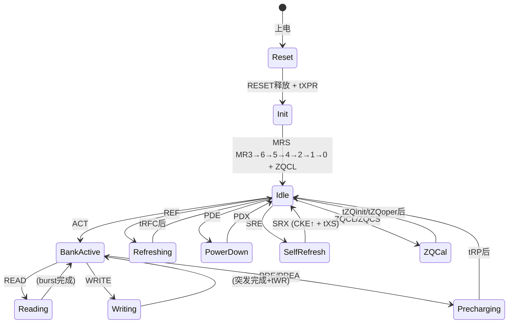

# DDR 协议基础

> DDR SDRAM 的命令真值表、状态机、Mode Register 体系和关键时序参数。基于 JEDEC JESD79-4 (DDR4) 标准。布线约束见 [硬件设计/DDR 布线设计规范](DDR%20布线设计规范.md)，初始化训练见 [硬件设计/DDR 初始化与训练序列](DDR%20初始化与训练序列.md)。

## 1. 命令真值表

DDR4 通过 7 根控制线解码命令：

| 命令 | CKE | CS_n | ACT_n | RAS_n | CAS_n | WE_n | AP | BG/BA |
|------|-----|------|-------|-------|-------|------|----|-------|
| **DES (Deselect)** | H | H | X | X | X | X | X | X |
| **NOP** | H | L | H | H | H | H | X | X |
| **ACT (Activate)** | H | L | L | L | H | H | X | ROW addr |
| **READ** | H | L | H | H | L | H | BC4/BL8 | COL addr |
| **RDA (Read+AutoPre)** | H | L | H | H | L | H | H | COL addr |
| **WRITE** | H | L | H | H | L | L | BC4/BL8 | COL addr |
| **WRA (Write+AutoPre)** | H | L | H | H | L | L | H | COL addr |
| **PRE (Precharge)** | H | L | H | L | H | L | X | Bank addr |
| **PREA (Precharge All)** | H | L | H | L | H | L | H | X |
| **REF (Refresh)** | H | L | H | L | L | H | X | X |
| **MRS (Mode Register)** | H | L | H | L | L | L | X | MR addr |
| **ZQCL (ZQ Cal Long)** | H | L | H | L | H | H | X | X |
| **ZQCS (ZQ Cal Short)** | H | L | H | L | H | H | H | X |
| **SRE (SelfRefresh Entry)** | H→L | L | H | L | L | H | X | X |
| **SRX (SelfRefresh Exit)** | L→H | L | H | L | L | H | X | X |
| **PDE (PowerDown Entry)** | H→L | L | H | H | — | — | X | X |
| **PDX (PowerDown Exit)** | L→H | L | H | H | — | — | X | X |

> H=High, L=Low, X=Don't care, —=any. BG/BA 选组选 Bank。

## 2. 状态机



### 切换关键约束

| 转换 | 约束 | 说明 |
|------|------|------|
| Idle → Bank Active | tRCD | RAS-to-CAS Delay: 行激活后等 tRCD 才能读写 |
| Reading → Precharge | tRTP | Read to Precharge: 读完后才能关行 |
| Writing → Precharge | tWR | Write Recovery: 写完等 tWR 确保数据写入 |
| Bank Active → Precharge | tRAS(min) | Row Active 最短时间 |
| Precharge → Idle | tRP | Row Precharge: 关行到下一 ACT 的等待 |
| Refresh | tRFC | Refresh Cycle: 刷新操作耗时 |

### 行周期

```
ACT → tRCD → READ → tRTP → PRE → tRP → 下一 ACT
│←────────────── tRAS ──────────→│
│←─────────────────── tRC ───────────────────→│
```

## 3. Mode Register 体系 (DDR4)

DDR4 提供 7 个 Mode Register：

| MR | 关键字段 | 说明 |
|----|----------|------|
| **MR0** | CL, BL, DLL Reset, TM | CAS Latency, Burst Length, DLL Reset, Test Mode |
| **MR1** | DLL Enable, AL, WL, ODT | DLL 开关, Additive Latency, Write Leveling, ODT 值 |
| **MR2** | CWL, RTT_WR, WL Enable | CAS Write Latency, 写终端电阻, Write Leveling 开关 |
| **MR3** | MPR, CRC, TDQS, Geardown | Multipurpose Register, CRC 校验, Termination DQS, 降 Gear |
| **MR4** | Preamble, Read/Write Preamble, CS→CMD Latency | 前导码设置, 片选到命令延迟 |
| **MR5** | CA Parity, ODT Input Buffer, CRC Error | CA 总线校验, ODT 缓冲, CRC 错误处理 |
| **MR6** | VrefDQ Training, tCCD_L | VrefDQ 训练, CAS-to-CAS 长延迟模式 |

### MRS 写入时序

```
MRS MR3 → tMRD → MRS MR6 → tMRD → ... → MRS MR0 → tMOD → ZQCL
                                                       ↑ MR0 有额外等待
```

## 4. 关键时序参数

### 4.1 核心延迟

| 参数 | DDR4-2400 | DDR4-3200 | 单位 |
|------|-----------|-----------|------|
| tCK (时钟周期) | 0.833 | 0.625 | ns |
| tRCD (行到列) | 14.16 | 13.75 | ns |
| tRP (预充电) | 14.16 | 13.75 | ns |
| tRAS (最小行活跃) | 32 | 32 | ns |
| tRC (行周期) | 46.16 | 45.75 | ns |
| CL (CAS 延迟) | 17 | 22 | tCK |
| CWL (CAS 写延迟) | 11 | 16 | tCK |
| tWR (写恢复) | 15 | 15 | ns |
| tRFC (刷新周期) | 350 | 350 | ns |
| tREFI (刷新间隔) | 7.8 | 7.8 | µs |
| tCCD_L (命令间隔) | 5 | 5 | tCK |

### 4.2 初始化时间

| 参数 | 值 | 说明 |
|------|-----|------|
| tPW_RESET | ≥ 500 µs | RESET 低脉冲最小宽度 |
| tXPR | MAX(tXS, 5×tCK) | RESET 释放后到第一个 MRS |
| tDLLK | 597~768 tCK | DLL 锁定时间 |
| tZQinit | MAX(512 tCK, 640ns) | ZQ 校准初始化 |
| tMRD | 4~8 tCK | MRS 命令间最小间隔 |
| tMOD | MAX(24 tCK, 15ns) | MR0 等更新间隔 |

### 4.3 电源

| 参数 | DDR4 | DDR5 |
|------|------|------|
| VDD | 1.2V ±60mV | 1.1V |
| VDDQ | 1.2V ±60mV | 1.1V |
| VPP | 2.5V | 1.8V |
| 接口电平 | SSTL_12 | POD_11 |
| 终端方案 | CTT (Center-Tapped) | POD (Pseudo Open Drain) |

## 5. 读写时序

### 5.1 读操作

```
CMD:  ACT ─tRCD─→ READ ─────→ (下一个CMD)
DQ:                     ←CL→ [D0][D1][D2][D3][D4][D5][D6][D7]
DQS:                    ←CL→ _/‾‾‾‾‾‾‾‾‾‾‾‾‾‾‾‾‾‾‾‾‾‾\_
```

### 5.2 写操作

```
CMD:  ACT ─tRCD─→ WRITE ─tWR─→ PRE
DQ:              ─CWL→ [D0][D1][D2][D3][D4][D5][D6][D7]
DQS:             ─CWL→ _/‾‾‾‾‾‾‾‾‾‾‾‾‾‾‾‾‾‾‾‾‾‾\_
```

### 5.3 Additive Latency (AL)

```
READ = ACT → tRCD → (等 AL×tCK) → READ命令发出 → (等 CL×tCK) → 数据出现在 DQ
```

AL 让 READ/WRITE 命令在 ACT 后提前发出，数据在 CL 个周期后出现在总线上——控制器可以更早知道数据何时到达。

## 6. 刷新机制

| 模式 | 触发 | 耗时 | 说明 |
|------|------|------|------|
| **REF (标准)** | 控制器每 7.8µs 发一次 | tRFC (~350ns) | 8192 次覆盖全部行 / 64ms |
| **Fine Granularity** | REF + 特定模式 | 缩短 | 可选择刷新某组 Bank |
| **Self Refresh** | SRE 进入 | 自行管理 | 低功耗模式，内部定时刷新 |

> 温度 >85°C：刷新间隔减半 (3.9µs)；>95°C：再次减半。

## 7. Bank 架构

```
DDR4 8Gb x8:
  4 Bank Groups × 4 Banks = 16 Banks Total
  
Bank Group 0: Bank0 Bank1 Bank2 Bank3
Bank Group 1: Bank4 Bank5 Bank6 Bank7
Bank Group 2: Bank8 Bank9 Bank10 Bank11
Bank Group 3: Bank12 Bank13 Bank14 Bank15
```

- **同一 Bank Group 内**：tCCD_L (长间隔) 限制连续读写
- **不同 Bank Group 间**：tCCD_S (短间隔) 可 pipeline
- 交错访问不同 Bank Group → 隐藏行周期延迟 → 更高有效带宽

## 8. DDR5 协议变化要点

| 特性 | DDR4 | DDR5 |
|------|------|------|
| 通道架构 | 1×64-bit | **2×32-bit 独立子通道** |
| Burst Length | BL8 (切 BL4) | **BL16** (切 BL8) |
| Mode Register | MR0-6 (7个) | MR0-127 (128个) |
| 刷新命令 | REF | **SREF** (Same-Bank Refresh) |
| DFE 均衡 | ❌ | ✅ 强制 |
| Write Pattern | ❌ | ✅ DRAM 内部检测已知 Pattern |
| CA 训练 | 控制器端 | DRAM 内部 Loopback |
| 内部 Write Leveling | ❌ | ✅ |
| 电压 | 1.2V | 1.1V (VDD/VDDQ), 1.8V (VPP) |
| CRC | 写 CRC | **读写双向 CRC** |

## 相关页面

- [硬件设计/DDR 初始化与训练序列](DDR%20初始化与训练序列.md) — 上电初始化 + Write Leveling + Read Training + DFE
- [硬件设计/DDR 布线设计规范](DDR%20布线设计规范.md) — Fly-by 拓扑 · 等长匹配 · 阻抗控制 · SI/PI
- [硬件设计/DDR4 vs DDR5 架构对比](DDR4%20vs%20DDR5%20架构对比.md) — DFE · 子通道 · Gear Mode · PHY 设计
