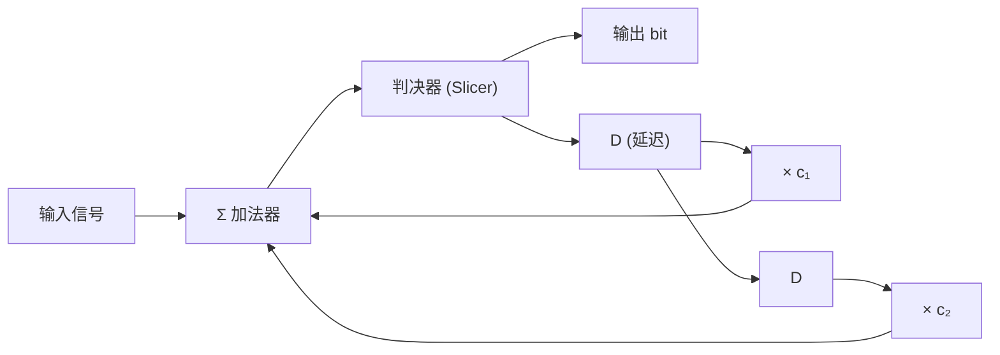

# DDR4 vs DDR5 架构对比

> DDR5 不仅是 DDR4 的速率升级——从 1×64-bit 改为 2×32-bit 独立子通道、引入 DFE 均衡、128 个 Mode Register (vs 7)、BL16 替代 BL8。本页逐项对比架构变化及其对 PCB 设计、PHY 设计、固件训练的影响。

## 1. 速览

| 维度 | DDR4 | DDR5 | 影响 |
|------|------|------|------|
| 最高数据率 | 3.2 Gbps | 6.4→8.4 Gbps | 信号完整性要求大幅提升 |
| 电压 | VDD/VDDQ=1.2V, VPP=2.5V | VDD/VDDQ=1.1V, VPP=1.8V | 功耗降低，噪声裕量收紧 |
| 通道架构 | 1×64-bit | **2×32-bit** 独立子通道 | 并行操作，两路独立读写 |
| Burst Length | BL8 (切 BL4) | **BL16** (切 BL8) | 每次突发传输 16 beats |
| Mode Register | 7 个 (MR0-6) | **128 个** (MR0-127) | 更细粒度的控制 |
| 均衡 | 无 | **CTLE + DFE** (多 tap) | DFE 强制集成到 DRAM 和 PHY |
| CRC | 仅写 CRC | **读写双向 CRC** | 数据完整性检查增强 |
| 内部 Write Leveling | ❌ | ✅ | 减少控制器 training 负担 |
| Write Pattern Training | ❌ | ✅ | DRAM 内部检测 Pattern 误码 |
| CS/CA Training | ❌/有限 | ✅ | 更完整的训练体系 |
| 刷新 | REF (统一刷新) | **SREF** (同 Bank 刷新) | 其他 Bank 不受刷新阻塞 |
| RTT_PARK | 不支持 | 支持 | 非活跃 ODT 终端值 |
| DQ 均衡 | Per-lane 可调 | Per-lane + Per-bit 独立 | 更精细 |

## 2. 通道架构：2×32-bit 独立子通道

```
DDR4:                           DDR5:
┌─────────────────────┐         ┌──────────────────────┐
│    64-bit Channel    │         │  Sub-Channel A: 32b  │
│  DQ[63:0]            │         │  DQ[31:0] + DQS + CB│
│  DQS, DM, CB         │         ├──────────────────────┤
│                      │         │  Sub-Channel B: 32b  │
│                      │         │  DQ[63:32]+DQS+CB    │
└─────────────────────┘         └──────────────────────┘

同一时刻只能做一件事         两子通道可同时做不同操作
                              (一个读、另一个写)
```

| 特性 | DDR4 64-bit | DDR5 子通道 A | DDR5 子通道 B |
|------|------------|--------------|--------------|
| 宽度 | 64-bit | 32-bit | 32-bit |
| Burst Length | BL8 = 64B | BL16 = 64B | BL16 = 64B |
| 独立操作 | ❌ | ✅ | ✅ |
| 命令总线 | 共享 | 独立 | 独立 |
| Read/Write 同时 | ❌ | ✅ (交错) |

> 子通道独立 → 可预先激活一个子通道的 Bank，另一个在做 Refresh，实现类似流水线的操作。

## 3. 均衡方案

### 3.1 为什么 DDR5 必须 DFE

| 因素 | DDR4 | DDR5 |
|------|------|------|
| 数据率 | ≤3.2 Gbps | ≤8.4 Gbps |
| Nyquist 频率 | 1.6 GHz | 4.2 GHz |
| PCB 损耗 (FR-4) | 3-6 dB @ Nyquist | 10-20 dB @ Nyquist |
| 无均衡时的眼图 | 可接受 | 完全闭合 |
| 电压摆幅 | 1.2V | 1.1V |

### 3.2 DFE 工作原理



```
Phase 1: 初始化 → CTLE 粗调 → DFE 旁路
Phase 2: 训练 → 已知 PRBS Pattern → tap 系数 (c₁,c₂,...) 收敛
Phase 3: 锁定 → 眼图监测启动 → 系数冻结
Phase 4: 运行 → 温度/电压变化时自适应微调
```

DFE 不放大噪声（与 CTLE 不同），但错误传播需要 BER 低于 ~10⁻⁴ 的初始基准。

### 3.3 CTLE + DFE 互补

| | CTLE | DFE |
|---|------|-----|
| 作用域 | 模拟域 | 数字域 |
| 放大噪声？ | ❌ 是 (高频增益抬升噪声) | ✅ 否 |
| 功耗 | 低 (连续时间) | 中 (每 tap 一个乘法器) |
| 最佳场景 | 光滑的频率相关衰减 | 反射/谐振造成的离散 ISI |
| DDR5 | 前一级，粗调 | 后一级，精调 |

## 4. 电源架构

| 信号 | DDR4 | DDR5 | 说明 |
|------|------|------|------|
| VDD | 1.2V ±60mV | 1.1V ±33mV | 核心电压 |
| VDDQ | 1.2V ±60mV | 1.1V ±33mV | IO 电压 |
| VPP | 2.5V | 1.8V | DRAM 内部字线升压 |
| VREFCA | 外部/内部 | 内部 (片上生成) | 参考电压 |
| VTT | VDDQ/2 (终端) | 不适用 (POD 终端) | DDR4 CTT vs DDR5 POD |

### POD vs CTT 终端

```
DDR4 CTT (Center-Tapped Termination):
  Driver ──┬── Trace ──┬── Receiver
          Rterm       Rterm
           │            │
          VTT         VTT
  两边都终端 → 功耗高

DDR5 POD (Pseudo Open Drain):
  Driver ──┬── Trace ── Rterm ── VDDQ
           │            (仅接收端)
  单端终端到 VDDQ → 功耗低
  逻辑 0 有电流流过 Rterm → 动态功耗仅发生在传输 0 时
```

## 5. 训练体系对比

| 训练项 | DDR4 | DDR5 |
|--------|------|------|
| ZQ 校准 | ZQCL / ZQCS | ZQCL / ZQCS (含 RTT_PARK) |
| Write Leveling | 控制器驱动，DRAM 反馈 DQ | **内部 Write Leveling** (DRAM 自动) |
| CS Training | ❌ | ✅ |
| CA Training | 有限 (MR5 CA Parity) | ✅ DRAM Loopback |
| VREFDQ Training | ✅ MR6 RTT[5] | ✅ 更细粒度 |
| Read DQS Gate | ✅ | ✅ |
| Read DQ/DQS Deskew | ✅ (per-lane) | ✅ (per-bit independent) |
| Write Pattern Training | ❌ | ✅ (DRAM 内部检测 Pattern) |
| DFE Training | ❌ | ✅ (CTLE + tap 收敛) |
| Eye Monitor | ❌ | ✅ (片上实时眼图) |

## 6. 刷新机制

| | DDR4 | DDR5 |
|------|------|------|
| 命令 | REF | **SREF** (Same-Bank Refresh) |
| 刷新范围 | 所有 Bank | 同 Bank Group 内同编号 Bank |
| 阻塞 | 全暂停 | 其他 Bank Group 可用 |
| 间隔 | tREFI=7.8µs (常温) | 相同，但 SREF 粒度更细 |
| 模式 | All-Bank + Fine Granularity | Same-Bank + All-Bank |

> SREF 的关键改进：刷新 Bank 0 时，其他 Bank 可继续读写——减少刷新对带宽的侵蚀。

## 7. CRC 与 ECC

| | DDR4 | DDR5 |
|------|------|------|
| **写 CRC** | ✅ | ✅ |
| **读 CRC** | ❌ | ✅ |
| 片上 ECC | ❌ | ✅ (DRAM 内部自动纠错) |
| CRC 多项式 | x⁸+x²+x+1 | 同 + Alert_n 扩展 |
| 纠错能力 | 仅检测 | 检测 + 通知 (ALERT_n) |

DDR5 片上 ECC 不是给用户看到的——DRAM 内部检测并纠正单 bit 错误（类似 SSD 的 FTL 层纠错），外部接口不变。

## 8. Mode Register 扩展

```
DDR4:  7 个 (MR0-MR6), 13-bit address
DDR5: 128 个 (MR0-MR127), 8-bit address × 16-bit data per MR

DDR5 MR 组分类:
  MR0-31:  时序参数 (CL/CWL/AL/ODT/RTT...)
  MR32-63: 训练与调试 (DFE/CTLE/VREF...)
  MR64-95: 测试与特性
  MR96-127: 保留
```

## 9. 控制器 (PHY) 设计影响

| 设计点 | DDR4 PHY | DDR5 PHY |
|--------|----------|----------|
| 通道数 | 1 | 2 (独立子通道) |
| DFE | 不需要 | 每 lane 集成 DFE |
| CTLE | 不需要 | 建议 (预均衡) |
| Eye Monitor | 可选 | 强烈建议 |
| DLL/PLL | per-channel | per-sub-channel |
| CA 总线 | LVCMOS 单端 | 差分 (可选) |
| 功耗 | 低基准 | +10-20% (DFE/监测) |
| 固件复杂度 | Write Leveling + Read Gate | + CS/CA/DFE/Write Pattern |

## 10. 向后兼容

DDR5 DIMM 和 DDR4 DIMM **物理不兼容**——防呆缺口位置不同。控制器侧：
- DDR5 控制器通常兼容 DDR4 (通过不同 PHY 配置)
- 同一 PCB 不能同时支持 DDR4 和 DDR5（电压、终端方案完全不同）
- DDR5-4800 和 DDR5-5600 之间的升级通常可行（同封装、同 Pinout）

## 相关页面

- [硬件设计/DDR 协议基础](../../知识/硬件设计/DDR%20协议基础.md) — 命令真值表 · 状态机 · Mode Register · 时序参数
- [硬件设计/DDR 初始化与训练序列](../../知识/硬件设计/DDR%20初始化与训练序列.md) — 上电初始化 · 训练流程 · 失败排查
- [硬件设计/DDR 布线设计规范](../../知识/硬件设计/DDR%20布线设计规范.md) — Fly-by 拓扑 · 等长匹配 · 阻抗 · SI/PI
