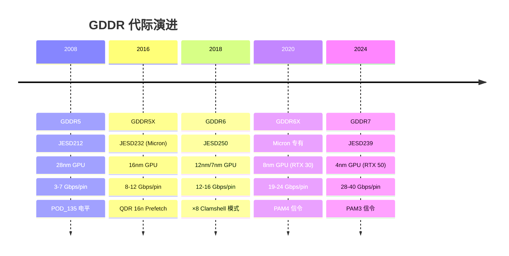

# GDDR 图形内存体系

> GDDR (Graphics Double Data Rate) 是 JEDEC 为 GPU 和高带宽计算定制的 SGRAM 标准。与 DDR 共享 JEDEC DRAM 技术根基，但架构目标截然不同：DDR 追求低延迟随机访问，GDDR 追求**极高带宽**（单芯片 32-bit 宽 I/O × 高频率）。

## 1. GDDR vs DDR 本质区别

| 特性 | DDR4/DDR5 | GDDR5/GDDR6/GDDR6X |
|------|-----------|---------------------|
| 应用 | CPU 主内存 | GPU 显存、AI 加速器 |
| I/O 宽度 | ×4/×8/×16 | **×32 (双通道 ×16)** |
| 通道架构 | 单通道或 DDR5 子通道 | **双独立通道 (2×16-bit)** |
| 访问模式 | 随机低延迟 (tRCD ~14ns) | 高带宽流式 (BW 优先) |
| 接口电平 | SSTL_12 (DDR4) / POD_11 (DDR5) | **POD_135** (GDDR5/6) |
| 典型频率 | 1600-2800 MHz (DDR4) | 3000-8000+ MHz (GDDR6) |
| Prefetch | 8n (DDR4) / 16n (DDR5) | **8n/16n** |
| 封装 | FBGA 78/96 ball | **BGA 180 ball** (14×12mm) |
| ECC/CRC | 可选 ECC (DDR5) | **EDC + CRC-8 强制** |

> **核心理念差异**：DDR 为 CPU 的 cache line (64B) 优化——一次 Burst 恰好填满一个 cache line。GDDR 为 GPU 的 warp/wavefront 优化——一次 Burst 覆盖大量并行线程的数据需求。

## 2. GDDR 代际演进



## 3. GDDR6 架构详解

### 3.1 双通道结构

```
GDDR6 8Gb 器件:
┌──────────────────────────────┐
│  Channel A (×16/x8)          │
│  ┌─ DQ[15:0] ────────────┐  │
│  │  WCKA, EDC, CA[9:0]    │  │
│  └────────────────────────┘  │
│  Channel B (×16/x8)          │
│  ┌─ DQ[15:0] ────────────┐  │
│  │  WCKB, EDC, CA[9:0]    │  │
│  └────────────────────────┘  │
│  共享: CK, CKE, RESET        │
└──────────────────────────────┘
```

- 两个通道**完全独立**运行——各自有独立的命令总线、WCK 时钟、DQ 数据线
- ×8 Clamshell 模式：将 ×16 通道分成两个 ×8 子通道，支持更多 DRAM 颗粒共享总线
- Pseudo-Channel (PC) 模式：两个伪通道共享 CA 总线，分别使用 CKE_n 和 CABI_n

### 3.2 电气规范

| 参数 | GDDR6 POD_135 | GDDR6X PAM4 |
|------|--------------|-------------|
| VDD | 1.35V | 1.35V |
| VDDQ | 1.35V | 1.35V |
| VPP | 1.8V | — |
| 信令 | NRZ (PAM2) | **PAM4** (4 电平) |
| 符号速率 | 12-16 Gsym/s | 9.5-12 Gsym/s |
| 位速率 | 12-16 Gbps/pin | **19-24 Gbps/pin** |
| 参考电压 | 内部 per-pin VREFD | 3 个判决电平 |

### 3.3 PAM4 (GDDR6X)

GDDR6X 最关键的创新——用 4 电平信号替代传统的 2 电平 (NRZ)：

```
NRZ (PAM2):           PAM4:
V                      V
│  ██     ██           │  ██  ██  ██  ██
│  ██ ██  ██           │  ██  ██  ██  ██
│  ██ ██  ██ ██        │  ██  ██  ██  ██
│──██─██──██─██── t    │──██──██──██──██── t
  1 symbol = 1 bit         1 symbol = 2 bits
```

| 特性 | NRZ (GDDR6) | PAM4 (GDDR6X) |
|------|-------------|----------------|
| 比特/符号 | 1 | **2** |
| 同波特率带宽 | 1× | **2×** |
| SNR 要求 | ~14 dB (BER 10⁻¹²) | ~22 dB (同 BER) |
| 判决电平 | 1 | **3** |
| RX 复杂度 | 简单 | 需 ADC/DSP 均衡 |
| 功耗 | 低 | 更高 (RX 复杂) |

> PAM4 的 SNR 代价 ≈ 9.5 dB——用信号完整性换取带宽翻倍。需要更强的 RX 均衡 (CTLE + DFE)。

## 4. 关键时序

### 4.1 GDDR6 命令时序

| 参数 | 值 | 说明 |
|------|-----|------|
| tCK | ~300-500 ps | 时钟周期 (2-3.3 GHz) |
| WCK 频率 | 2× CK | Write Clock 双倍频 |
| tRCD | ~12-18 ns | RAS-to-CAS Delay |
| tRP | ~12-18 ns | Row Precharge |
| tRC | ~42-55 ns | Row Cycle Time |
| CL | ~18-24 tCK | CAS Latency |
| tCCD | 2-4 tCK | CAS-to-CAS Delay |
| tRFC | ~180-350 ns | Refresh Cycle Time |

### 4.2 与 DDR 的关键时序差异

| 参数 | DDR4-3200 | GDDR6-14000 (14 Gbps) |
|------|-----------|----------------------|
| 数据率/pin | 3.2 Gbps | 14 Gbps |
| I/O 宽度 | ×8 | ×32 (2×16) |
| 单芯片带宽 | 3.2 GB/s | **56 GB/s** |
| Bank 数量 | 16 | 16 (×2 ch) |
| Burst Length | 8 | 16 |
| Refresh | 全芯片 | per-bank (更精细) |

> GDDR6 ×32 I/O 的物理含义：**每个 GDDR6 芯片相当于 4 个 DDR4 ×8 芯片并排工作**，但延迟高 2-4×——GPU 用海量并行线程掩盖延迟。

## 5. 温度管理

GDDR 是散热大户：

| 模式 | GDDR6 典型功耗 | 说明 |
|------|---------------|------|
| Idle | ~0.5-1W/芯片 | 静态漏电 |
| 中等负载 | ~2-3W/芯片 | 游戏场景 |
| 满载 (16 Gbps) | **~4-6W/芯片** | 计算/AI 训练 |
| 结温上限 | Tj_max = 105°C | 自动降频 |

> 12 颗 GDDR6X 满载 = 60-72W → 显存散热不能只靠背板，需要主动风道或热管。

## 6. EDC 与 RAS

GDDR6/6X 的可靠性机制比 DDR4 更激进：

| 机制 | 说明 |
|------|------|
| **EDC** (Error Detection Code) | 每笔读写附带 EDC pin——检测传输错误 |
| **CRC-8** | 写操作 CRC 校验——检测 command+address 错误 |
| **Parity** | CA 总线奇偶校验 |
| **DFE** | 接收端判决反馈均衡——补偿 ISI |
| **per-pin VREFD** | 每 pin 独立参考电压训练 |

## 相关页面

- [硬件设计/DDR 协议基础](DDR%20协议基础.md) — DDR 命令真值表、时序参数对比
- [硬件设计/DDR4 vs DDR5 架构对比](DDR4%20vs%20DDR5%20架构对比.md) — POD vs SSTL、DFE 演进
