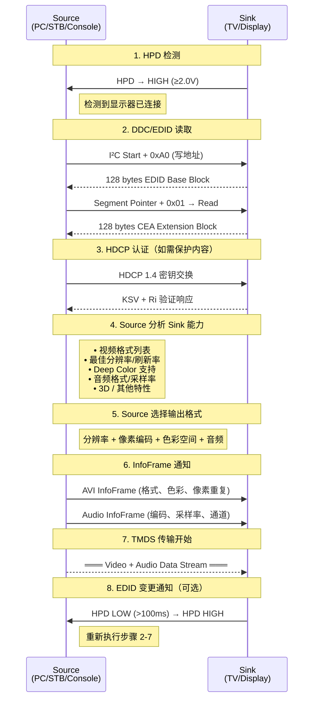

# HDMI EDID / DDC / 显示配置

## 1. DDC 概述

DDC (Display Data Channel) 是基于 I²C 总线的配置和状态交换通道，是 Source 与 Sink 之间沟通能力的桥梁。

**物理层**：SCL (时钟) + SDA (数据) 两根线，由 Source 提供 5V 上拉（HDMI Pin 18 — +5V Power）。

**用途**：
- EDID 读取 — Source 获取 Sink 的显示能力
- HDCP 认证 — 内容保护协商
- DDC/CI — 显示器控制（亮度、对比度等）

**协议版本**：E-DDC (Enhanced DDC)，遵循 VESA 标准。

**I²C 总线地址分配**：

| 功能           | 7-bit 写地址        | 7-bit 读地址        |
| ------------ | ---------------- | ---------------- |
| EDID (E-DDC) | 0xA0 (1010000 0) | 0xA1 (1010000 1) |
| HDCP         | 0x74             | 0x75             |
| DDC/CI       | 0x6E             | 0x6F             |

**速度**：标准模式 100kHz，支持快速模式 400kHz。

DDC 本质上是 Sink 端的一个 I²C Slave 器件，Source 作为 Master 发起读写操作。与标准 I²C 协议完全兼容，因此可以用逻辑分析仪或 MCU I²C 接口直接抓取调试。

## 2. E-EDID 结构

E-EDID (Enhanced Extended Display Identification Data) 是 VESA 定义的数据结构，Sink 必须通过 DDC 通道提供给 Source。

### EDID 1.3 基础块（128 bytes）

EDID 基础块的前 128 个字节是所有显示器必须提供的最小数据集。

| 偏移 | 长度 | 内容 | 备注 |
|------|------|------|------|
| 0x00 | 8 | Header | 固定值：`00 FF FF FF FF FF FF 00` — 这是 I²C 读取时的签名 |
| 0x08 | 10 | 制造商 ID + 产品代码 | 制造商 ID 按 PNP ID 编码（3 字符压缩为 2 字节），产品代码 2 字节 LE |
| 0x12 | 2 | EDID 版本号 | 通常为 `01 03` (Version 1, Revision 3) |
| 0x14 | 5 | 基本显示参数 | 视频输入定义（数字/模拟信号类型）、屏幕尺寸、Gamma |
| 0x19 | 10 | 色彩特征 | RGB 色度坐标（CIE xy 各 10-bit 编码）、白点坐标 |
| 0x23 | 3 | 已建立的时序 | 位掩码表示 VESA DMT 标准时序支持情况 |
| 0x26 | 16 | 标准时序 | 8 个 2-byte 条目，每个描述分辨率 + 刷新率 |
| 0x36 | 72 | Detailed Timing Descriptors | 4 个 18-byte 块，详细描述显示时序参数 |
| 0x7E | 1 | 扩展块计数 | 后续扩展块数量（HDMI 至少 1 个 CEA 扩展） |
| 0x7F | 1 | 校验和 | 使整个块 128 字节和为 0x00 |

**Detailed Timing Descriptor (18 bytes) 解析**：

| 偏移 | 位宽 | 内容 |
|------|------|------|
| 0x00 | 2 | 像素时钟 (MHz)，除以 10000 |
| 0x02 | 2 | 水平有效像素 |
| 0x04 | 2 | 水平消隐 (blanking) |
| 0x06 | 2 | 垂直有效像素 |
| 0x08 | 2 | 垂直消隐 (blanking) |
| 0x0A | 1 | 水平同步偏移 |
| 0x0B | 1 | 水平同步脉冲宽度 |
| 0x0C | 4-bit | 垂直同步偏移 |
| 0x0C | 4-bit | 垂直同步脉冲宽度 |
| 0x0D | 2-bit | 水平同步极性 (正/负) |
| 0x0D | 2-bit | 垂直同步极性 |
| 0x0D | 4-bit | 交错标志 + 立体模式 |
| 0x0E | 1 | 水平边框宽度 |
| 0x0F | 1 | 垂直边框宽度 |
| 0x10 | 2 | 显示器名称字符串 (DPMS 等) |

### EDID 扩展块 — CEA Extension（128 bytes）

HDMI Sink **必须**包含至少一个 CEA-861 扩展块。该扩展块在 EDID 基础块的扩展块计数中声明。Source 通过 I²C 段指针（Segment Pointer）切换访问：段 0 为基础块，段 1 为 CEA 扩展。

CEA 扩展块结构：

| 偏移 | 长度 | 内容 |
|------|------|------|
| 0x00 | 1 | Tag = 0x02 (CEA Extension) |
| 0x01 | 1 | 版本号 (Revision) |
| 0x02 | 1 | DTD 起始偏移 (从块头开始) |
| 0x03 | 1 | 其他 Data Block 总长度 + 标志位 |
| 0x04 | N | Data Block Collection |
| ... | 18 | Detailed Timing Descriptors（每个 18 字节） |
| 0x7F | 1 | 校验和 |

**Data Block Collection** 以短标签格式 (Short Descriptor) 编码：

- **Short Video Descriptor (SVD)** — CE 视频格式 (CEA-861 定义的 480p, 720p, 1080p 等)
- **Short Audio Descriptor (SAD)** — 音频格式：LPCM, AC-3, DTS, DSD, MPEG, AAC 等
- **Speaker Allocation Data Block** — 扬声器布局（前置左/右/中置/低音炮/环绕等）
- **Vendor Specific Data Block (VSDB)** — HDMI 特有的扩展声明

## 3. HDMI Vendor Specific Data Block (HDMI VSDB)

VSDB 是 CEA Extension 中标识设备为 HDMI（而非 DVI）的关键字段。Source 仅凭此块即可判断 Sink 是 HDMI 还是仅 DVI。

**Tag** 固定为 0x03 (Vendor Specific)。**IEEE OUI** 为 `0x000C03`（HDMI Licensing, LLC 分配的 OUI）。

VSDB 内关键字段：

| 字段 | 长度 | 描述 |
|------|------|------|
| IEEE OUI | 3 bytes | 0x00, 0x0C, 0x03 |
| CEC Physical Address | 2 bytes | 4 个 4-bit 值 A.B.C.D，用于 CEC 路由 |
| Supports_AI | 1 bit | 支持 ACP/ISRC 包（音频内容保护） |
| Max_TMDS_Clock | 7 bits | 最大 TMDS 时钟频率，单位 MHz。HDMI 1.4 最大 340MHz (3.4Gbps/lane) |
| Latency_Fields_Present | 1 bit | 是否包含视频/音频延迟字段 |
| I_Latency / V_Latency | 8 bits 各 | 视频延迟 — 逐行 (V) 和隔行 (I) 源到屏幕延迟 |
| Audio_Latency | 8 bits | 音频延迟 |
| 3D_present | 1 bit | 支持 3D 传输 |
| 3D_Multi_present | 1 bit | 支持多种 3D 格式组合 |
| HDMI_VIC_present | 1 bit | 支持扩展 VIC（HDMI 定义的非 CEA 格式） |
| CN0:CN3 | 4 bits | 支持的内容类型：Graphics, Photo, Cinema, Game |
| YCC420_present | 1 bit | 支持 YCbCr 4:2:0 色度子采样 |

**HDMI 1.4 新增特性**：
- **3D_Structure / 3D_Detail** — 声明支持的 3D 帧封装结构（Frame Packing, Side-by-Side, Top-and-Bottom 等）
- **3D_Multi_present** — 支持多种 3D 格式组合
- **HDMI_VIC** — 扩展视频格式 ID（例如 4K 分辨率的专用格式，之前由 CEA-861 扩展实现）

> [!note] PCB 调试要点
> 读取 EDID 时，首先检查 Header (0x00-0x07) 是否为 `00 FF FF FF FF FF FF 00`。大多数 DDC 通信故障源于 5V 电源不足、I²C 上拉电阻不匹配，或 I²C 地址寻址错误。Max_TMDS_Clock 字段决定了 Source 能否输出 3.4Gbps 的高带宽。

## 4. InfoFrame 系统

InfoFrame 是 Source 在视频消隐区间发送给 Sink 的辅助数据包，携带当前音视频流的元数据。与 EDID 方向相反 — EDID 是 Sink 告知 Source 能力，InfoFrame 是 Source 告知 Sink 当前实际输出格式。

**数据包结构**：Header (3 bytes) + Content (最多 28 bytes) + Checksum (1 byte)

| InfoFrame 类型 | 包类型码 | 用途 |
|---------------|---------|------|
| AVI InfoFrame | 0x82 | **视频格式**：视频格式 (VIC)、色彩空间 (RGB/YCbCr)、像素重复、量化范围 (0-255/16-235)、过扫描标志、YCbCr 采样结构、IT 内容类型 |
| Audio InfoFrame | 0x84 | **音频格式**：编码格式、声道数、采样率、样本尺寸 |
| Source Product Description | 0x83 | **源描述**：设备名称字符串、产品序列号 |
| MPEG Source | 0x85 | **压缩流信息**：MPEG 帧重组时序 |
| HDMI Vendor Specific | 0x81 | **HDMI 专有**：3D 格式、内容类型等 |

**AVI InfoFrame 详解**：
- **Y1:Y0** (2 bits) — 色彩空间：0=RGB, 1=YCbCr 4:2:2, 2=YCbCr 4:4:4
- **Colorimetry** (2 bits) — 色度标准：ITU-R BT.601, BT.709, 或扩展色域 xvYCC
- **Extended Colorimetry** (3 bits) — 扩展色域：sRGB, Adobe RGB, DCI-P3 等
- **RGB Quantization Range** (2 bits) — 量化范围：Default (0-255 PC / 16-235 Video), Limited (16-235), Full (0-255)
- **SC** (1 bit) — 非均匀缩放标志
- **ITC** (1 bit) — IT 内容标志（通知显示器启用"电影/游戏模式"）

## 5. Hot Plug Detect (HPD)

HPD 是 Sink 向 Source 发送连接状态变化的物理信号线（HDMI Pin 19）。

**电平定义**：
- **>2.0V** — Sink 已就绪，Source 可读取 EDID
- **<0.8V** — Sink 断开，Source 停止 TMDS 传输

**HPD 脉冲机制**：
- Sink 将 HPD 短暂拉低（>100ms），然后重新拉高
- 信号含义：EDID 已更新，请 Source 重新读取
- 通常在显示器 OSD 菜单更改分辨率设置或固件更新后触发

**时序要求**：
- Source 必须在 HPD 变高后 **≤100ms** 内开始读 EDID
- EDID 读取应在 Sink 准备好后尽快完成
- Source 在 HPD 低电平时必须停止 TMDS 视频传输
- 如果 HPD 脉冲小于 100ms，Source 可能无法检测到状态变化，导致仍然使用旧的 EDID 数据

> [!note] PCB 设计建议
> HPD 线不需要阻抗匹配，但上拉电阻值会影响上升/下降时间。HDMI 规范建议 Source 端使用 10kΩ-100kΩ 上拉到 5V。对于长线缆，注意 HPD 线可能引入噪声，可在 Source 端加 RC 滤波。

## 6. CEC Physical Address

CEC 协议使用 EDID VSDB 中的物理地址实现设备发现和路由。

- 物理地址格式：4 个 4-bit 值，表述为 **A.B.C.D**（如 `1.0.0.0`）
- **CEC Root 设备地址为 `0.0.0.0`**（通常为电视/显示器本身）
- 每个 HDMI 输入端口在 EDID 中包含该端口对应的物理地址
- Repeater（如 AVR、Soundbar）为其每个输入分配递增端口号

**地址分配示例** (HDMI Repeater)：
```
TV (Root):        0.0.0.0
  ├─ HDMI IN 1:   1.0.0.0
  ├─ HDMI IN 2:   2.0.0.0
  └─ MHL:         3.0.0.0
      └─ ARC:     1.0.0.0
```

CEC 设备在发现阶段的流程：
1. 读取 Sink EDID 中的物理地址
2. 依据物理地址计算 CEC 逻辑地址
3. 在 CEC 总线上声明该逻辑地址并开始监听

## 7. DDC 时序要求

**I²C 总线参数**：
- 标准模式：100kHz
- 快速模式：400kHz — HDMI 1.4 支持
- 上拉电压：5V (来自 Source Pin 18)
- 最大电容负载：400pF

**EDID 分段读取**：
- **基础块**：标准 I²C 读取，偏移地址 0x00-0x7F
- **扩展块**：通过段指针寄存器 (Segment Pointer) 切换块
  - 写段指针地址 0x60/0x61，写入段号 (0 或 1)
  - 然后读取偏移 0x80-0xFF 范围
- 读取流程示例：
  1. Source 发送 Start + 0xA0 (写) + 0x00 (偏移) → 段 0 基础块偏移起始
  2. Source 发送 Repeated Start + 0xA1 (读) + 读取 128 字节
  3. Source 发送 Stop
  4. Source 发送 Start + 0xA0 + 0x60 (段指针地址) + 0x01 (段号 1)
  5. Source 发送 Start + 0xA0 + 0x80 (扩展块偏移起始)
  6. Source 发送 Repeated Start + 0xA1 (读) + 读取 128 字节

## 8. 自动唇音同步 (Auto Lipsync)

从 HDMI 1.3 开始引入，用于解决音视频不同步问题。

**工作原理**：
1. Sink 在 EDID VSDB 的延迟字段中声明视频和音频处理延迟
2. Source 读取这些延迟值
3. Source 在 AVI 和 Audio InfoFrame 中调整音频偏移
4. 支持延迟值的动态变化（显示器处理模式变化时）

**延迟单位**：
- 视频延迟 `V_Latency` / `I_Latency`：以 **ms** 为单位表示（0-255ms）
- 音频延迟：以音频采样数为单位

**实际延迟来源**：
- 面板响应时间
- 视频处理 (缩放器、去隔行、MEMC 运动补偿)
- 色域转换 (3D LUT 处理)
- 音频 DSP 处理

> [!note] 调试经验
> 如果遇到音画不同步问题，检查 EDID VSDB 中的 Latency_Fields_Present 位是否已置位，以及实际的延迟值是否准确。某些廉价的 HDMI 到 LVDS 桥接芯片（如 CH7036）可能不会正确编码延迟字段，导致 Source 无法实施自动唇音同步。

## 9. 源选择与配置流程 — 完整时序图

HDMI 从连接建立到正常显示音视频的完整初始化流程：



**实际应用中的常见问题**：

| 问题 | 可能原因 | 排查思路 |
|------|---------|---------|
| 无画面 (黑屏) | EDID 读取失败 | 检查 DDC 电压、I²C 总线状态 |
| 花屏/闪烁 | TMDS 时钟/数据同步 | 检查 TMDS 差分信号质量和抖动 |
| 分辨率不对 | EDID 解析错误 / VSDB 缺失 | 读 EDID 原始值，确认 CEA Extension 存在 |
| 无声音 | Audio InfoFrame 缺失 | 检查 SAD 中的音频格式声明 |
| 画面卡顿/撕裂 | 时序参数不匹配 | 比较 Detailed Timings 实际值与 Source 输出 |
| HDCP 失败 | 密钥交换中断 | 检查 DDC 总线是否被其他设备占用 |

## 相关页面

- [视频显示/HDMI 协议概述](HDMI%20协议概述.md) — HDMI 整体协议体系
- [视频显示/HDMI 物理层](HDMI%20物理层.md) — 电气特性和 PCB 设计指导
- [视频显示/HDMI TMDS 编码](HDMI%20TMDS%20编码.md) — 最小化传输差分信号编码
- [视频显示/HDMI 视频传输](HDMI%20视频传输.md) — 视频格式、时序和字符生成

## 参考资料

- HDMI Specification 1.4a, Section 8 — Configuration and Status Channel
- VESA Enhanced Extended Display Identification Data (E-EDID) Standard
- CEA-861-D — A DTV Profile for Uncompressed High Speed Digital Interfaces
- I²C-bus specification and user manual (UM10204), NXP Semiconductors
