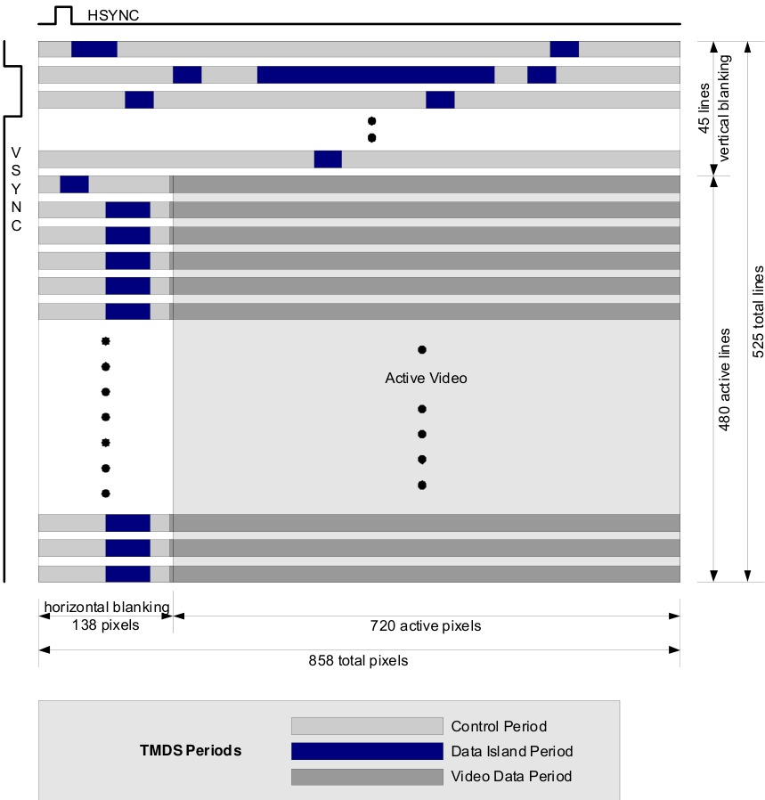
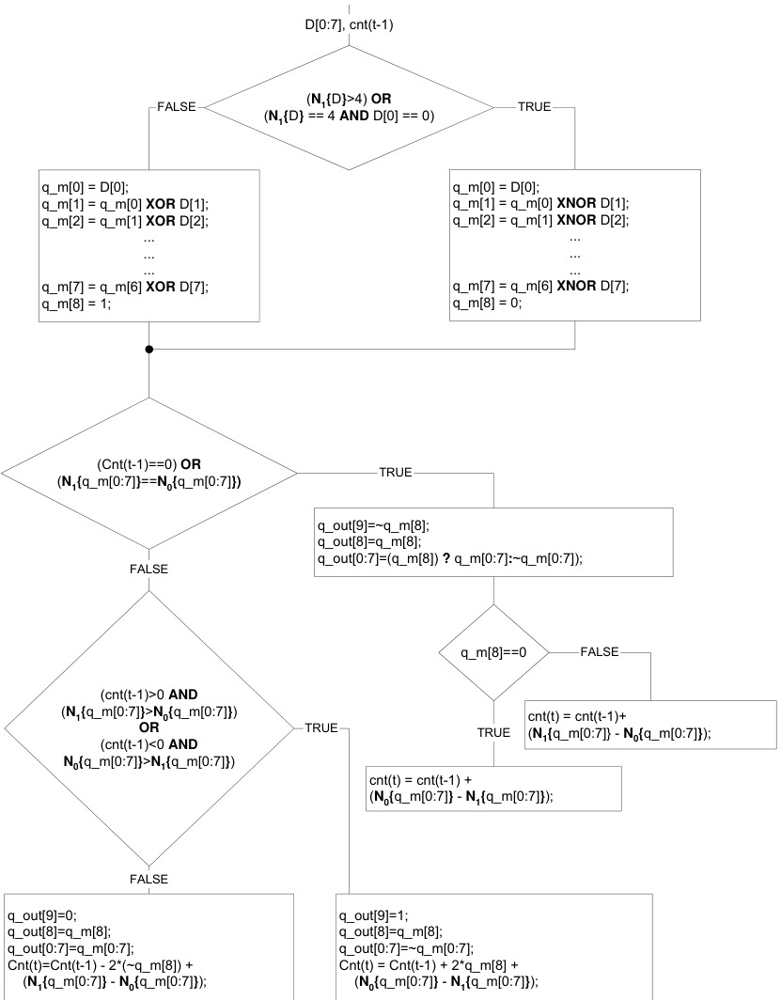
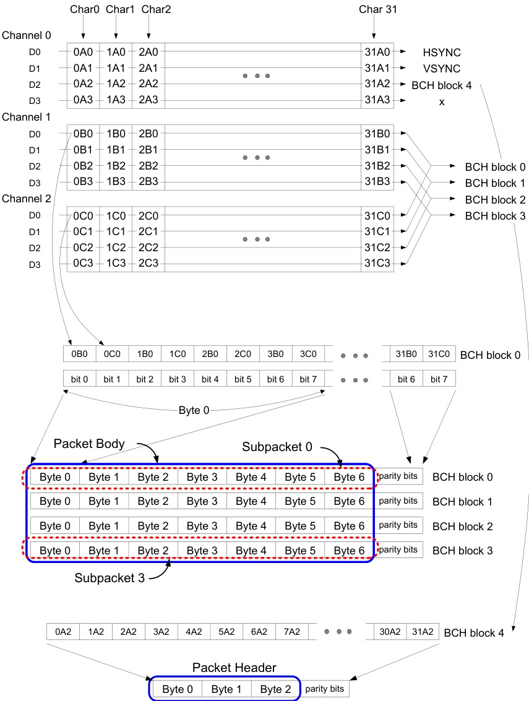
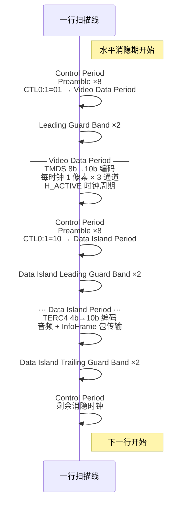

# HDMI TMDS 编码

> TMDS (Transition Minimized Differential Signaling) 是 HDMI 和 DVI 的核心链路层编码技术。它将视频、音频和控制数据编码为串行 10-bit 字符，通过差分信号传输，兼具 DC 平衡和 EMI 抑制特性。

## TMDS 链路架构

一个 HDMI 链路包含 **3 个 TMDS 数据通道**（Channel 0/1/2）和 **1 个 TMDS 时钟通道**：

| 通道 | 视频分量 | 控制信号 | 数据负载 |
|------|----------|----------|----------|
| Channel 0 | B (Blue) | HSYNC, VSYNC | 包头部 (Packet Header) |
| Channel 1 | G (Green) | CTL0, CTL1 | 音频采样 (Audio Sample) |
| Channel 2 | R (Red) | CTL2, CTL3 | 音频采样 (Audio Sample) |

TMDS 时钟持续运行，频率等于视频像素率（pixel rate）。每个时钟周期，每个通道传输一个 **10-bit 字符**。Source 端的编码器在每个时钟周期从以下三种输入中选择一种进行编码：

- **2 bits** 控制数据（Control Period）
- **4 bits** 包数据（Data Island Period）
- **8 bits** 视频数据（Video Data Period）

以及特殊 Guard Band 字符用于消隐期内的边界标记。

## 三种操作模式


*Figure 5-2 — 720×480p 视频帧中的 TMDS 周期分布：Video Period（有效像素）、Data Island（音频/InfoFrame）、Control Period 的时空布局*


一个视频帧的传输链路按时间顺序在三种操作模式间切换：

| 周期 | 传输数据 | 编码方式 | 每通道位数 |
|------|----------|----------|-----------|
| Video Data | 活跃视频像素 | TMDS 转换最小化编码 | 8 bits → 10 bits |
| Data Island | 音频采样、InfoFrame、辅助数据 | TERC4 编码 | 4 bits → 10 bits |
| Control | HSYNC/VSYNC、CTLx、Preamble | 转换最大化编码 | 2 bits → 10 bits |

每个 **Video Data Period** 和 **Data Island Period** 前面有 **Leading Guard Band**（2 个特殊 10-bit 字符）。Data Island 后面还有 **Trailing Guard Band** 做结尾标记。

帧时序示意（以 720×480p 为例）：
- 总像素：858 × 525
- 活跃视频：720 × 480
- 水平消隐 (HBlank)：138 像素
- 垂直消隐 (VBlank)：45 行
- Data Island 出现在消隐期内

```
[Control: Preamble] → [Video Guard Band] → [Video Data: 8b10b pixels] →
[Control: Preamble] → [Data Island Guard Band] → [Data Island: TERC4 packets + Trailing GB] →
[Control] → [Video Guard Band] → [Video Data: next line] → ...
```

## Control Period

Control Period 出现在消隐期（Blanking Interval），负责传输 Preamble（前导码）和同步信号。

**Preamble 机制**：8 个相同的 Control 字符（2b→10b 编码），告知 Sink 即将到来的数据周期类型。

| CTL0:1 状态 | 含义 |
|-------------|------|
| 00 | 默认控制 |
| 01 | **Video Data Period** 即将到来 |
| 10 | **Data Island Period** 即将到来 |
| 11 | 预留 |

- Channel 0：传输 HSYNC 和 VSYNC（2 bits）
- Channel 1：传输 CTL0 和 CTL1（2 bits）
- Channel 2：传输 CTL2 和 CTL3（2 bits）

Sink 端利用 Control Period 进行 **字符同步**（character alignment），通过检测特定 Control 字符边界来锁定 10-bit 字对齐。

## Video Data 编码：TMDS 转换最小化


*Figure 5-7 — TMDS 视频编码算法流程图：XOR/XNOR 选择（最小化跳变）→ DC 平衡（可选取反）*


8-bit 视频像素数据转化为 10-bit TMDS 字符，核心目标是 **最小化跳变次数 + DC 平衡**。

### 编码算法步骤

#### Step 1: 选择最小跳变编码（8-bit → 9-bit）

对 8-bit 输入 `D[7:0]`，计算两种候选编码：

- **XOR 编码**：`q_out[0] = d[0]`；对 i=1..7：`q_out[i] = d[i] XOR q_out[i-1]`
- **XNOR 编码**：`q_out[0] = d[0]`；对 i=1..7：`q_out[i] = d[i] XNOR q_out[i-1]`

计数每种编码中 "1" 的个数，选择规则：

```
if (ones(XOR) > 4) → 选 XNOR，第 9 位 q[8] = 0
if (ones(XOR) < 4) → 选 XOR，  第 9 位 q[8] = 1
if (ones(XOR) == 4) → 特殊处理：
  if (q[0] == 0) → 选 XNOR，q[8] = 0
  if (q[0] == 1) → 选 XOR，  q[8] = 1
```

> 这一步骤确保编码后的 9-bit 数据中跳变次数不超过 4 次，从而降低高频分量、减少 EMI。

#### Step 2: DC 平衡（9-bit → 10-bit）

引入第 10 位 `q[9]` 控制反转，维护 **running disparity**（累计 DC 偏置）：

```
disparity = (# of 1 bits) − (# of 0 bits)
```

规则：

```
if (disparity == 0 或 q[8] == 0):
  不反转
  q[9] = 1（表示当前 9-bit 未反转）
  更新 disparity += disparity(q[8:0])
else:
  反转（将 1 和 0 互换后传输）
  q[9] = 0（表示当前 9-bit 已反转）
  更新 disparity −= disparity(q[8:0])
```

#### Step 3: 最终输出

10-bit TMDS 字符 `q[9:0]` 通过差分对串行发送，每个时钟周期每通道 1 个字符。

### Disparity 说明

**Disparity** 是编码器维护的累计 DC 偏置计数器，反映已发送数据中 "1" 和 "0" 的数量差：

- 正数 (positive disparity)：已发送的 "1" 多于 "0"
- 负数 (negative disparity)：已发送的 "0" 多于 "1"
- 目标：长期趋近于 0

通过第 10 位的反转控制，编码器动态选择发送原码或反码，确保：

- 任意连续 10-bit 字符的 disparity 不超过 ±2
- 长期 DC 分量接近 0，避免接收端 AC 耦合电容充电偏移

> 这个 DC 平衡机制是链路能在无变压器/无编码预加重下稳定传输的关键。

## TERC4 编码（Data Island）

TERC4（TMDS Error Reduction Coding）将 4-bit 输入映射为 10-bit 输出，用于 **Data Island Period** 传输音频采样、InfoFrame 和辅助数据包。

| 4-bit 输入 | 10-bit 输出（十进制表示） |
|:----------:|:------------------------:|
| 0000 | 1001001100 |
| 0001 | 1001110010 |
| 0010 | 0100111001 |
| 0011 | 1010010011 |
| 0100 | 0001110100 |
| 0101 | 1101000101 |
| 0110 | 0010110101 |
| 0111 | 0110010110 |
| 1000 | 0001011101 |
| 1001 | 0100101110 |
| 1010 | 1011100001 |
| 1011 | 0011100110 |
| 1100 | 1011000110 |
| 1101 | 1100011001 |
| 1110 | 1000101101 |
| 1111 | 1010110001 |

TERC4 的特点：

- 每个输出码型中 **0 和 1 的数量差为 0 或 ±2**，天然趋近 DC 平衡
- 码间 **最小汉明距离大**，抗误码能力强于视频编码
- 每 4-bit nibble 独立编码，适合承载非视频数据

## Data Island 包结构


*Figure 5-4 — Data Island 包与 ECC 结构：Packet Header 32bit（含 BCH ECC）+ 4 个 Subpacket*


Data Island Period 传输的数据以包（Packet）为单位组织。

### 包类型

| 包类型 | 类型码 | 用途 |
|--------|:------:|------|
| Null | 0x00 | 空包，填充占位 |
| Audio Clock Regeneration | 0x01 | 音频时钟再生参数 N/CTS |
| Audio Sample | 0x02 | L-PCM 音频采样 |
| General Control | 0x03 | 通用控制 |
| ACP | 0x04 | 音频内容保护（Audio Content Protection） |
| ISRC1 | 0x05 | 国际标准录音码 1 |
| ISRC2 | 0x06 | 国际标准录音码 2 |
| One Bit Audio | 0x07 | DSD/SACD 单比特音频 |
| DST Audio | 0x08 | DST 压缩音频 |
| HBR Audio Stream | 0x09 | 高比特率音频流（DTS-HD Master Audio, Dolby TrueHD） |
| Gamut Metadata | 0x0A | xvYCC 宽色域元数据 |
| InfoFrame | 0x80+ | AVI(0x82), Audio(0x84), SPD(0x83), MPEG(0x85), Vendor Specific(0x81) |

### 包格式

每个 Data Island 包包含三个部分，通过 3 个 Channel 并行传输：

```
Header: 3 bytes (Type + Version + Length) — 通过 Channel 0 传输
Body:   28 bytes 最大 — 通过 Channel 1/2 交替传输
ECC:    BCH 纠错码校验 — 保护整个包
```

InfoFrame 包（Packet Type 0x80+）用于传输辅助信息帧：
- **AVI InfoFrame** (0x82)：视频格式、色域、量化范围、像素重复
- **Audio InfoFrame** (0x84)：音频编码格式、采样率、声道数
- **SPD InfoFrame** (0x83)：源设备描述（类似 USB 设备描述符）
- **MPEG InfoFrame** (0x85)：MPEG 源内容信息
- **Vendor Specific InfoFrame** (0x81)：HDMI 特有的扩展信息（如 Deep Color、3D 格式、4K 支持）

## Guard Band 机制

Guard Band 是消隐期内用于界定不同数据周期边界的专用 10-bit 字符：

- **Leading Guard Band**（前导保护带）：2 个特殊字符，标记从 Control Period 切换到数据周期
  - Video Data Period 的 Leading GB：Channel 0/1/2 各有特定 10-bit 模式
  - Data Island Period 的 Leading GB：与 Video 不同的模式
- **Trailing Guard Band**（尾部保护带）：仅 Data Island Period 使用，标记 Data Island → Control 的转换

Guard Band 的用途：
1. 提供明确的周期边界，防止 Sink 侧误判数据类型
2. 允许 Sink 端完成编码器/解码器状态重置
3. 为字符同步提供额外参考点

## 链路时序总览

完整的帧/行传输时序：



## 与 HDMI 其他知识模块的关系

- [视频显示/HDMI 协议概述](HDMI%20协议概述.md) — TMDS 是 HDMI 链路层的核心编码方案
- [视频显示/HDMI 物理层](HDMI%20物理层.md) — TMDS 差分信号的电平规范（3.3V 单端，摆幅 400-600mV）
- [视频显示/HDMI 视频传输](HDMI%20视频传输.md) — TMDS 承载的视频像素时序和消隐期安排
- [视频显示/HDMI EDID](HDMI%20EDID.md) — TMDS 时钟和通道支持的像素格式由 EDID 协商确定
- [TC358870](../../元件/接口存储/TC358870.md) — 该接口芯片内部包含 TMDS 编码器，将并行 RGB 转换为 HDMI 串行输出
