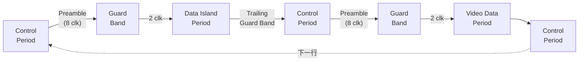

# HDMI 协议概述

## 1. 定义与范围

**HDMI (High-Definition Multimedia Interface)** 是一种全数字化的音视频传输接口，用于将未经压缩的视频和音频信号从源设备（DVD 播放器、机顶盒、游戏机、PC）传输到接收端设备（电视、显示器、投影仪）。HDMI 集成了视频、音频和控制信号于单一线缆，取代了模拟接口（如 VGA、复合视频、分量视频）的复杂布线。

HDMI 由七家消费电子企业联合开发：**Hitachi、Panasonic、Philips、Silicon Image、Sony、Thomson、Toshiba**。其中 Silicon Image 贡献了核心的 TMDS (Transition Minimized Differential Signaling) 传输技术。

HDMI 于 **2002 年 12 月 9 日** 首次发布，当前讨论的 **HDMI 1.4 版于 2009 年 6 月 5 日** 发布。HDMI 向后兼容 [DVI](../../元件/连接器/HDMI%20Type%20A.md)，通过被动适配器即可实现 DVI 信号源到 HDMI 显示器的连接（仅传输视频，不包含音频）。

> [!note] HDMI 与 DVI 的兼容性
> HDMI Type A 的物理层和 TMDS 信号电气特性与 DVI 1.0 完全兼容，仅通过适配器即可互连。区别在于 HDMI 增加了音频传输、CEC 控制和更紧凑的连接器。

## 2. 系统架构

HDMI 采用 **Source（源）→ Sink（接收端）** 的单向视频传输模型：

```mermaid
flowchart LR
    subgraph Source["Source (DVD/STB/PC)"]
        TMDS_TX["TMDS Encoder"]
        DDC_M["DDC Master"]
        CEC_S["CEC"]
        HPD_DET["HPD Detect"]
        HEAC_S["HEAC"]
    end

    subgraph Sink["Sink (TV/Projector)"]
        TMDS_RX["TMDS Decoder"]
        DDC_S["DDC Slave<br/>EDID ROM"]
        CEC_R["CEC"]
        HPD_DRV["HPD Driver"]
        HEAC_R["HEAC"]
    end

    TMDS_TX -->|"3×Data + 1×Clock<br/>差分对"| TMDS_RX
    DDC_M <-->|"SCL/SDA (I²C)"| DDC_S
    CEC_S <-->|"单线双向"| CEC_R
    HPD_DET <--|"HPD"| HPD_DRV
    HEAC_S <-->|"Ethernet + ARC"| HEAC_R
```

### 2.1 设备类型

- **Source（源端）**：产生音视频数据的设备，如 DVD 播放器、机顶盒、游戏机、PC 显卡。
- **Sink（接收端）**：接收并显示/播放音视频数据的设备，如电视、显示器、投影仪。
- **Repeater（中继器）**：同时具备 Sink 和 Source 功能的设备。典型例子是 AV 接收器（AVR）：先以 Sink 模式接收 Source 的音视频，处理（如音频解码、视频缩放）后再以 Source 模式发送到电视。

### 2.2 物理信号线

HDMI 链路包含以下信号组：

| 信号组 | 线数 | 方向 | 功能 |
|--------|------|------|------|
| **TMDS Data Channel 0/1/2** | 3 对差分线 | Source → Sink | 视频、音频、辅助数据主通道 |
| **TMDS Clock** | 1 对差分线 | Source → Sink | 像素时钟参考 |
| **DDC (Display Data Channel)** | 2 线 (SCL/SDA) | 双向 | I²C 总线，用于 [EDID](HDMI%20EDID.md) 读取和 HDCP 密钥交换 |
| **CEC (Consumer Electronics Control)** | 1 线 | 双向 | 消费电子控制，单线双向协议 |
| **Utility / HEAC** | 1 线 | 双向 | HDMI 1.4 新增：以太网通道 (HEC) 或音频回传通道 (ARC) |
| **HPD (Hot Plug Detect)** | 1 线 | Sink → Source | 热插拔检测信号 |
| **+5V Power** | 1 线 | Source → Sink | 为 Sink 端 DDC 电路供电（最高 50mA） |

> 以上是 HDMI Type A（标准 19 引脚）的完整信号布局。Type C（Mini）和 [Type D（Micro）](../../元件/连接器/HDMI%20Type%20D.md) 信号相同但引脚排列不同。

## 3. 链路架构

[📷 _llm/raw/assets/standards/hdmi14/hdmi14_p91_fig1.jpg|620]
*Figure 5-1 — HDMI 编码器/解码器总览：3 条 TMDS 数据通道 + 1 条时钟通道，Video/Data Island/Control 三种周期复用*


### 3.1 TMDS 传输基础

TMDS (Transition Minimized Differential Signaling) 是 HDMI 的核心传输技术：

- **时钟频率** = 视频像素时钟频率。例如 1080p@60Hz 的像素时钟为 148.5MHz，则 TMDS 时钟也是 148.5MHz。
- **每通道每时钟周期传输 10-bit 数据**。3 个通道合计每时钟周期传输 30-bit。
- **编码方式**：原始 8-bit 视频数据经过 8b/10b 编码转换为 10-bit 字符，直流平衡并减少电磁干扰。

### 3.2 三种操作周期

HDMI 的 TMDS 通道按行扫描时序分为三种周期：

**1. Video Data Period（视频数据周期）**

传输活跃视频像素数据。每个通道传输 8-bit 像素分量，经 8b/10b 编码转换为 10-bit 输出。
- 对于 RGB 或 YCbCr 4:4:4：通道 0 = B/Cb，通道 1 = G/Y，通道 2 = R/Cr
- 对于 YCbCr 4:2:2：通道 0 = Cb/Cr 交替，通道 1 = Y，通道 2 = Y

**2. Data Island Period（数据岛周期）**

传输音频和辅助数据包。数据经 TERC4 (T-MDS Error Reduction Coding 4) 编码，将 4-bit 映射为 10-bit 字符。包含：
- 音频采样数据（IEC 60958 / IEC 61937 格式）
- InfoFrame 包（AVI、Audio、SPD、VS 等）
- HDCP 内容保护信息

**3. Control Period（控制周期）**

传输行/场同步和控制信号。经过 TMDS 转换最大化编码，将 2-bit 控制信号编码为 10-bit 字符。包含：
- HSYNC（行同步）
- VSYNC（场同步）
- CTL0/CTL1/CTL2/CTL3（通用控制信号）

**时序结构**：每种周期之间由 **Guard Band（保护带）** 和 **Preamble（前导码）** 分隔。前导码（在 Control Period 中编码）指示下一个周期的类型，Guard Band 确保通道状态稳定转换。



详细编码过程参见 [视频显示/HDMI TMDS 编码](HDMI%20TMDS%20编码.md)，视频时序参数参见 [视频显示/HDMI 视频传输](HDMI%20视频传输.md)。

## 4. 版本演进

| 版本 | 发布日期 | 关键变化 |
|------|----------|----------|
| **1.0** | 2002/12/09 | 初始发布。基于 TMDS，最高 165MHz 时钟，4.95 Gbps 带宽，支持 1080p。Type A 连接器 |
| **1.1** | 2004/05/20 | 引入 ACP (Audio Content Protection) 和 ISRC 包。明确 AVI InfoFrame 要求 |
| **1.2** | 2005/08/22 | 支持 One Bit Audio（DSD 音频）。移除 Type A 连接器 5V 电流限制。CEC 特性改进和命令扩展 |
| **1.2a** | 2005/12/14 | CEC 全面改进，新增命令和功能。增加 DVI 设备判别能力 |
| **1.3** | 2006/06/22 | **重大升级**。引入 Type C Mini 连接器。支持 Deep Color（30/36/48-bit）。xvYCC 广色域。DST 无损音频。自动唇音同步。频宽翻倍至 340MHz（10.2 Gbps）。定义 Category 1（标准）和 Category 2（高速）线缆分类 |
| **1.3a** | 2006/11/10 | 修正 Type C Sink 的源端终止要求。增加 AC 耦合支持说明 |
| **1.4** | 2009/06/05 | **本规范覆盖的版本**。详见下文 |

## 5. HDMI 1.4 关键新特性

### 5.1 新连接器类型

- **[Type D (Micro HDMI)](../../元件/连接器/HDMI%20Type%20D.md)**：尺寸 2.8mm × 6.4mm，比 Type C (Mini) 更小（约 1/3 体积），19 引脚间距 0.4mm，面向移动设备（智能手机、平板、数码相机）
- **Type E (Automotive Connection System)**：汽车级连接器，带锁定卡扣和防脱落机械结构，工作温度范围更宽，具备防潮/防振动特性

### 5.2 Audio Return Channel (ARC)

ARC 允许电视通过 HDMI 线缆将音频信号**回传**到 AV 接收器或音响系统，无需额外的光纤或 RCA 音频线。工作原理：
- 正常方向：Source → TV（视频 + 音频）
- ARC 方向：TV → AVR（仅音频，通过同一条 HDMI 线缆）
- 音频格式：支持最高 Dolby Digital 5.1、DTS 5.1、PCM 2.0
- 在现有 HDMI 链路中，ARC 复用 Utility/HEAC 线传输

### 5.3 HDMI Ethernet Channel (HEC)

HEC 在 HDMI 线缆内集成 100 Mbps 全双工以太网通道：
- 复用 Utility 线和 HPD 线（差分传输模式）
- 允许连接的所有 HDMI 设备共享单一宽带连接
- 物理层基于 MII (Media Independent Interface)，工作在 100BASE-TX 速率

### 5.4 3D 视频支持

定义了多种 3D 帧封装格式：

| 格式 | 说明 | 带宽需求 |
|------|------|----------|
| **Frame Packing** | 两帧完整分辨率图像（左+右）垂直堆叠，含空白行 | 最高（2 倍像素时钟） |
| **Side-by-Side (Half)** | 左右图像各取一半水平像素并排 | 与 2D 相同 |
| **Top-and-Bottom** | 左右图像各取一半垂直行上下排列 | 与 2D 相同 |
| **Frame Sequential** | 交替帧方式（仅 720p@50/60Hz） | 2 倍帧率 |

3D 视频通过 HDMI Vendor Specific InfoFrame (VSIF) 中的 HDMI_3D_Structure 字段标识。

### 5.5 4K × 2K 分辨率

新增超高清分辨率支持：

| 分辨率 | 帧率 | 像素时钟 |
|--------|------|----------|
| 3840 × 2160p | 24 Hz | 297 MHz |
| 3840 × 2160p | 25 Hz | 297 MHz |
| 3840 × 2160p | 30 Hz | 297 MHz |
| 4096 × 2160p | 24 Hz | 297 MHz |

这些分辨率需要 297 MHz TMDS 时钟和 Category 2（高速）线缆，总带宽约 8.91 Gbps，接近 TMDS 1.4 的最大带宽极限。

### 5.6 色彩空间扩展

- **sYCC-601**：标准 RGB 之外的广色域编码
- **Adobe RGB**：面向摄影和印刷的色彩空间
- **xvYCC (IEC 61966-2-4)**：色域比 sRGB 扩大约 1.8 倍
- **Deep Color**：每通道 10-bit、12-bit 或 16-bit，减少色彩条带（banding）

## 6. 文档结构

HDMI 1.4 规范由以下章节和附录组成：

| 章节 | 标题 | 内容概要 |
|------|------|----------|
| **Chapter 1** | Introduction | 范围、定义、缩略语 |
| **Chapter 2** | Overview | 系统架构概览，框图 |
| **Chapter 3** | Link Layer | TMDS 链路层协议：三种周期、编码、时序 |
| **Chapter 4** | Electrical Specifications | 电气特性：电压摆幅、上升/下降时间、抖动、线缆要求 |
| **Chapter 5** | DDC | Display Data Channel：I²C 协议、EDID 读取时序、Segment Pointer |
| **Chapter 6** | CEC | 消费电子控制：物理层、帧格式、命令集 |
| **Chapter 7** | HEAC | HDMI 以太网和音频回传通道：物理层、链路建立、协议 |
| **Chapter 8** | Connector and Cable | 连接器 Type A/B/C/D/E 引脚定义、线缆规格、测试 |
| **Chapter 9** | Test Specifications | 一致性测试：Source/Sink/线缆/Repeater 测试要求 |
| **Appendix A–F** | — | 寄存器定义、I²C 地址映射、InfoFrame 格式、CRC 算法等 |
| **Supplement** | 3D Video | 3D 视频补充规范（独立于主体文档） |

## 7. 参考规范

HDMI 规范引用了以下外部标准和规范：

| 标准 | 全称 | 关联章节 |
|------|------|----------|
| **CEA-861-D** | DTV Profile for Uncompressed High Speed Digital Interfaces | 视频时序、VSDB 数据块 |
| **VESA E-EDID** | Enhanced Extended Display Identification Data Standard | EDID 数据结构 |
| **VESA E-DDC** | Enhanced Display Data Channel Standard | DDC 总线协议 |
| **I²C Bus Specification** | NXP I²C-bus specification and user manual | DDC 物理层 |
| **HDCP 1.4** | High-bandwidth Digital Content Protection System | 内容保护 |
| **DVI 1.0** | Digital Visual Interface Specification | 基础兼容性参照 |
| **IEC 60958** | Digital audio interface (S/PDIF 基础) | 音频传输格式 |
| **IEC 61937** | Digital audio interface for non-linear PCM (Dolby/DTS) | 压缩音频传输 |
| **ITU-R BT.601** | Studio encoding parameters of digital television | SD 色彩空间 |
| **ITU-R BT.709** | Parameter values for HDTV standards | HD 色彩空间 |

## 相关页面

- [视频显示/HDMI 物理层](HDMI%20物理层.md) — 电气特性、信号摆幅、端接
- [视频显示/HDMI TMDS 编码](HDMI%20TMDS%20编码.md) — 8b/10b、TERC4、控制编码细节
- [视频显示/HDMI 视频传输](HDMI%20视频传输.md) — 视频时序、InfoFrame、色彩空间
- [视频显示/HDMI EDID](HDMI%20EDID.md) — EDID 数据结构与读取协议
- [HDMI Type A](../../元件/连接器/HDMI%20Type%20A.md) — 标准 19 引脚连接器
- [HDMI Type D](../../元件/连接器/HDMI%20Type%20D.md) — Micro HDMI 连接器
- [TC358870](../../元件/接口存储/TC358870.md) — HDMI 1.4b → 双 MIPI DSI 桥接芯片
