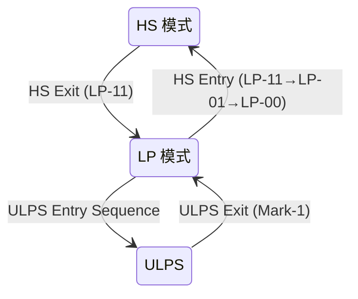
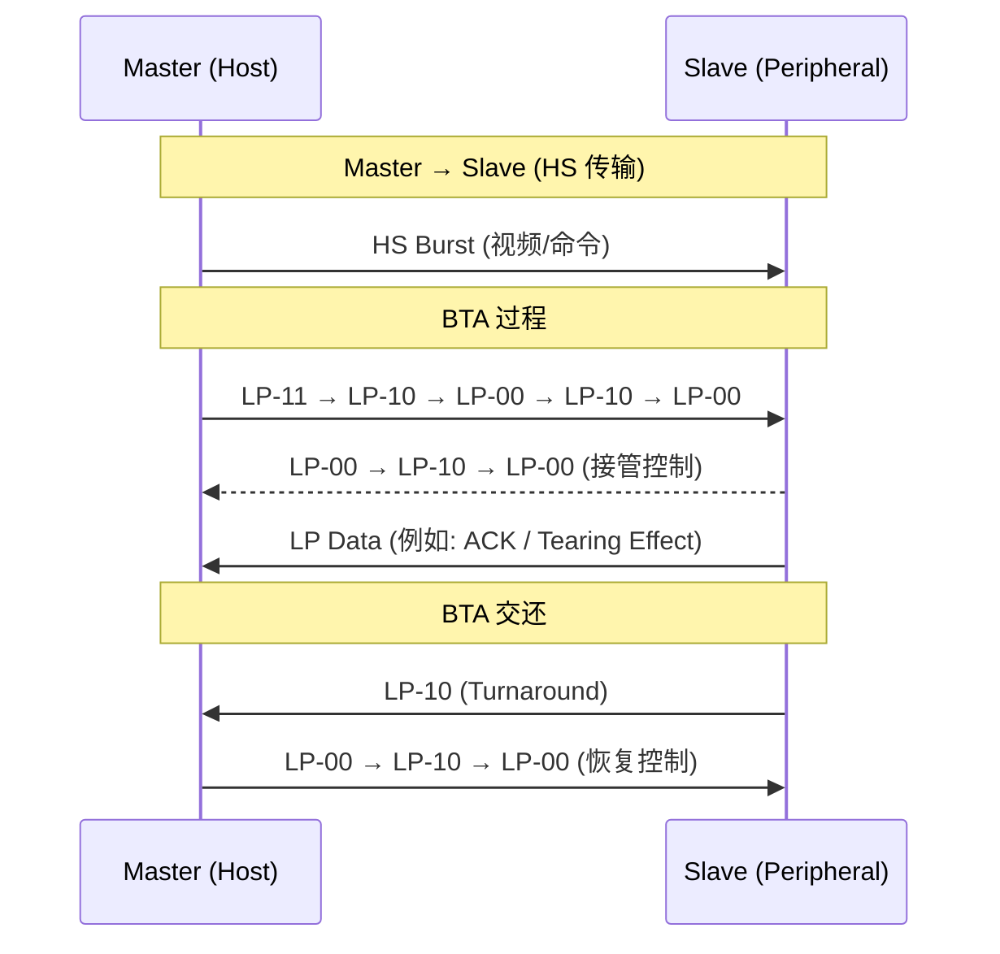

# MIPI D-PHY

> D-PHY 是 MIPI 联盟定义的高速源同步物理层规范，专为移动设备内部短距离芯片互连设计。它被 [DSI](MIPI%20DSI.md) 和 [CSI-2](../../CSI-2.md) 等上层协议采用，提供每通道 80 Mbps ~ 4.5 Gbps 的数据传输能力。

## 1. 双模信号机制

[📷 _llm/raw/assets/standards/dphy25/dphy25_p40_fig1.jpg|540]
*Figure 13 — HS 与 LP 模式的线电平：HS 差分 ±200mV @ 200mV 共模，LP 单端 0-1.2V*


D-PHY 最核心的设计特点是**双模信号**——同一条差分线上，根据工作模式切换完全不同的电气特性：

| 模式 | 信号类型 | 摆幅 | 速率 | 功耗 | 用途 |
|------|----------|------|------|------|------|
| **HS (High-Speed)** | 差分 LVDS | ~200 mV (典型 140-270 mV) | 80 Mbps ~ 4.5 Gbps | 中 | 高速数据传输（视频、像素流） |
| **LP (Low-Power)** | 单端 CMOS | 0 ~ 1.2 V | ≤ 10 Mbps | 极低 | 低速控制、 Escape Mode 通信 |

> [!note] 为什么需要两种模式？
> 移动设备有严格的功耗和 EMI 约束。HS 模式提供高带宽传输视频数据；LP 模式用单端 CMOS（无需差分驱动）实现极低功耗的控制通信。二者**交替使用同一条物理导线**，是 D-PHY 架构的精妙之处。



## 2. Lane 模块架构

[📷 _llm/raw/assets/standards/dphy25/dphy25_p25_fig1.jpg|480]
*Figure 1 — Universal Lane Module 内部功能：HS-TX/RX + LP-TX/RX/CD 组合*

[📷 _llm/raw/assets/standards/dphy25/dphy25_p27_fig1.jpg|560]
*Figure 2 — 双数据 Lane PHY 配置：时钟 Lane + 数据 Lane 的典型组织*


D-PHY 链路由一个 **Clock Lane** 和 1-4 条 **Data Lane** 组成。每条 Lane 是一个独立的差分对（Dp/Dn）。

### 2.1 Universal Lane Module

所有 Lane 都基于通用 Lane 模块（Universal Lane Module），内部包含：

| 子模块 | 功能 |
|--------|------|
| **HS-TX** | 高速差分发送器（LVDS 驱动器） |
| **HS-RX** | 高速差分接收器 |
| **LP-TX** | 低功耗单端 CMOS 发送器（推挽输出） |
| **LP-RX** | 低功耗单端接收器（施密特触发器，含毛刺滤波） |
| **LP-CD** | 低功耗冲突检测器（双向 Lane 的仲裁） |
| **ALP-ED** | ALP 模式包络检测器（D-PHY v2.0+） |
| **CIL** | 控制和接口逻辑（PPI 协议接口） |

### 2.2 Lane 类型

| Lane 类型 | 符号 | 方向 | HS-TX | HS-RX | LP-TX | LP-RX | 说明 |
|-----------|------|------|-------|-------|-------|-------|------|
| **Clock Lane** | CLK | 单向 | Master | Slave | — | — | 仅 Master→Slave，持续发送 DDR 时钟 |
| **Unidirectional Data** | Uni-D | 单向 | Master | Slave | — | — | 仅高速数据前向 |
| **Bi-directional Data** | Bi-D | 双向 | Master+Slave | Master+Slave | Master+Slave | Master+Slave | 支持 BTA（Bus Turnaround） |

### 2.3 时钟架构

D-PHY 使用 **DDR 源同步时钟**：

- Clock Lane 传输差分时钟信号，频率 = 数据速率的一半
- 在时钟的**双边沿**（上升+下降）采样数据
- 数据 lane 与 Clock Lane 之间存在**通道间偏移（Lane-to-Lane Skew）**，D-PHY v2.0+ 引入 Deskew 机制

```
Clock:  ──┐     ┌──┐     ┌──┐     ┌──
          └─────┘  └─────┘  └─────┘
Data:   ──X──X──X──X──X──X──X──X──
         ↑  ↑  ↑  ↑  (双边沿采样)
```

## 3. HS 传输结构

[📷 _llm/raw/assets/standards/dphy25/dphy25_p45_fig1.jpg|620]
*Figure 15 — HS Burst 传输序列：LP-11 → SoT → HS 载荷 → EoT → LP-11*

[📷 _llm/raw/assets/standards/dphy25/dphy25_p45_fig3.jpg|560]
*Figure 16 — HS 数据收发状态机*


### 3.1 Burst 传输

HS 数据以 **Burst（突发）** 形式传输，每次 Burst 经历以下阶段：

| 阶段 | 信号 | 说明 |
|------|------|------|
| **LP-11** | Dp=1.2V, Dn=1.2V | 空闲状态（Stop State） |
| **HS-Entry (SoT)** | LP-11 → LP-01 → LP-00 | 进入 HS 模式序列（Start-of-Transmission） |
| **HS Sync** | HS-0 序列 | 同步码 `00011101`，用于位对齐 |
| **HS Payload** | HS 数据字节 | 实际载荷（视频像素、命令包等） |
| **HS-Exit (EoT)** | LP-11 | 退出 HS 模式，返回 Stop State |

### 3.2 SoT 和 EoT

```
LP Mode ────╮            ╭──── LP Mode
            │ HS Entry   │ HS Exit
    LP-11 → LP-01 → LP-00 → HS-0 → [Payload] → LP-11
            └─ SoT ──────┘              └ EoT ┘
```

| 参数 | v1.0 | v2.5 |
|------|------|------|
| HS-Entry 时间 (T<sub>LPX</sub>) | ≥ 50 ns | 可程序化 |
| HS-Exit 时间 (T<sub>EOT</sub>) | 固定 | 可程序化 |
| HS Sync 模式 | `00011101` (8-bit) | 同上 |

### 3.3 EoTp（End of Transmission Packet）

DSI 协议层可在 payload 末尾插入 EoTp 短包标记传输结束（DSI v1.1+）。当 EoTp 使能时，接收器能更准确地识别 Burst 边界。

## 4. LP 模式与 Escape Mode

[📷 _llm/raw/assets/standards/dphy25/dphy25_p59_fig1.jpg|480]
*Figure 24 — Escape Mode 状态机：LP-11→LP-10→LP-00→LP-01→LP-00 进入序列*


### 4.1 LP 信号电平

LP 模式使用单端 CMOS 推挽驱动，逻辑电平如下：

| 逻辑状态 | Dp 电压 | Dn 电压 |
|----------|---------|---------|
| LP-00 | 0 V | 0 V |
| LP-01 | 0 V | 1.2 V |
| LP-10 | 1.2 V | 0 V |
| LP-11 | 1.2 V | 1.2 V |

- LP-11 是默认空闲状态（Stop State）
- LP-00 从 HS 的角度是 "Bridge State"，从 LP 的角度是 "Space State"

### 4.2 Escape Mode

Escape Mode 是在 LP 状态下进行低速数据通信的方法：

1. 发送 Escape Entry 码（LP-11→LP-10→LP-00→LP-01→LP-00）
2. 发送 8-bit Entry Command 选择子模式
3. 进入相应的 Escape 子模式

| Entry Command | 子模式 | 用途 |
|:------------:|--------|------|
| `0000_0001` | **LPDT** (Low-Power Data Transmission) | 低速数据传输 |
| `0010_0001` | **ULPS** (Ultra-Low Power State) | 超低功耗休眠 |
| `0100_0001` | **Trigger** | 触发/复位命令 |
| `1000_0001` | **Remote Reset** | 远程复位外设 |
| `0001_1110` | **Tearing Effect** | 撕裂效应信号（面板→主机） |
| `0010_1110` | **Acknowledge** | BTA 应答 |

### 4.3 ULPS（超低功耗状态）

ULPS 将所有 Lane 置于最低功耗状态（nA 级漏电流）：
- **进入**：Escape Mode → ULPS Entry Command → 长时间保持 LP-00
- **退出**：发送 Mark-1 状态（LP-10 持续 T<sub>WAKEUP</sub>）

## 5. BTA（Bus Turnaround）

[📷 _llm/raw/assets/standards/dphy25/dphy25_p51_fig1.jpg|620]
*Figure 19 — 控制模式 Lane 换向流程：主从驱动权交接的电平序列*


双向 Data Lane 支持方向反转（Bus Turnaround）：



## 6. 电气规范（关键参数）

### 6.1 HS 发送器

| 参数 | 符号 | 最小值 | 典型值 | 最大值 | 单位 |
|------|------|--------|--------|--------|------|
| 差分输出摆幅 | V<sub>OD</sub> | 140 | 200 | 270 | mV |
| 共模电压 | V<sub>CMTX</sub> | 150 | 200 | 250 | mV |
| 单端输出阻抗 | Z<sub>OS</sub> | 40 | 50 | 62.5 | Ω |
| 上升/下降时间 (20%-80%) | t<sub>r</sub>/t<sub>f</sub> | 50 | — | 0.3 UI | ps |

### 6.2 HS 接收器

| 参数 | 最小值 | 最大值 | 单位 |
|------|--------|--------|------|
| 差分输入灵敏度 | — | 70 | mV |
| 共模电压范围 | 70 | 330 | mV |
| 差分端接阻抗 | 80 | 125 | Ω |

### 6.3 LP 发送器

| 参数 | 最小值 | 典型值 | 最大值 | 单位 |
|------|--------|--------|--------|------|
| 输出高电平 (V<sub>OH</sub>) | 1.1 | 1.2 | 1.3 | V |
| 输出低电平 (V<sub>OL</sub>) | -50 | — | 50 | mV |
| 输出阻抗 | 110 | — | — | Ω |

### 6.4 时序参数

| 参数 | 符号 | 限制 | 条件 |
|------|------|------|------|
| Data-to-Clock Setup | T<sub>SETUP</sub> | ≥ 0.15 UI | 1.5 Gbps 以下 |
| Data-to-Clock Hold | T<sub>HOLD</sub> | ≥ 0.15 UI | 1.5 Gbps 以下 |
| HS-Entry 前 LP 持续时间 | T<sub>LPX</sub> | ≥ 50 ns | — |
| HS-Exit 后 LP 持续时间 | T<sub>EOT</sub> | ≥ 60 ns + 10×UI | — |

## 7. D-PHY 版本演进

| 版本 | 年份 | 最大速率/通道 | 关键新特性 |
|------|------|-------------|-----------|
| **v1.0** | 2009 | 1.0 Gbps | 基础 HS/LP 双模 |
| **v1.1** | 2011 | 1.5 Gbps | Eye diagram 规范改进 |
| **v1.2** | 2014 | 2.5 Gbps | HS-Deskew, 同步模式改进 |
| **v2.0** | 2016 | 4.5 Gbps | **ALP Mode**（替代 LP 的低开销模式） |
| **v2.1** | 2017 | 4.5 Gbps | HS-Idle, 无 Preamble 模式 |
| **v2.5** | 2019 | 4.5 Gbps | 8b9b Line Coding, 光互联支持 |

> [!note] ALP Mode（Alternate Low-Power）
> D-PHY v2.0 引入 ALP Mode 替代传统 LP Mode。ALP 使用差分信号的低振幅摆幅，省去 LP→HS 的电压模式切换延迟，Burst 间距更短，效率更高。ALP-ED（包络检测器）取代 LP-RX。

## 8. 与 HDMI TMDS 的物理层对比

| 参数 | HDMI TMDS | MIPI D-PHY |
|------|-----------|------------|
| 差分摆幅 | 400-600 mV | 140-270 mV |
| 共模电压 | 3.3 V (AVcc) | 200 mV (HS) / 1.2 V (LP) |
| 终端阻抗 | 50 Ω to 3.3V | 100 Ω 差分 (HS) / 无终端 (LP) |
| 时钟方案 | 独立差分时钟通道 | DDR 源同步（双边沿） |
| 编码 | 8b/10b TMDS | 无编码（v1.x）/ 8b9b（v2.5） |
| 低功耗模式 | 无 | LP Mode + ULPS |
| 双向通信 | 独立 DDC 通道 | BTA（同线反转） |

## 相关页面

- [视频显示/MIPI 概述](MIPI%20概述.md) — MIPI 家族全景
- [视频显示/MIPI DSI](MIPI%20DSI.md) — DSI 协议层（基于 D-PHY）
- [视频显示/HDMI 物理层](HDMI%20物理层.md) — HDMI TMDS 物理层（同类对比参照）
- [视频显示/HDMI TMDS 编码](HDMI%20TMDS%20编码.md) — HDMI 编码层
- [TC358870](../../元件/接口存储/TC358870.md) — HDMI→DSI 桥接芯片（内部含 D-PHY TX）
