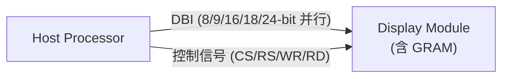
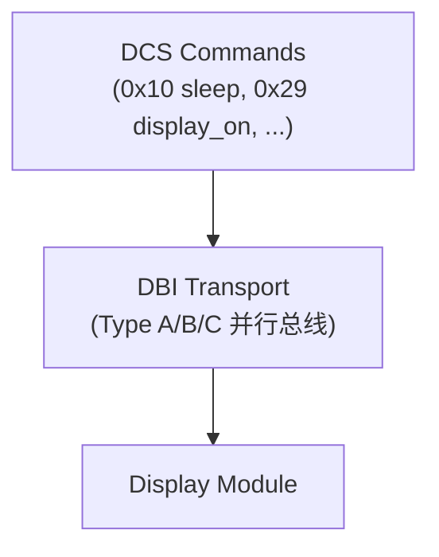

# MIPI DBI

> **DBI (Display Bus Interface)** 是 MIPI 联盟定义的并行显示总线接口，基于经典的微处理器总线协议（Intel 8080 和 Motorola 6800），用于主机通过并行数据总线控制显示模组。DBI 通常与 [[视频显示/MIPI DCS|DCS]] 命令集配合使用。

## 1. 定位与用途

DBI 是 MIPI 显示接口体系中的**传统并行接口**：



| 特性 | DBI | DSI |
|------|-----|-----|
| 信号类型 | 并行 CMOS | 串行差分 |
| 线数 | 13-30+ | 4-10 |
| 速率 | ≤ 50 Mbps | ≤ 4.5 Gbps/lane |
| 帧缓存 | 面板侧 GRAM | 可选 |
| 适用场景 | 低分辨率 MCU 屏 | 中高分辨率智能屏 |

## 2. 三种类型

![[_llm/raw/assets/standards/dbi20/dbi20_p17_fig1.jpg|420]]
*Figure 5 — Type A 接口方框图（摩托罗拉 6800 总线风格）*

![[_llm/raw/assets/standards/dbi20/dbi20_p18_fig1.jpg|440]]
*Figure 7 — Type C 接口方框图（3/4 线 SPI 串行）*

![[_llm/raw/assets/standards/dbi20/dbi20_p23_fig1.jpg|540]]
*Figure 9 — Type A 固定 E 模式写周期时序*

![[_llm/raw/assets/standards/dbi20/dbi20_p28_fig1.jpg|540]]
*Figure 17 — Type B（8080 风格）写周期时序：WRX 上升沿锁存*


DBI 定义了三种接口类型（Type A/B/C），基于不同的微处理器总线协议：

| 类型 | 协议基础 | 数据宽度 | 控制信号 |
|------|----------|:------:|----------|
| **Type A** | Motorola 6800 | 8/9/16/18/24 | CS\*, RS, R/W\*, E |
| **Type B** | Intel 8080 | 8/9/16/18/24 | CS\*, RS, WR\*, RD\* |
| **Type C** | SPI-like | 8/9/16 | CS\*, SCL, D/CX |

### 2.1 Type A（Motorola 6800 风格）

```
写时序: CS↓ → RS 建立 → R/W=0 → E↑（数据锁存）→ E↓
读时序: CS↓ → RS 建立 → R/W=1 → E↑（数据输出有效）→ E↓
```

- 使用 E (Enable) 时钟信号
- R/W 控制读写方向
- 常用于传统 LCD 控制器

### 2.2 Type B（Intel 8080 风格）

```
写时序: CS↓ → RS 建立 → WR↓（数据锁存）→ WR↑
读时序: CS↓ → RS 建立 → RD↓（数据输出）→ RD↑
```

- 使用独立的 WR\* 和 RD\* 选通信号
- 最常用的 DBI 类型
- 大量 TFT-LCD 驱动 IC 采用（如 ILI9341、ST7789）

### 2.3 Type C（SPI-like）

```
传输: CS↓ → D/CX 建立 → SCL 时钟 → 数据在 SCL 边沿采样
```

- 三线或四线 SPI 变体
- D/CX 区分命令/数据（类似 RS）
- 引脚最少，速率最低

## 3. 数据宽度

DBI 支持多种数据总线宽度：

| 宽度 | 颜色支持 | 典型像素格式 |
|:----:|----------|-------------|
| 8-bit | 256 色 | RGB 3-3-2 |
| 9-bit | 512 色 | — |
| 16-bit | 65K 色 | RGB 5-6-5 |
| 18-bit | 262K 色 | RGB 6-6-6 |
| 24-bit | 16.7M 色 | RGB 8-8-8 |

> 9-bit 模式在 Intel 8080 协议中用于传输 8-bit 数据 + 1-bit 命令/数据标志。

## 4. 与 DCS 的关系

DBI 不定义命令语义——它只提供传输管道。显示控制命令由 [[视频显示/MIPI DCS|DCS]] 定义：



常见工作流程：
1. Host 通过 DBI Type B 发送 `exit_sleep_mode` (0x11)
2. 等待 120ms
3. 发送像素格式设置 `set_pixel_format` (0x3A)
4. 发送 `set_display_on` (0x29)
5. 发送 `write_memory_start` (0x2C) 后接像素数据

## 5. 与 DSI 的关系

DSI 在 Command Mode 下实质上是对 DBI+DCS 的**串行化替代**——同样的 DCS 命令，同样的命令/数据模型，只是物理层从并行 CMOS 变成了串行差分。

DSI 的 DCS 包类型（DT=0x05/0x15/0x39）直接对应 DBI 的命令传输操作，使得驱动代码在 DBI 和 DSI 之间可以共享 DCS 命令逻辑。

## 相关页面

- [[视频显示/MIPI 概述]] — MIPI 家族全景
- [[视频显示/MIPI DSI]] — DSI（DBI 的串行替代方案）
- [[视频显示/MIPI DCS]] — Display Command Set（DBI 上运行的命令层）
- [[视频显示/MIPI DPI]] — 并行像素接口（无 GRAM，实时刷新）
