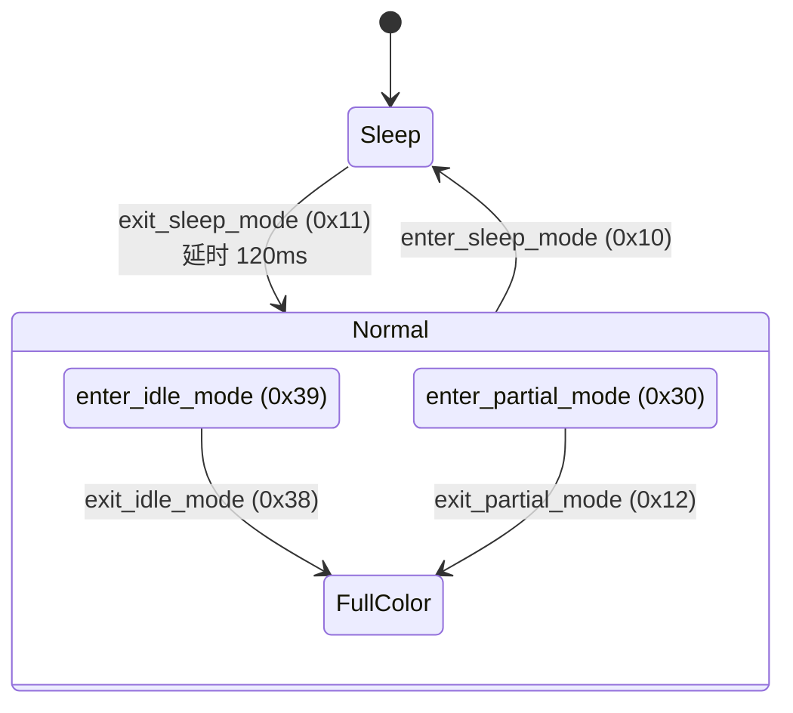

# MIPI DCS

> **DCS (Display Command Set)** 是 MIPI 联盟定义的标准化显示命令集，为显示模组提供统一的控制接口。DCS 独立于物理传输层，可运行在 [[视频显示/MIPI DSI|DSI]]（通过 DCS 短包/长包）或 [[视频显示/MIPI DBI|DBI]]（通过并行总线）之上。

## 1. 设计目标

DCS 解决的核心问题：**不同厂商的显示模组使用不同的命令码实现相同功能**。

| 问题 | DCS 方案 |
|------|----------|
| 睡眠命令码不统一 | `enter_sleep_mode` = 0x10（所有 DCS 面板相同） |
| 显示开关命令不同 | `set_display_on` = 0x29（标准码） |
| 伽马曲线无标准 | GC0-GC3 四条标准曲线 |
| 自诊断无规范 | Register Loading / Functionality / Chip Attachment 检测 |

## 2. 显示架构类型

![[_llm/raw/assets/standards/dcs102/dcs102_p15_fig1.jpg|440]]
*Figure 1 — Type 1 显示架构：全帧缓冲在显示模组侧，主机只发增量更新*

![[_llm/raw/assets/standards/dcs102/dcs102_p17_fig1.jpg|440]]
*Figure 3 — Type 3 显示架构：无帧缓冲，主机持续推流（对应 DSI Video Mode）*


DCS 定义了三种显示模组架构，对应不同的内存和接口复杂度：

| 架构 | 帧缓存 | 视频流接口 | 典型场景 | 功耗 |
|------|:------:|:----------:|----------|:----:|
| **Type 1** | 全帧 | 无 | 低分辨率 MCU 屏（DBI 接口） | 最低 |
| **Type 2** | 部分帧 | 有 | 中分辨率屏（DSI Command Mode） | 中 |
| **Type 3** | 无 | 有 | 高分辨率屏（DSI Video Mode） | 高 |

```
Type 1: Host → DBI/DSI → [GRAM] → Display Driver → Panel
Type 2: Host → DSI/DPI → [Partial RAM] → Display Driver → Panel
Type 3: Host → DSI/DPI → Display Driver → Panel（实时刷新）
```

## 3. 电源状态机

![[_llm/raw/assets/standards/dcs102/dcs102_p19_fig1.jpg|520]]
*Figure 4 — Type 1 架构电源状态变化序列：Power Off ↔ Sleep ↔ Display Off/On 的完整迁移路径*


### 3.1 电源模式



### 3.2 关键时序

| 命令 | 命令码 | 说明 | 延时要求 |
|------|:------:|------|----------|
| `enter_sleep_mode` | **0x10** | 进入睡眠，关闭显示和大部分电路 | — |
| `exit_sleep_mode` | **0x11** | 退出睡眠，恢复所有功能块 | **5 ms** 后可发下一条命令<br>**120 ms** 后才可再次进入睡眠 |
| `set_display_on` | **0x29** | 开启显示输出 | **120 ms** 分辨率切换稳定期 |
| `set_display_off` | **0x28** | 关闭显示输出 | — |
| `enter_idle_mode` | **0x39** | 进入空闲（减少色彩） | — |
| `exit_idle_mode` | **0x38** | 退出空闲（恢复全色彩） | — |
| `enter_partial_mode` | **0x30** | 进入部分显示模式 | — |
| `exit_partial_mode` | **0x12** | 退出部分显示模式 | — |

> [!warning] 120ms 规则
> `exit_sleep_mode` 后必等待 **120 ms** 才能发 `enter_sleep_mode`。此延时允许电源和时钟电路稳定。`set_display_on` 同理。Linux 驱动中通常用 `msleep(120)` 实现。

### 3.3 Type 1 电源转换

```
Power-On → Sleep → [exit_sleep_mode] → Normal
                                    ↕
Normal → [enter_partial_mode] → Partial
Normal → [enter_idle_mode]    → Idle
Normal → [enter_sleep_mode]   → Sleep
```

## 4. 伽马校正

![[_llm/raw/assets/standards/dcs102/dcs102_p21_fig1.jpg|400]] ![[_llm/raw/assets/standards/dcs102/dcs102_p21_fig3.jpg|400]]
*Figure 7/8 — 内置伽马曲线 GC0（2.2）与 GC1：set_gamma_curve 命令按位选择*


DCS 定义四条标准伽马曲线：

| 曲线 | 命名 | 公式 | 说明 |
|:----:|------|------|------|
| **GC0** | Gamma 2.2 | y = x²·² | 最常用，sRGB 标准近似 |
| **GC1** | Gamma 1.8 | y = x¹·⁸ | 传统 Mac 系统 |
| **GC2** | Gamma 2.5 | y = x²·⁵ | DICOM 医学成像 |
| **GC3** | Linear | y = x¹ | 线性（无校正） |

通过 `set_gamma_curve` (0x26) 命令选择。

## 5. 自诊断功能

DCS 定义了标准的自诊断框架，在 `exit_sleep_mode` 时触发：

| 诊断 | 位 | 说明 |
|------|:--:|------|
| **Register Loading** | D7 | 验证 NVM→Registers 加载正确性 |
| **Functionality** | D6 | 验证电源、时钟等功能块正常 |
| **Chip Attachment** | D5 | （可选）验证芯片焊接连接 |
| **Glass Break** | D4 | （可选）检测屏幕玻璃破裂 |

通过 `get_diagnostic_result` (0x0F) 读取。

## 6. 常用命令速查

### 6.1 电源与显示控制

| 命令 | 码 | 参数 | 说明 |
|------|:--:|------|------|
| `enter_sleep_mode` | 0x10 | 无 | 进入睡眠模式 |
| `exit_sleep_mode` | 0x11 | 无 | 退出睡眠模式（5ms+120ms 延时） |
| `set_display_off` | 0x28 | 无 | 关闭显示 |
| `set_display_on` | 0x29 | 无 | 开启显示 |
| `enter_idle_mode` | 0x39 | 无 | 进入 Idle 模式 |
| `exit_idle_mode` | 0x38 | 无 | 退出 Idle 模式 |
| `enter_partial_mode` | 0x30 | 4 bytes | 进入部分区域显示 |
| `exit_partial_mode` | 0x12 | 无 | 退出部分区域显示 |
| `set_display_brightness` | 0x51 | 1 byte | 设置亮度 (0x00-0xFF) |

### 6.2 像素格式与扫描

| 命令 | 码 | 参数 | 说明 |
|------|:--:|------|------|
| `set_pixel_format` | 0x3A | 1 byte | 设置像素格式 (3=12bpp, 5=16bpp, 6=18bpp, 7=24bpp) |
| `set_address_mode` | 0x36 | 1 byte | 设置地址模式（扫描方向、RGB/BGR） |
| `set_column_address` | 0x2A | 4 bytes | 设置列地址范围 |
| `set_page_address` | 0x2B | 4 bytes | 设置行地址范围 |
| `write_memory_start` | 0x2C | N bytes | 写入像素数据到帧缓存 |
| `write_memory_continue` | 0x3C | N bytes | 继续写入像素数据 |

### 6.3 伽马与色彩

| 命令 | 码 | 参数 | 说明 |
|------|:--:|------|------|
| `set_gamma_curve` | 0x26 | 1 byte | 选择伽马曲线 (GC0-GC3) |
| `enter_invert_mode` | 0x21 | 无 | 进入色彩反转 |
| `exit_invert_mode` | 0x20 | 无 | 退出色彩反转 |

### 6.4 状态读取

| 命令 | 码 | 返回 | 说明 |
|------|:--:|------|------|
| `get_diagnostic_result` | 0x0F | 1 byte | 自诊断结果 |
| `get_address_mode` | 0x0B | 1 byte | 地址模式状态 |
| `get_pixel_format` | 0x0C | 1 byte | 像素格式 |
| `get_display_mode` | 0x0D | 1 byte | 显示模式状态 |
| `get_power_mode` | 0x0A | 1 byte | 电源模式状态 |
| `get_red_channel` | 0x06 | 1 byte | 首像素红色分量 |
| `get_green_channel` | 0x07 | 1 byte | 首像素绿色分量 |
| `get_blue_channel` | 0x08 | 1 byte | 首像素蓝色分量 |

## 7. 在 DSI 中的传输

DCS 命令通过 DSI 的 **DCS 包类型** 在 DSI 链路上传输：

| DCS 命令类型 | DSI DT 码 | 最大参数长度 |
|-------------|:---------:|:-----------:|
| DCS Short Write (no param) | 0x05 | 0 |
| DCS Short Write (1 param) | 0x15 | 1 byte |
| DCS Long Write | 0x39 | 65535 bytes |
| DCS Read (no param) | 0x06 | BTA 回调 |

## 8. 工业实践：Linux DRM 中的 DCS

Linux 内核通过 `mipi_dsi_dcs_*` API 封装 DCS 命令：

```c
// 常用 API（include/video/mipi_display.h）
mipi_dsi_dcs_write(dsi, MIPI_DCS_SET_DISPLAY_OFF, NULL, 0);
mipi_dsi_dcs_write_buffer(dsi, init_cmds, num_cmds);
mipi_dsi_dcs_write(dsi, MIPI_DCS_EXIT_SLEEP_MODE, NULL, 0);
msleep(120);  // DCS 规范要求
mipi_dsi_dcs_write(dsi, MIPI_DCS_SET_DISPLAY_ON, NULL, 0);
msleep(120);
```

> 参见 [[NT35597]] 的 `panel-truly-nt35597.c` 驱动，完整展示了 Dual-DSI + DCS 的初始化序列：100+ 条厂商特定命令（通过 `MIPI_DCS_SET_DISPLAY_ON` 等标准 DCS 命令配合 `DCS Long Write` 传输）。

## 相关页面

- [[视频显示/MIPI 概述]] — MIPI 家族全景
- [[视频显示/MIPI DSI]] — DSI 协议（DCS 命令的传输层）
- [[视频显示/MIPI DBI]] — DCS 在并行总线上的传输
- [[NT35597]] — 面板驱动 IC（DCS 命令集实战）
- [[TC358870]] — HDMI→DSI 桥接（内部 DCS 转发）
