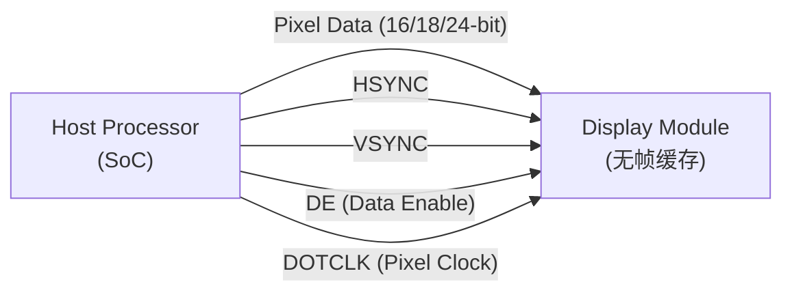

# MIPI DPI

> **DPI (Display Pixel Interface)** 是 MIPI 联盟定义的并行像素级显示接口，通过 HSYNC/VSYNC/DE/DOTCLK 时序信号直接传输实时像素流。DPI 是传统 RGB 并行接口的标准化版本，也是 [DSI](MIPI%20DSI.md) 的 Video Mode 传输模式的原型。

## 1. 定位与用途

DPI 是 MIPI 显示接口体系中的**实时像素流并行接口**：



| 特性 | DPI | DSI (Video Mode) |
|------|-----|------------------|
| 信号类型 | 并行 CMOS | 串行差分 |
| 线数 | 20-29（典型 24-bit） | 4-10 |
| 帧缓存 | 无（实时刷新） | 无 |
| 消隐期 | 物理信号（HSYNC/VSYNC 脉冲） | 短包编码 + BLLP |
| 低功耗 | 无 | LP 模式 / ULPS |

## 2. 信号定义

[📷 _llm/raw/assets/standards/dpi20/dpi20_p13_fig1.jpg|480]
*Figure 5 — DPI 接口信号与电源连接：像素总线 + HSYNC/VSYNC/DE/PCLK + SD/CM 控制*


DPI 使用以下核心信号：

| 信号 | 方向 | 功能 |
|------|:----:|------|
| **DOTCLK** | Host→Panel | 像素时钟，上升沿采样数据 |
| **HSYNC** | Host→Panel | 行同步（水平消隐边界） |
| **VSYNC** | Host→Panel | 帧同步（垂直消隐边界） |
| **DE** (Data Enable) | Host→Panel | 有效像素指示 |
| **Data[23:0]** | Host→Panel | 并行像素数据（16/18/24-bit） |

### 可选信号

| 信号 | 功能 |
|------|------|
| **SD** (Shutdown) | 显示关闭控制 |
| **CM** (Color Mode) | 色彩模式选择 |
| **PCLK** | 外部像素时钟（替代 DOTCLK 输入） |

## 3. 时序关系

[📷 _llm/raw/assets/standards/dpi20/dpi20_p16_fig1.jpg|560]
*Figure 6 — DPI 时序参数定义：HSA/HBP/HACT/HFP 与垂直方向对应参数*


DPI 时序与标准 VESA 显示时序一致：

```
          ┌──────┬─────────────────────────────────┬──────┐
  VSYNC   │ VSA  │              VBP                │ VFP  │
          └──────┴─────────────────────────────────┴──────┘
          ┌──┐   ┌───────────────────────────┐     ┌──┐
  HSYNC   │  │   │                           │     │  │  (× V-Lines)
          └──┘   └───────────────────────────┘     └──┘
          ┌──────────────────────────────────┐
  DE      │        Active Video              │
          └──────────────────────────────────┘
  DOTCLK  ═══════════════════════════════════════ (持续)
```

### 参数示例（1080p@60Hz）

| 参数 | 符号 | 值 | 单位 |
|------|------|-----|------|
| 像素时钟 | DOTCLK | 148.5 | MHz |
| 水平活跃 | H<sub>ACTIVE</sub> | 1920 | px |
| 水平消隐 | H<sub>BLANK</sub> | 280 | px |
| 垂直活跃 | V<sub>ACTIVE</sub> | 1080 | lines |
| 垂直消隐 | V<sub>BLANK</sub> | 45 | lines |
| 帧率 | — | 60 | Hz |

## 4. 像素格式

DPI 标准支持以下并行像素格式：

| 格式 | 数据宽度 | 线数 | 说明 |
|------|:-------:|:----:|------|
| RGB 5-6-5 | 16-bit | 18 | 65K 色 |
| RGB 6-6-6 | 18-bit | 21 | 262K 色 |
| **RGB 8-8-8** | **24-bit** | **27** | **最常用** |
| YCbCr 4:2:2 | 8/16-bit | — | 视频场景 |

> [!note] DPI 色彩深度与 HDMI 的关联
> DPI 24-bit RGB 格式与 HDMI Deep Color 前的基础格式一致。HDMI→DSI 桥接芯片（如 [TC358870](../../元件/接口存储/TC358870.md)）的内部流程是：HDMI TMDS 解码 → 24-bit RGB 像素 → DSI 长包封装，其中间格式即为 DPI。

## 5. 三种操作模式

[📷 _llm/raw/assets/standards/dpi20/dpi20_p31_fig1.jpg|540]
*Figure 8 — 上电与关断恢复序列*


| 模式 | 说明 | DE 作用 |
|------|------|:------:|
| **Mode 1** (DE Only) | 无 HSYNC/VSYNC，仅靠 DE+数据 | 标识有效像素区域 |
| **Mode 2** (DE + HSYNC/VSYNC) | 标准模式，DE 和同步信号兼备 | 精确标识行内像素边界 |
| **Mode 3** (HSYNC/VSYNC Only) | 无 DE，靠同步信号推断消隐 | 省略 |

> Mode 2 最常用，与 DSI Video Mode 的 Non-Burst with Sync Events 直接对应。

## 6. 与 DSI 的映射关系

DPI 的物理信号在 DSI Video Mode 中通过**短包**虚拟化：

| DPI 物理信号 | DSI 协议等价 | DSI 短包类型 |
|-------------|-------------|:-----------:|
| VSYNC 下降沿 | V Sync Start 短包 | DT=0x01 |
| VSYNC 上升沿 | V Sync End 短包 | DT=0x11 |
| HSYNC 下降沿 | H Sync Start 短包 | DT=0x21 |
| HSYNC 上升沿 | H Sync End 短包 | DT=0x31 |
| DE Inactive | Blanking Packet (BLLP) | 任意 |
| DE Active | Pixel Stream 长包 | DT=0x3E 等 |

这是为何 DSI Video Mode 能向下兼容传统 DPI 面板时序的根本原因。

## 7. 现代应用

虽然 DPI 并行接口在高端设备中已被 DSI 替代，它仍然活跃于：

- **嵌入式 Linux 开发板**（Raspberry Pi 的 DPI 接口输出）
- **FPGA 显示控制器**（简单直接，无需 MIPI 编码器 IP）
- **低端 MCU 屏**（与 DBI Type B 共用物理引脚）
- **HDMI 桥接参考设计**（DSI TX 内部上层的中间格式）

## 相关页面

- [视频显示/MIPI 概述](MIPI%20概述.md) — MIPI 家族全景
- [视频显示/MIPI DSI](MIPI%20DSI.md) — DSI Video Mode（DPI 的串行等价）
- [视频显示/MIPI DBI](MIPI%20DBI.md) — 并行命令接口（不同于 DPI 的像素流模式）
- [视频显示/HDMI 视频传输](HDMI%20视频传输.md) — HDMI 视频时序（同类概念对比）
- [TC358870](../../元件/接口存储/TC358870.md) — HDMI→DSI 桥接（内部 DPI 格式中间层）
