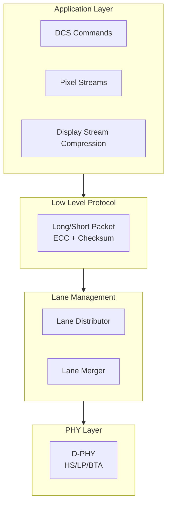
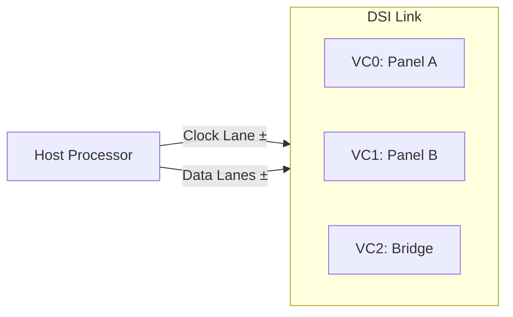
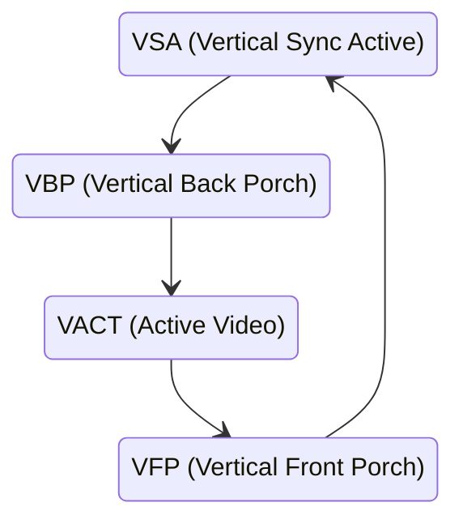
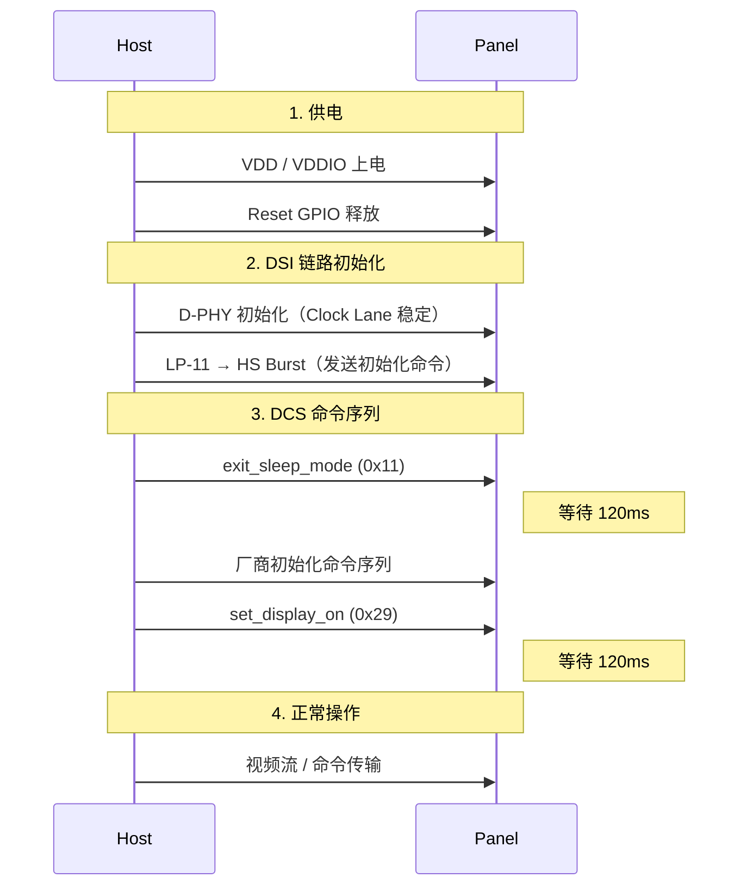

# MIPI DSI

> **DSI (Display Serial Interface)** 是 MIPI 联盟定义的显示串行接口协议，连接主机处理器（Host）和显示模组（Peripheral）。DSI 构建在 [D-PHY](../../视频显示/MIPI D-PHY.md)（或 [C-PHY](../../视频显示/MIPI C-PHY.md)）物理层之上，定义了包格式、视频/命令传输模式、ECC 纠错和虚拟通道复用机制。

## 1. 协议分层

[📷 _llm/raw/assets/standards/dsi13/dsi13_p23_fig1.jpg|560]
*Figure 2 — DSI 分层模型：应用层 → 低级协议层 → Lane 管理层 → D-PHY 物理层*


DSI 协议栈分为四层，每层独立演进：



| 层 | 职责 | 关键机制 |
|----|------|----------|
| **Application** | 像素格式封装、DCS 命令生成、压缩流管理 | RGB/YUV 像素映射、DSC VDC-M |
| **Low Level Protocol (LLP)** | 包结构定义、ECC 生成/校验、Checksum | 长包(6-65541 bytes)/短包(4 bytes) |
| **Lane Management** | 多 Lane 数据分发与合并、Deskew | Lane Distributor（TX）、Lane Merger（RX） |
| **PHY** | 物理信号传输 | D-PHY 的 HS/LP/BTA |

## 2. 包格式

[📷 _llm/raw/assets/standards/dsi13/dsi13_p56_fig1.jpg|600]
*Figure 22 — 长包结构：4B 包头（DI+WC+ECC）+ 载荷（0~65541B）+ 2B 校验和*

[📷 _llm/raw/assets/standards/dsi13/dsi13_p57_fig1.jpg|440]
*Figure 23 — 短包结构：仅 4B（DI + 2B 数据 + ECC）*


DSI 定义了两种包类型：

### 2.1 短包 (Short Packet)

4 字节固定长度，用于命令、同步事件和状态读取：

```
┌─────────┬─────────┬─────────┬─────────┐
│   DI    │ Data 0  │ Data 1  │   ECC   │
│ 1 byte  │ 1 byte  │ 1 byte  │ 1 byte  │
└─────────┴─────────┴─────────┴─────────┘
```

| 字段 | 位宽 | 说明 |
|------|------|------|
| **DI** (Data Identifier) | 8 bits | VC[7:6] + DT[5:0] |
| **Data 0** | 8 bits | 命令/参数低字节 |
| **Data 1** | 8 bits | 命令/参数高字节 |
| **ECC** | 8 bits | 对 DI+Data0+Data1 的汉明纠错码 |

### 2.2 长包 (Long Packet)

6-65541 字节，用于视频像素流和长命令：

```
┌─────────┬─────────┬─────────┬───────────···───────────┬──────────┐
│   DI    │  WC Lo  │  WC Hi  │      Payload            │ Checksum │
│ 1 byte  │ 1 byte  │ 1 byte  │    0-65535 bytes        │  2 bytes │
└─────────┴─────────┴─────────┴───────────···───────────┴──────────┘
```

| 字段 | 位宽 | 说明 |
|------|------|------|
| **DI** | 8 bits | VC[7:6] + DT[5:0] |
| **WC** (Word Count) | 16 bits | Payload 字节数 (0-65535) |
| **Payload** | WC bytes | 像素数据或命令参数 |
| **Checksum** | 16 bits | CRC-16（不包括包头） |

### 2.3 Data Identifier (DI) 字节

DI 字节编码了包的**目标虚拟通道**和**数据类型**：

```
Bit:     7    6    5    4    3    2    1    0
      ┌────┬────┬─────────────────────────────┐
      │ VC1│ VC0│         Data Type           │
      └────┴────┴─────────────────────────────┘
```

| 字段 | 位 | 说明 |
|------|-----|------|
| **VC** (Virtual Channel) | [7:6] | 虚拟通道号 0-3 |
| **DT** (Data Type) | [5:0] | 数据类型码 |

## 3. 虚拟通道 (Virtual Channel)

DSI 在单条物理链路上支持最多 **4 个虚拟通道**（VC0-VC3），实现多外设复用：



- 每个包通过 DI[7:6] 标记目标 VC
- 不同 VC 的包可**交织传输**
- 常用于：主面板 (VC0) + 副面板 (VC1) + 触摸控制器 (VC2)

## 4. Video Mode

[📷 _llm/raw/assets/standards/dsi13/dsi13_p89_fig2.jpg|620]
*Figure 43 — Non-Burst 同步脉冲模式时序：HSS/HSE 包精确对齐行同步沿*

[📷 _llm/raw/assets/standards/dsi13/dsi13_p91_fig1.jpg|620]
*Figure 45 — Burst 模式时序：像素数据高速突发后链路进入 LP 省电*


Video Mode 通过 DSI 实时传输视频时序信号（类似 DPI/HDMI 的消隐期），面板无帧缓存。

### 4.1 时序信号

DSI 在视频模式下传输以下时序信息（通过短包编码）：

| DPI 信号 | DSI 等价 | 短包类型 |
|----------|----------|----------|
| **VSYNC** | V Sync Start / V Sync End | 短包 DT=0x01/0x11 |
| **HSYNC** | H Sync Start / H Sync End | 短包 DT=0x21/0x31 |
| **VBP/VFP** | 消隐行（无像素数据） | Blanking Packet (BLLP) |
| **HBP/HFP** | 消隐像素 | Blanking Packet (BLLP) |
| **DE** | 包类型隐式表达 | — |

### 4.2 三种视频传输模式



| 模式 | 时序特点 | 适用场景 |
|------|----------|----------|
| **Non-Burst with Sync Pulse** | 同步脉冲+精确消隐期匹配 | 兼容传统 DPI 时序 |
| **Non-Burst with Sync Events** | 同步事件（无脉冲），消隐期由 BLLP 填充 | 简化时序 |
| **Burst Mode** | 像素数据高速 Burst 传输，消隐期进入 LP 省电 | **功耗最优** |

> [!note] Burst Mode 的功耗优势
> Burst Mode 下像素数据以最高速率一次性传完，剩余消隐时间进入 LP 模式（甚至 ULPS），大幅节省功耗。这是 DSI 相比于并行 DPI 的显著优势。

### 4.3 视频时序示例

以 1080×1920@60Hz 面板为例：

| 参数 | 值 | DSI 表示 |
|------|-----|----------|
| H-Active | 1080 px | 长包像素流 |
| H-Sync | 4 px | H Sync Start → H Sync End 短包 |
| H-Back Porch | 16 px | BLLP |
| H-Front Porch | 16 px | BLLP |
| V-Active | 1920 lines | 1920 行视频数据 |
| V-Sync | 2 lines | V Sync Start → V Sync End 短包 |
| V-Back Porch | 8 lines | 消隐行 |
| V-Front Porch | 8 lines | 消隐行 |

## 5. Command Mode

Command Mode 适用于**面板自有帧缓存 (GRAM)** 的场景：

| 特性 | Video Mode | Command Mode |
|------|-----------|--------------|
| 帧缓存 | 无（Host 侧） | 面板侧 GRAM |
| 传输触发 | 持续实时流 | 命令触发更新 |
| 撕裂防护 | 不需要 | **TE (Tearing Effect)** 信号 |
| 功耗 | Burst 模式省电 | 更省电（仅更新时传输） |

### 5.1 TE（Tearing Effect）信号

面板通过 TE 信号通知 Host 可安全写入帧缓存而不产生撕裂：

```
Host 发送写入命令 → 等待 TE 上升沿 → 写入像素数据 → 面板刷新
                    ↑
              TE GPIO (面板→Host)
```

DSI 通过 LP Escape Mode 的 **Tearing Effect Trigger** (Entry Command `0001_1110`) 在带内传输 TE 信号，省去独立 GPIO。

## 6. 像素格式与数据类型

### 6.1 视频数据类型码

| DT[5:0] | 格式 | 每像素位数 | 包类型 |
|:-------:|------|:---------:|--------|
| `0x0E` | RGB 5-6-5 | 16 bpp | 长包 |
| `0x1E` | RGB 5-6-5 (Loosely Packed) | 16 bpp | 长包 |
| `0x2E` | RGB 6-6-6 | 18 bpp | 长包 |
| `0x3E` | RGB 6-6-6 (Loosely Packed) | 18 bpp | 长包 |
| `0x0D` | **RGB 8-8-8** | 24 bpp | 长包 |
| `0x1E` | YUV 4:2:0 | 12 bpp | 长包 |
| `0x2C` | YUV 4:2:2 | 16 bpp | 长包 |
| `0x3C` | YUV 4:2:2 | 20 bpp | 长包 |
| `0x0B` | **Compressed** | DSC | 长包 |

> MIPI_DSI_FMT_RGB888 在 Linux 驱动中对应 DT=`0x0D`（RGB 8-8-8, 24 bpp）。

### 6.2 命令数据类型码

| DT[5:0] | 命令 | 说明 |
|:-------:|------|------|
| `0x05` | **DCS Short Write (no param)** | 单字节 DCS 命令 |
| `0x15` | **DCS Short Write (1 param)** | 带 1 字节参数的 DCS 命令 |
| `0x39` | **DCS Long Write** | 带多字节参数的 DCS 命令 |
| `0x06` | **DCS Read** | 读取 DCS 寄存器 |
| `0x03` | **Generic Short Write (no param)** | 厂商自定义短命令 |
| `0x13` | **Generic Short Write (1 param)** | 厂商自定义短命令 |
| `0x23` | **Generic Short Write (2 params)** | 厂商自定义短命令 |
| `0x29` | **Generic Long Write** | 厂商自定义长命令 |

## 7. ECC 与 Checksum

[📷 _llm/raw/assets/standards/dsi13/dsi13_p99_fig1.jpg|560]
*Figure 46 — 发送侧 24bit ECC 生成：Hamming 码覆盖包头 24 位*


### 7.1 ECC（包头纠错）

- 覆盖范围：DI + Data0 + Data1（24 bits）
- 算法：**汉明码 (24, 16)**，可纠正 1-bit 错误、检测 2-bit 错误
- 如果 DI 的 VC 或 DT 发生错误且无法纠正，包被丢弃

### 7.2 Checksum（载荷校验）

- 覆盖范围：长包 Payload（不含包头）
- 算法：**CRC-16**（多项式 `x^16 + x^12 + x^5 + 1`，即 CRC-CCITT）
- 校验失败：包被丢弃，报告给应用层

## 8. 多 Lane 与 Sub-Link（DSI v1.3）

[📷 _llm/raw/assets/standards/dsi13/dsi13_p31_fig1.jpg|480]
*Figure 5 — Lane 分配器概念图：字节流轮转分发到 N 条 Lane*


### 8.1 Lane 分配

数据经 Lane Distributor 按**字节轮询**分发到 N 条 Lane：

```
Payload: B0 B1 B2 B3 B4 B5 ...
2 Lane:  Lane0=B0,B2,B4  Lane1=B1,B3,B5
3 Lane:  Lane0=B0,B3     Lane1=B1,B4     Lane2=B2,B5
4 Lane:  Lane0=B0,B4     Lane1=B1,B5     Lane2=B2     Lane3=B3
```

### 8.2 Sub-Link（分割链路，v1.3）

DSI v1.3 引入 Sub-Link 概念，将多个物理 DSI 链路组合以驱动超高分辨率或超宽面板：

- 每个 Sub-Link 有独立的 Clock Lane + Data Lanes
- **Deskew** 机制补偿 Sub-Link 间偏移
- 典型应用：**Dual-DSI** 驱动 1440×2560 或更大分辨率

> **Linux 驱动示例**：`panel-truly-nt35597.c`（[NT35597](../../NT35597.md)）使用 Dual-DSI（2×4 Lane）驱动 1440×2560@60Hz 面板。

## 9. DSC（Display Stream Compression，v1.3）

DSI v1.3 支持 VESA DSC 压缩标准：
- 压缩比 3:1 或更高
- 降低带宽需求（相同分辨率用更少 Lane 或更低频率）
- 通过 Compression Mode 命令（短包 DT=`0x05`）激活
- PPS（Picture Parameter Set）通过长包传输

## 10. 链路初始化流程

典型 DSI 面板上电序列：



## 相关页面

- [视频显示/MIPI 概述](../../视频显示/MIPI 概述.md) — MIPI 家族全景
- [视频显示/MIPI D-PHY](../../视频显示/MIPI D-PHY.md) — 物理层定义
- [视频显示/MIPI DCS](../../视频显示/MIPI DCS.md) — Display Command Set 命令集
- [视频显示/MIPI DBI](../../视频显示/MIPI DBI.md) — 并行总线接口
- [视频显示/MIPI DPI](../../视频显示/MIPI DPI.md) — 并行像素接口
- [NT35597](../../NT35597.md) — Dual-DSI 面板驱动 IC 实例
- [TC358870](../../元件/接口存储/TC358870.md) — HDMI → DSI 桥接芯片
