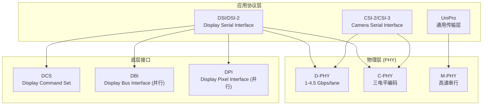
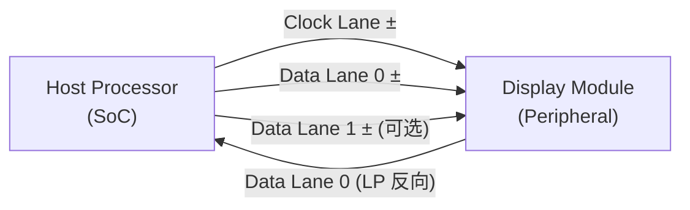

# MIPI 概述

> **MIPI Alliance**（Mobile Industry Processor Interface）是一个开放的移动接口标准组织，由 ARM、Nokia、ST、TI 于 2003 年创立。MIPI 规范定义了移动设备内部芯片间通信的系列化接口协议，覆盖显示、摄像头、存储、传感器等子系统，以低功耗、低 EMI、少引脚为设计目标。

## 1. MIPI 规范家族

MIPI 采用**分层规范体系**：底层物理层（PHY）为上层协议层提供传输服务，上层协议层定义具体应用的数据格式和控制语义。



| 规范 | 全称 | 版本 | 用途 |
|------|------|------|------|
| **D-PHY** | Display/Physical Layer | v2.5 (2019) | 高速差分串行物理层，1 Gbps~4.5 Gbps/通道 |
| **DSI** | Display Serial Interface | v1.3 (2015) | 主机↔显示屏串行协议，替代并行 RGB/CPU 总线 |
| **DCS** | Display Command Set | v1.02 (2009) | 显示模组命令集：电源、伽马、扫描方向 |
| **DBI** | Display Bus Interface | v2.0 | 并行显示总线（Type A/B/C），基于 Intel 8080 / Motorola 6800 |
| **DPI** | Display Pixel Interface | v2.0 | 并行像素接口：HSYNC/VSYNC/DE/DOTCLK，类似 HDMI 消隐期 |
| **CSI-2** | Camera Serial Interface 2 | v2.0 | 摄像头→主机串行接口，与 DSI 共用 D-PHY |

## 2. 显示接口演进

传统的移动显示接口使用**并行总线**（DBI 或 DPI），需要 20-28 根信号线：

| 接口 | 线数 | 速率 | 功耗 | 适用场景 |
|------|------|------|------|----------|
| **DBI (并行)** | 8/16 数据 + 控制 ≈ 22 线 | ~50 Mbps | 高 | 低分辨率 MCU 屏 |
| **DPI (并行)** | 16-24 数据 + HSYNC/VSYNC/DE/CLK ≈ 28 线 | ~200 Mbps | 高 | RGB 接口屏 |
| **MIPI DSI (串行)** | 1 Clock + 1-4 Data 差分对 = 4-10 线 | 最高 4.5 Gbps/通道 | 低 | 现代手机/平板/嵌入屏 |

> [!note] 关键优势
> DSI 将 28 线并行接口压缩为最多 10 线差分串行，同时支持 LP（低功耗）模式、双向通信、ECC 纠错和虚拟通道复用。

## 3. DSI 协议栈

DSI 协议栈分层设计，各层独立演进：

```
┌─────────────────────────────────────┐
│  Application Layer                   │
│  DCS Commands / Pixel Streams / DSC │
├─────────────────────────────────────┤
│  Low Level Protocol (LLP)            │
│  Packet Format / ECC / Checksum     │
├─────────────────────────────────────┤
│  Lane Management Layer               │
│  Lane Distribution / Merging         │
├─────────────────────────────────────┤
│  PHY Layer (D-PHY or C-PHY)         │
│  HS/LP Signaling / Clock / Escape   │
└─────────────────────────────────────┘
```

## 4. 关键概念速览

| 概念 | 说明 | 详见 |
|------|------|------|
| **D-PHY** | 差分物理层：HS 模式用差分 LVDS、LP 模式用单端 CMOS | [视频显示/MIPI D-PHY](视频显示/MIPI D-PHY.md) |
| **C-PHY** | 三线三电平物理层：嵌入式时钟、~2.28 bits/symbol、可与 D-PHY 共存 | [视频显示/MIPI C-PHY](视频显示/MIPI C-PHY.md) |
| **DSI Host / Peripheral** | 主机（SoC）发送时钟和命令，外设（面板）响应 | [视频显示/MIPI DSI](视频显示/MIPI DSI.md) |
| **Video Mode** | 实时视频流，类似 HDMI 的 HSYNC/VSYNC 时序 | [视频显示/MIPI DSI](视频显示/MIPI DSI.md) |
| **Command Mode** | 面板自有帧缓存，主机发命令触发刷新 | [视频显示/MIPI DSI](视频显示/MIPI DSI.md) |
| **DCS Commands** | 标准显示命令：Sleep In/Out、Display On/Off、Gamma | [视频显示/MIPI DCS](视频显示/MIPI DCS.md) |
| **DBI Type A/B/C** | 并行 CPU 总线接口的三种变体 | [视频显示/MIPI DBI](视频显示/MIPI DBI.md) |
| **DPI** | 并行像素接口，带 HSYNC/VSYNC/DE/DOTCLK | [视频显示/MIPI DPI](视频显示/MIPI DPI.md) |
| **Virtual Channel** | 同一 DSI 链路上多外设复用（最多 4 个 VC） | [视频显示/MIPI DSI](视频显示/MIPI DSI.md) |
| **Dual DSI** | 双 DSI 链路驱动一面超高分辨率面板 | [视频显示/MIPI DSI](视频显示/MIPI DSI.md) |

## 5. 物理拓扑

[📷 _llm/raw/assets/standards/dsi13/dsi13_p22_fig1.jpg|600]
*DSI Figure 1 — 主机与外设的 DSI 接口：一条时钟 Lane + N 条数据 Lane 的点对点连接*

最简 DSI 系统：



- **Clock Lane**：单向（Master→Slave），提供 DDR 时钟参考
- **Data Lanes**：高速单向（Master→Slave），低速双向（Escape Mode）
- **Lane 数量**：1-4 条 Data Lane，对称或非对称均可

## 6. 与 HDMI 的对比

| 特性 | HDMI | MIPI DSI |
|------|------|----------|
| 目标场景 | 消费电子长距离（1-15m） | 设备内部短距离（<30cm） |
| 物理层 | TMDS 差分 100Ω | D-PHY HS/LP 双模式 |
| 时钟方案 | 独立 TMDS Clock 通道 | DDR 源同步时钟 |
| 双向通信 | DDC（I²C 独立通道） | Escape Mode（同线反向） |
| 控制协议 | CEC、InfoFrame | DCS 命令集 |
| 功耗模式 | 无低功耗模式 | LP 模式（~1.2V 单端 CMOS） |
| EMI 控制 | 8b/10b 编码 + 扰码 | 数据位宽窄、摆幅小 |
| 内容保护 | HDCP | （无标准内容保护） |

> [!note] HDMI→DSI 桥接
> 在嵌入式和移动场景中，[TC358870](TC358870.md) 等桥接芯片将 HDMI 1.4 输入转换为 MIPI DSI 输出，使得标准 HDMI 信号源可以驱动 MIPI 面板。

## 7. 工业实践

MIPI DSI 在现代设备中无处不在：

- **智能手机**：几乎所有现代手机使用 DSI 连接 LCD/OLED 面板
- **嵌入式 Linux**：DRM 驱动框架通过 `mipi_dsi_device` 抽象 DSI 外设
- **Linux 驱动示例**：`panel-truly-nt35597.c`（[NT35597](NT35597.md)）实现 dual-DSI + DCS 完整驱动

## 相关页面

- [视频显示/MIPI D-PHY](视频显示/MIPI D-PHY.md) — 物理层：HS/LP 差分信号、电气特性、时序
- [视频显示/MIPI C-PHY](视频显示/MIPI C-PHY.md) — 物理层：三电平编码、嵌入式时钟、2.28 bits/symbol
- [视频显示/MIPI DSI](视频显示/MIPI DSI.md) — 协议层：包格式、视频/命令模式、ECC
- [视频显示/MIPI DCS](视频显示/MIPI DCS.md) — 命令集：电源控制、伽马、显示设置
- [视频显示/MIPI DBI](视频显示/MIPI DBI.md) — 并行总线接口 Type A/B/C
- [视频显示/MIPI DPI](视频显示/MIPI DPI.md) — 并行像素接口
- [视频显示/HDMI 协议概述](视频显示/HDMI 协议概述.md) — HDMI 协议栈（同属显示接口）
- [TC358870](TC358870.md) — HDMI 1.4 → 双 MIPI DSI 桥接芯片
- [NT35597](NT35597.md) — Novatek 2K 面板驱动 IC（Dual-DSI + DCS）
