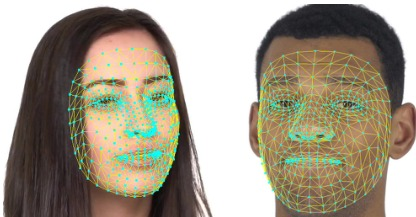
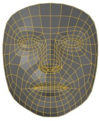
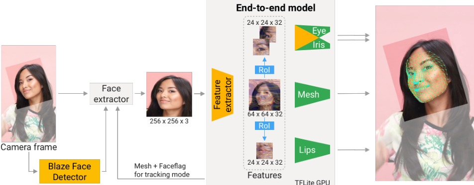
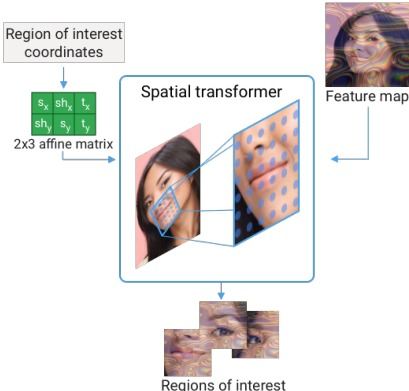

# 面部关键点检测

> MediaPipe Face Mesh：468 个 3D 面部顶点，移动端 GPU 2.5ms/帧，只取唇部 40 点驱动虚拟角色嘴型——Phase 2 嘴部动捕方案。

---

## 为什么不用传统 68 点

传统 dlib/OpenCV 方案：68 个 2D 关键点。问题：

| | 68 点 | Face Mesh 468 点 |
|------|:---:|:---:|
| 唇部密度 | ~12 点（外轮廓） | **~40 点**（含内唇轮廓） |
| 维度 | 2D | **3D** |
| 速度 | ~10ms CPU | **2.5ms GPU (iPhone)** |
| 唇形表达 | 开口/闭口 | **+ 抿嘴/撇嘴/圆唇/嘴角上扬** |
| 眼睑 | 无 | **眼睑开合度** |

> 68 点只能驱动基础张嘴闭嘴。Face Mesh 的唇部密度可以驱动更自然的唇形。

---

## 管线

```
摄像头 → BlazeFace(人脸检测+旋转) → 256×256 crop → Residual CNN → 468×3 坐标
                                                                       ↓
                                   唇部 ~40 点 → 唇形参数
                                   眼部 ~30 点 → 眼睑开合度 (Phase 2)
```


*Kartynnik Fig. 1 — Face Mesh 预测示例：468 点 3D 网格直接从单目 RGB 回归*


*Kartynnik Fig. 2 — 预测的网格拓扑及其 3 级 Catmull-Clark 细分*

### 模型变体

| 模型 | 输入 | IOD MAD | 速度 (Pixel 3) |
|------|:---:|:---:|:---:|
| Full | 256×256 | 3.96% | 7.4ms |
| Light | 128×128 | 5.15% | 3.4ms |
| Lightest | 128×128 | 5.29% | 2.6ms |

IOD MAD = 平均坐标误差 / 眼间距。人工标注基线 = 2.56%（人的一致性）。Light 模型精度已接近人。

---

## Attention Mesh 升级（2020）

Kartynnik 的后续工作：在基础 mesh 网络上加**空间变换器**分别处理唇部、眼部、虹膜。


*Grishchenko Fig. 2 — Attention Mesh 推理管线：主干网络输出粗 mesh，空间变换器裁出唇/双眼+虹膜区域送子模型精化*


*Grishchenko Fig. 3 — 空间变换器即注意力机制：可微仿射采样网格对准局部区域*

| | 基础 Face Mesh | Attention Mesh |
|------|:---:|:---:|
| 全脸误差 | 3.11% | 3.11% |
| **唇部误差** | 3.28% | **2.89%** ⬇12% |
| **眼部误差** | 6.60% | **6.04%** ⬇8% |
| 速度 | 22.4ms (级联) | **16.6ms** (统一) |

> 唇部误差下降了 12%，对 Phase 2 嘴部动捕最关键的改进。

---

## 时序平滑（1 Euro Filter）

单帧预测有抖动。1 Euro Filter 的 tradeoff：

- 坐标变化慢 → 强滤波（稳定优先）
- 坐标变化快 → 弱滤波（避免延迟）

$$
\hat{x}_t = \alpha x_t + (1-\alpha) \hat{x}_{t-1}, \quad \alpha = \frac{\Delta t}{\Delta t + \tau}
$$

$\tau$ 随速度自适应：静止时大（平滑），快速运动时小（跟随）。

---

## 深度坐标的局限

z 坐标来自合成 3DMM 渲染的监督——**不是度量准确的深度**，但视觉上可接受（能驱动 3D 纹理渲染）。

---

## 关键词

`face mesh` `MediaPipe` `BlazeFace` `468 landmarks` `spatial transformer` `blend shapes` `1 Euro filter` `on-device ML` `lip tracking`
