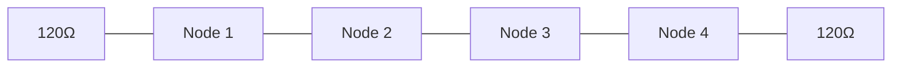
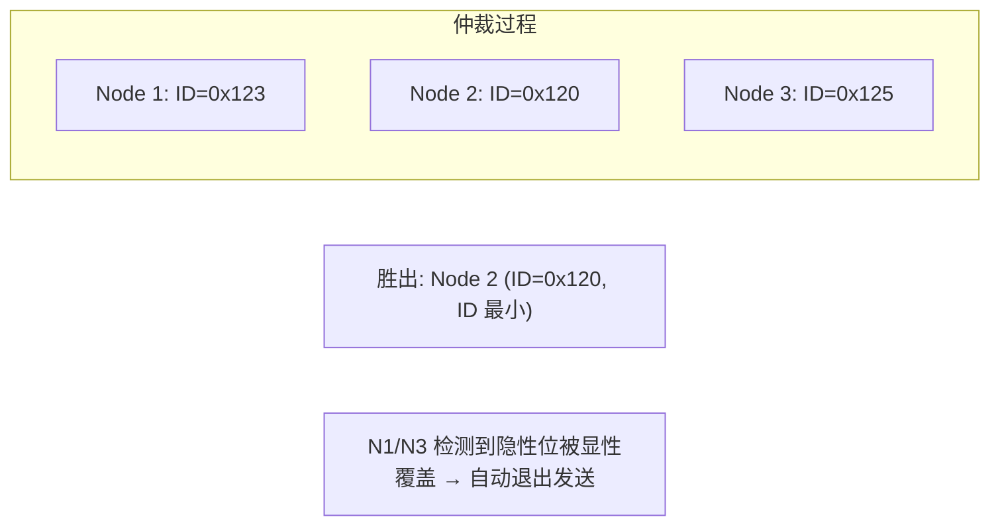
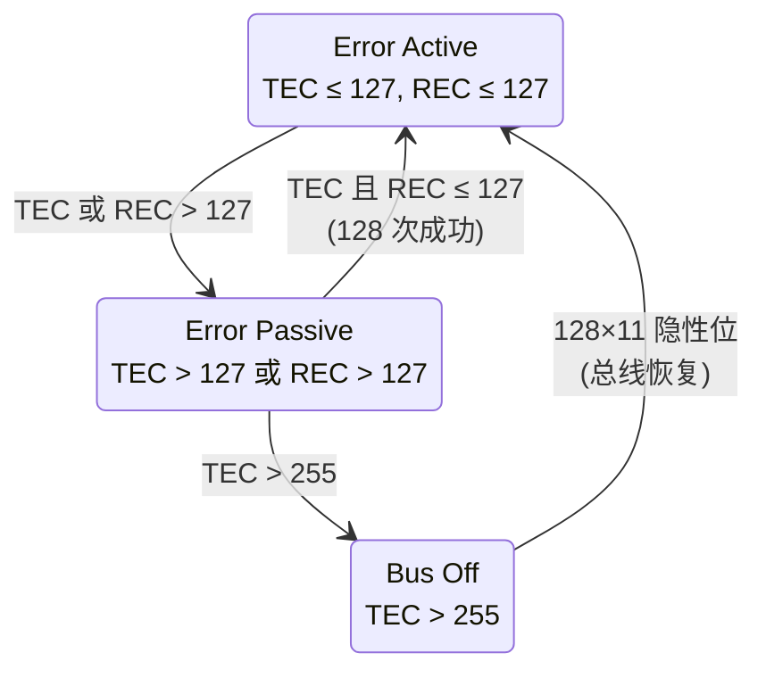
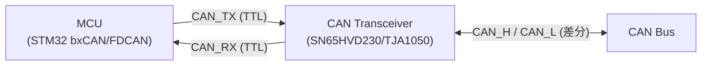

# CAN 总线协议基础

> CAN (Controller Area Network) 是 Bosch 于 1986 年发布的实时串行总线协议，1987 年首次商用。这是汽车和工业控制领域最核心的现场总线——动力总成、底盘控制、车身电子几乎全部依赖 CAN。CAN 的核心设计目标：**多主实时通信 + 高噪声环境下的可靠性**。

## 1. 物理层

### 1.1 信号定义

CAN 使用差分信号对传输——这是其抗噪能力的物理基础：

| 信号 | 功能 |
|------|------|
| **CAN_H** (CAN High) | 差分正端，显性 ~3.5V，隐性 ~2.5V |
| **CAN_L** (CAN Low) | 差分负端，显性 ~1.5V，隐性 ~2.5V |

```
高速 CAN (ISO 11898-2):
显性 (Dominant = 0):  CAN_H - CAN_L ≈ +2V
隐性 (Recessive = 1): CAN_H - CAN_L ≈ 0V
```

### 1.2 显性 vs 隐性

| 属性 | 显性 (Dominant, 0) | 隐性 (Recessive, 1) |
|------|-------------------|---------------------|
| 差分电压 | ~2V | ~0V |
| 总线驱动 | CAN_H 拉高 + CAN_L 拉低 | 两端均不驱动（终端电阻释放） |
| 仲裁 | **覆盖隐性** | 被显性覆盖 |
| 空闲状态 | — | ✅ 总线空闲为隐性 |

> [!note] 显性覆盖隐性是 CAN 逐位仲裁的物理基础——所有发送方同时驱动总线，显性信号 "胜出"。

### 1.3 终端电阻

CAN 总线两端必须各接 **120 Ω** 终端电阻（差分阻抗匹配，消除反射）：



### 1.4 比特率与距离

| 比特率 | 最大总线长度 | 典型场景 |
|--------|-------------|----------|
| 1 Mbps | 25 m | ECU 间高速通信 |
| 500 kbps | 100 m | 动力总成骨干 |
| 250 kbps | 250 m | 车身电子 |
| 125 kbps | 500 m | 诊断/LIN 网关 |
| 50 kbps | 1 km | 故障诊断 |

## 2. 帧格式

### 2.1 标准数据帧 (11-bit ID)

| # | 字段 | 位数 | 说明 |
|---|------|------|------|
| 1 | **SOF** | 1 | Start of Frame—显性，同步所有节点 |
| 2 | **ID** | 11 | 消息标识符，**越小越优先**（仲裁域） |
| 3 | **RTR** | 1 | Remote Transmission Request: 0=数据帧，1=远程帧 |
| 4 | **IDE** | 1 | Identifier Extension: 0=标准，1=扩展 |
| 5 | **r0** | 1 | 保留 |
| 6 | **DLC** | 4 | Data Length Code: 0-8 |
| 7 | **Data** | 0-64 | Payload (0-8 B Classic, 0-64 B CAN FD) |
| 8 | **CRC** | 15/17/21 | CRC 校验 (多项式 x¹⁵+x¹⁴+x¹⁰+x⁸+x⁷+x⁴+x³+1) |
| 9 | **ACK** | 2 | Slot + Delimiter: 发送方发隐性，接收方拉显性 |
| 10 | **EOF** | 7 | End of Frame: 全部隐性 |

### 2.2 扩展帧 (29-bit ID, CAN 2.0B)

```
ID[28:18] + SRR + IDE(=1) + ID[17:0] + RTR
```

- SRR (Substitute Remote Request) = 隐性 —— 保证标准帧仲裁优先于扩展帧
- 29-bit ID 提供 5.37 亿个标识符

### 2.3 Stuff Bit 插入

**连续 5 个相同极性后自动插入一个相反极性的 Stuff Bit**——接收端自动去除。

```
原始:         0000011111
插入 Stuff:   00000111110
              ↑      ↑
            填充位   填充位
```

| 作用 | 说明 |
|------|------|
| **DC 平衡** | 避免长串 0 或 1 造成直流偏置 |
| **再同步** | 提供额外的跳变沿，维持位时序同步 |
| **错误检测** | 第 6 个相同极性位 = Stuff Error |

## 3. 逐位仲裁

CAN 最核心的机制——**无破坏性逐位仲裁**：



1. 所有节点同时发 SOF + ID
2. 每个 bit 发送后**回读总线**
3. 若发了隐性 (1) 但读到显性 (0) → **仲裁失败，立即转入接收模式**
4. 仲裁失败者不干扰总线——**无损**
5. **ID 最小的消息胜出** → 最高优先级

> [!note] CAN 的仲裁不需要中央调度器——每个控制器自主参与，失败后自动退避。这是它成为实时系统的关键。

## 4. 错误检测与处理

CAN 有五重错误检测机制，确保极高可靠性：

| # | 机制 | 检测条件 |
|---|------|----------|
| 1 | **CRC 校验** | 接收方计算 CRC 与帧中 CRC 不匹配 |
| 2 | **ACK 检查** | 发送方在 ACK Slot 未检测到显性电平 |
| 3 | **位监控** | 发送方回读总线电平，与发送的不一致（非仲裁/ACK 域） |
| 4 | **Stuff Check** | 连续 6 个相同极性位 |
| 5 | **帧格式检查** | CRC Delimiter / ACK Delimiter / EOF 必须为隐性 |

### 4.1 错误状态机



| 状态 | TEC/REC | 行为 |
|------|---------|------|
| **Error Active** | ≤127 | 正常参与通信；检测到错误后发 Active Error Flag (6×显性) |
| **Error Passive** | >127 | 仍可收发；检测到错误后发 Passive Error Flag (6×隐性) |
| **Bus Off** | >255 | 强制退出总线，不再收发 |

- **TEC** (Transmit Error Counter)：发送方错误计数
- **REC** (Receive Error Counter)：接收方错误计数
- 成功发送 → TEC−1；发送错误 → TEC+8
- 成功接收 → REC−1；接收错误 → REC+1

## 5. CAN FD 与 CAN XL

| 特性 | CAN 2.0 (Classic) | CAN FD | CAN XL |
|------|-------------------|--------|--------|
| 数据速率 | ≤ 1 Mbps | ≤ 8 Mbps (数据段) | ≤ 20 Mbps |
| Payload | 0-8 B | 0-64 B | 1-2048 B |
| 帧格式 | 标准/扩展 | FD 帧 (FDF=1) | XL 帧 |
| CRC | 15-bit | 17/21-bit | 更复杂 |
| 发布 | 1991 | 2012 (ISO 11898-1:2015) | 2024 |

> [!warning] CAN FD / CAN XL 需要支持对应模式的 CAN 控制器（如 STM32G4/H7 的 FDCAN 外设），传统 bxCAN 不支持。

## 6. 嵌入式实践

### 6.1 Typical MCU CAN Setup



| 组件 | 功能 | 常见型号 |
|------|------|----------|
| **CAN 控制器** | 协议层：帧封装、仲裁、CRC、错误处理 | MCU 内置：bxCAN (F1/F4), FDCAN (G4/H7) |
| **CAN 收发器** | 物理层：TTL↔差分电平转换 | SN65HVD230 (3.3V), TJA1050 (5V) |

### 6.2 CANopen 上层协议

裸 CAN 只定义数据链路层和物理层。上层应用协议需要额外标准——CANopen (CiA 301) 是最广泛使用的选项。参见 [通讯网络/CANopenNode 协议栈分析](CANopenNode%20协议栈分析.md)。

## 7. 常见问题

| 问题 | 原因 | 对策 |
|------|------|------|
| Bus Off 反复触发 | 物理层干扰或终端电阻缺失 | 示波器检查 CAN_H/CAN_L 波形 |
| 仲裁丢失 | ID 优先级低于其他节点 | 调小 ID 或降低发送频率 |
| ACK 错误 | 总线上无其他节点 | 确保至少一个节点处于 Normal Mode (非 Silent/Loopback) |
| 波形反射 | 终端电阻缺失 | 总线两端各加 120Ω |
| Stuff Error | 位时序配置错误 | 确认 SJW/Prop_Seg/Phase_Seg 参数 |

## 相关页面

- [通讯网络/CANopenNode 协议栈分析](CANopenNode%20协议栈分析.md) — CANopen 上层协议实现
