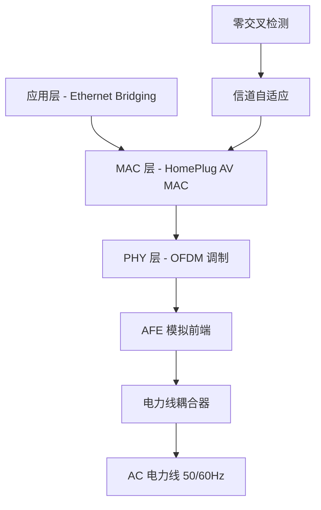

# HomePlug AV 电力线通信

**HomePlug AV (HPAV)** 是由 HomePlug Powerline Alliance 制定的电力线通信标准，后被纳入 IEEE 1901 国际标准。利用现有电力线传输高速数据，速率最高 200 Mbps（PHY 层），工作频段 2–30 MHz。

## 协议层次

## 关键技术

### OFDM 调制

HomePlug AV 采用 OFDM (Orthogonal Frequency Division Multiplexing) 在 2–30 MHz 频段分配大量子载波，自适应地关闭噪声严重频段的子载波（tone masking），实现鲁棒通信。

### 零交叉同步 (Zero Cross Detection)

电力线上存在与 50/60 Hz 交流周期同步的周期性噪声（如 TRIAC 调光器、开关电源）。HomePlug AV 通过零交叉检测器（ZCD）获取交流过零点时刻，并据此调度信道自适应和传输窗口：

- **50 Hz AC**：每 10 ms 一次过零
- **60 Hz AC**：每 8.33 ms 一次过零
- MAC 层利用此信息将 Beacon 周期与交流周期对齐，在高噪声窗口期间避免传输

### QoS 服务质量管理

HomePlug AV MAC 支持多流 QoS：

- 连接准入控制 (Connection Admission Control)
- 服务流分类和优先级
- 带宽预留和调度
- 适用于 HDTV、SDTV 等多媒体流同时传输

### 共存机制

- 与 **HomePlug 1.0** 节点共存（向下兼容）
- 与 **HomePlug Green PHY (HPGP)** 互操作
- 通过 ISP (Inter-System Protocol) 实现 IEEE 1901 多系统共存

## 物理层参数

| 参数 | 数值 |
|------|------|
| 频段 | 2–30 MHz |
| 调制方式 | OFDM (窗口化 OFDM) |
| PHY 速率 | 最高 200 Mbps |
| 前向纠错 | Turbo Code (可选) |
| 信道接入 | CSMA/CA + TDMA |
| Beacon 周期 | 与交流周期同步 |

## 典型系统架构

电力线通信系统由以下功能块组成：

1. **电力线耦合器** — 将 OFDM 信号耦合到 AC 电力线上，同时隔离高压（通过变压器或电容耦合）
2. **模拟前端 (AFE)** — ADC/DAC 转换、发送/接收放大、线路驱动
3. **PHY 层** — OFDM 调制/解调、信道估计与均衡
4. **MAC 层** — 网络管理、QoS 调度、信道接入控制
5. **桥接层** — PLC 网络 ↔ Ethernet 10/100 Mbps 桥接

## SoC 集成趋势

现代 HomePlug AV 芯片（如 [QCA6410](QCA6410.md)）高度集成：

- 单芯片 SoC：MAC + PHY + AFE + 线路驱动
- 集成 10/100 Ethernet PHY（直接桥接以太网）
- 内置 ARM CPU 运行 MAC 协议栈
- 单 3.3V 供电（内部 DC-DC 产生核心电压）
- 零交叉检测器集成在芯片内

## 与 Wi-Fi 的对比

| 特性 | HomePlug AV | Wi-Fi (802.11n) |
|------|------------|-----------------|
| 传输介质 | 电力线 | 无线电 2.4/5 GHz |
| 穿墙能力 | 不穿墙——有线介质 | 穿墙衰减大 |
| 延迟 | 稳定可控 | 受干扰变化大 |
| 安全性 | 物理隔离（需接入同一电表后） | 无线信号可被截获 |
| 安装 | 即插即用（电力猫） | 需配置 SSID/密码 |

## 参见

- [QCA6410](QCA6410.md) — HomePlug AV SoC 元件
- [Ethernet 协议概述](Ethernet%20协议概述.md) — 802.3 以太网
- [2012-03-16 - QCA6410 HomePlug AV 数据手册](2012-03-16%20-%20QCA6410%20HomePlug%20AV%20数据手册.md) — 来源文档
