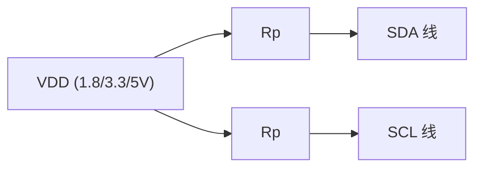
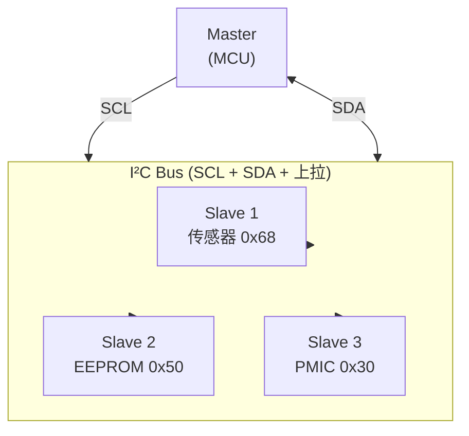
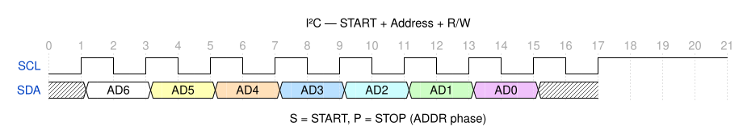
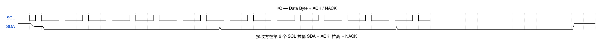
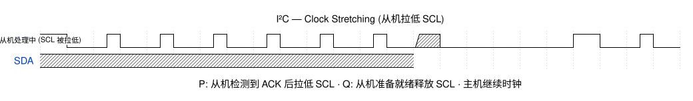

# I²C 总线协议

> I²C (Inter-Integrated Circuit) 是嵌入式系统中最广泛使用的双线串行总线，由 Philips (现 NXP) 于 1982 年发明。用于板上芯片间短距离通信——传感器、EEPROM、PMIC、GPIO 扩展器、显示控制器等场景。

## 1. 物理层

I²C 使用两条开漏双向线：

| 信号 | 全称 | 方向 | 功能 |
|------|------|------|------|
| **SCL** | Serial Clock Line | 主机驱动 | 时钟信号，控制数据传输节奏 |
| **SDA** | Serial Data Line | 双向 | 数据信号，携带地址、数据、确认 |

### 1.1 开漏输出与上拉

两条线均为**开漏 (open-drain)** 架构——设备只能将线拉低，不能主动拉高。高电平由外部上拉电阻 (Rp) 实现：



| 参数 | 典型值 | 说明 |
|------|--------|------|
| Rp (Standard/Fast) | 2.2 kΩ ~ 4.7 kΩ | 取决于总线电容和速率 |
| Rp (Fast+) | ~1 kΩ | 更高驱动强度 |
| 总线电容 | ≤ 400 pF | 包括所有设备 + 走线 |
| 逻辑低 | ≤ 0.4 V (或 0.3×VDD) | 开漏下拉 |
| 逻辑高 | ≥ 0.7×VDD | 上拉到 VDD |

> [!note] 开漏的关键意义
> 开漏 + 上拉的 "线与" (wired-AND) 特性是 I²C 多主仲裁和时钟拉伸的物理基础：任何设备都可以将总线拉低，不会发生推挽驱动器冲突。

### 1.2 速率模式

| 模式 | 最高速率 | 方向 | 用途 |
|------|----------|------|------|
| **Standard (Sm)** | 100 kbps | 双向 | 传统外设 |
| **Fast (Fm)** | 400 kbps | 双向 | 大多数现代外设 |
| **Fast+ (Fm+)** | 1 Mbps | 双向 | 大容量 EEPROM |
| **High-speed (Hs)** | 3.4 Mbps | 双向 | 需要主机主动激活 |
| **Ultra Fast (UFm)** | 5 Mbps | **单向（仅写）** | 推挽驱动，无时钟拉伸 |

## 2. 总线拓扑



- **多主多从**：总线上可挂多个主机和从机
- **地址唯一**：每个从机有独立的 7-bit 或 10-bit 地址
- **主机发起**：只有主机可以发起传输（产生 START + 时钟）

## 3. 协议层

### 3.1 START 与 STOP 条件



| 条件 | 操作 | 含义 |
|------|------|------|
| **START (S)** | SCL 高时 SDA ↓ | 主机宣告传输开始，总线变为忙 |
| **STOP (P)** | SCL 高时 SDA ↑ | 主机宣告传输结束，总线释放 |
| **Repeated START (Sr)** | 无 STOP 直接再 START | 主机不释放总线，连续发送多个消息 |

### 3.2 数据帧格式

完整 I²C 传输 = **地址帧 + N × 数据帧**，每帧 9 bits（8 数据 + 1 ACK）：



1. 主机发 **START**
2. 主机发 **7-bit 地址 + R/W bit**（0=写，1=读）
3. 从机回 **ACK**（拉低 SDA）
4. 主机/从机发 **8-bit 数据**
5. 接收方回 **ACK/NACK**
6. 重复 4-5 直到传输完成
7. 主机发 **STOP**

### 3.3 ACK / NACK

| 响应 | SDA 电平 | 含义 |
|------|----------|------|
| **ACK** | 0 (低) | 数据接收成功，继续传输 |
| **NACK** | 1 (高) | 主机发 NACK → 这是最后一字节，停止；从机发 NACK → 地址不匹配或无法接收 |

> [!note] 第 9 个时钟
> I²C 的 ACK 位是协议的精妙设计——每字节自带确认，无需额外的流控信号线。接收方必须在第 9 个 SCL 脉冲时拉低 SDA。

### 3.4 读写操作

**主机写从机（Master Write）**：
```
S | SLAVE_ADDR+W | ACK | REG_ADDR | ACK | DATA | ACK | ... | P
```

**主机读从机（Master Read）**：
```
S | SLAVE_ADDR+W | ACK | REG_ADDR | ACK | Sr | SLAVE_ADDR+R | ACK | DATA | NACK | P
```

先写寄存器地址，然后 Repeated START 切换到读模式——这是 I²C 外设最常用的寄存器访问模式。

### 3.5 10-bit 寻址

> [!note] 绝大多数 I²C 设备使用 7-bit 寻址。10-bit 仅在地址空间不足时使用。

```
S | 11110xx+W | ACK | ADDR[7:0] | ACK | ... 
```

10-bit 地址的前 5 bits 固定为 `11110`，后 2 bits + 第二个字节组成完整地址。

## 4. 多主仲裁

当两个主机同时发 START，通过 **SDA 线的逐位仲裁** 确定胜者：

1. 每个主机在 SCL 高时监测 SDA
2. 如果主机驱动 SDA=1 但读到 SDA=0 → **仲裁失败，立即退出发送**
3. 仲裁失败的设备自动变为从机模式

仲裁的无损特性意味着：**优先级最高的消息完整发送，不会被破坏。**

## 5. 时钟拉伸 (Clock Stretching)

从机可以在 ACK 位后**拉低 SCL**，强制主机等待：



| 场景 | 说明 |
|------|------|
| ADC 转换未完成 | 从机拉低 SCL，转换完成后释放 |
| EEPROM 页写入忙 | 内部写入周期中，暂停 I²C 通信 |

> [!note] 不是所有主机都支持时钟拉伸。STM32 硬件 I²C 支持，但某些 bit-banging 实现和 Raspberry Pi I²C 有已知问题。

## 6. 典型外设地址

| 设备 | 7-bit 地址 | 类型 |
|------|-----------|------|
| BMP280 | 0x76/0x77 | 气压传感器 |
| MPU6050 | 0x68/0x69 | IMU |
| AT24C02 | 0x50-0x57 | EEPROM |
| PCA9685 | 0x40-0x7F | PWM 扩展器 |
| SSD1306 | 0x3C/0x3D | OLED 显示 |

## 7. 常见问题

| 问题 | 原因 | 对策 |
|------|------|------|
| SDA 一直被拉低 | 从机卡死或时钟拉伸无限制 | 给 SCL 发 9-16 个脉冲释放从机状态机 |
| ACK 始终为 NACK | 地址错误或从机未上电 | 用 I²C 扫描器确认地址 |
| 总线冲突 | 多主无仲裁设计 | 用 I²C MUX (如 TCA9548A) 隔离 |
| 电容超限 | 线缆过长或设备过多 | 降速或加 I²C buffer/repeater |

## 相关页面

- [通讯网络/SPI 总线协议](SPI%20总线协议.md) — 四线全双工替代方案
- [通讯网络/UART 串行通信](UART%20串行通信.md) — 异步串行对比
- [视频显示/HDMI EDID](../视频显示/HDMI%20EDID.md) — DDC 通道基于 I²C
