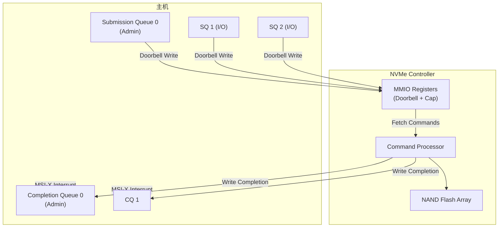

# NVMe SSD 协议

> NVM Express (NVMe) 是专门为 NAND 闪存和持久内存设计的**主机控制器接口标准**。它不是 SATA 的升级，而是从零为 PCIe SSD 构建的协议——利用 PCIe 的高带宽和低延迟，解决了 AHCI (SATA 时代的控制器接口) 在 SSD 上的性能瓶颈。

## 1. 为什么需要 NVMe

### 1.1 AHCI 的瓶颈

SATA SSD 使用 AHCI (Advanced Host Controller Interface)，这个接口最初为机械硬盘设计：

| 限制 | AHCI | NVMe |
|------|------|------|
| 命令队列深度 | **1 队列 / 32 命令** | **65535 队列 / 每队列 65536 命令** |
| 命令提交方式 | 需多次 MMIO 寄存器写 | **门铃寄存器一次通知** |
| 中断 | 单中断引脚 | **MSI-X + 每队列独立中断** |
| 并行性 | 单队列串行提交 | **多核并行、无锁提交** |
| CPU 开销 | 高（锁定竞争） | 低（Per-Core 队列） |

> AHCI 的 32 命令深度对机械硬盘够用（寻道 5-10ms），但对延迟 ~10µs 的 NVMe SSD，队列深度不够意味 CPU 等 I/O。

### 1.2 NVMe 的设计目标

- **并行性**：SSD 内部大量 NAND die 可并行操作。NVMe 的多队列直接映射到 SSD 内部并行度
- **低延迟**：简化命令提交路径——比 AHCI 减少 ~50% 的寄存器访问
- **低 CPU 开销**：无锁队列、MSI-X 中断、每个 CPU 核心独立队列

## 2. 架构模型

### 2.1 整体架构



### 2.2 队列模型

```
Admin Submission Queue (ASQ) ──→ Controller ──→ Admin Completion Queue (ACQ)
      (1 对, 管理命令)                          

I/O Submission Queue (SQ n) ──→ Controller ──→ I/O Completion Queue (CQ m)
      (最多 65535 对)
```

- **Submission Queue (SQ)**：主机→控制器，环形缓冲区，存放待执行命令
- **Completion Queue (CQ)**：控制器→主机，环形缓冲区，存放已完成命令的 status
- SQ 和 CQ 的关联在创建时指定（1 个 CQ 可关联多个 SQ）

### 2.3 命令提交流程

```
1. Host: 写命令到 SQ (在主机内存)
2. Host: 写 SQ Tail Doorbell → 通知控制器有新命令
3. Controller: DMA 读取 SQ 中的命令
4. Controller: 执行命令（读/写 NAND）
5. Controller: DMA 写完成记录到 CQ (在主机内存)
6. Controller: 发 MSI-X 中断（或 Host 轮询 CQ）
7. Host: 处理完成记录
8. Host: 写 CQ Head Doorbell → 释放 CQ 空间
```

## 3. 命令体系

### 3.1 Admin 命令 (Admin Queue 专用)

| 命令 | 功能 |
|------|------|
| **Identify** | 查询控制器/命名空间能力 |
| **Create I/O SQ** | 创建 I/O 提交队列 |
| **Create I/O CQ** | 创建 I/O 完成队列 |
| **Delete I/O SQ/CQ** | 删除队列 |
| **Get/Set Features** | 配置特性（中断合并、温度阈值等） |
| **Format NVM** | 格式化命名空间（安全擦除/加密擦除） |
| **Firmware Commit/Download** | 固件更新 |
| **Namespace Management** | 创建/删除命名空间 |
| **Sanitize** | 安全擦除（Block Erase / Crypto Erase / Overwrite） |

### 3.2 I/O 命令

| 命令 | 说明 |
|------|------|
| **Read** | 从 NAND 读取数据 |
| **Write** | 写入数据到 NAND |
| **Flush** | 强制刷写缓存到 NAND |
| **Write Zeroes** | 零填充（不实际写数据，仅标记） |
| **Dataset Management** | TRIM/Unmap（通知 SSD 哪些 LBA 不再使用） |
| **Compare** | 比较数据（校验用） |
| **Reservations** | 多主机共享命名空间的访问控制 |

### 3.3 命令格式 (64 字节)

```
Byte 0-7:   Command Dword 0 (CDW0) — Opcode + FUSE + PSDT
Byte 8-15:  NSID (Namespace ID)
Byte 16-23: Reserved
Byte 24-31: Metadata Pointer
Byte 32-39: Data Pointer (PRP1)
Byte 40-47: Data Pointer (PRP2)
Byte 48-55: CDW10-11 (命令特定参数)
Byte 56-63: CDW12-15 (命令特定参数)
```

> [!note] PRP vs SGL
> NVMe 支持两种数据传输方式：**PRP (Physical Region Page)** — 简单、高效，适合连续物理内存；**SGL (Scatter Gather List)** — 支持离散物理地址，更适合复杂 I/O。

## 4. 命名空间

### 4.1 概念

命名空间 (Namespace) 是 NVMe 的基本存储单元——类似 SCSI 的 LUN 或 SATA 的卷。一个 NVMe 控制器可拥有多个命名空间，每个命名空间独立格式化、独立容量、独立 LBA 范围。

```
NVMe Controller
├── Namespace 1 (NSID=1): 1TB, 4KB LBA
├── Namespace 2 (NSID=2): 500GB, 512B LBA
└── Namespace 3 (NSID=3): 500GB, 512B LBA
```

### 4.2 LBA Format

| 参数 | 可选值 |
|------|--------|
| LBA 大小 | 512B, 1KB, 2KB, 4KB, 8KB... |
| Metadata 大小 | 0/8/16/32/64... 字节（每 LBA） |
| 端到端保护 | Type 1/2/3 (PI — Protection Information) |

## 5. 中断与通知

### 5.1 中断模式

| 模式 | 说明 |
|------|------|
| **Pin-based** | Legacy INTx（单中断线） |
| **MSI** | Message Signaled Interrupts（最多 32 向量） |
| **MSI-X** | 每 I/O CQ 可独立指定中断向量——多核最优 |
| **轮询** | 主机主动读 CQ Head 指针——零中断延迟 |

### 5.2 中断合并 (Interrupt Coalescing)

高 IOPS 时避免中断风暴：

```
中断合并窗口: 50µs
  → 窗口内完成的所有 I/O 打包成一个 MSI-X
  → 减少中断次数但不增加延迟（适合吞吐优先场景）
```

## 6. 传输层

NVMe 规范定义了两种传输模型：

### 6.1 PCIe (Memory-Based Transport)

- 命令和数据通过 **PCIe 内存读写 (TLP)** 传输
- 控制器通过 BAR 空间暴露 MMIO 寄存器
- SQ/CQ 驻留在**主机内存**——控制器 DMA 访问
- 延迟 ~10µs (NVMe SSD over PCIe Gen4)

### 6.2 NVMe over Fabrics (Message-Based Transport)

| Fabric | 封装 |
|--------|------|
| **NVMe/TCP** | NVMe 命令封装在 TCP 报文中 |
| **NVMe/RDMA** | NVMe 命令通过 RDMA (RoCE/InfiniBand/iWARP) |
| **NVMe/FC** | NVMe 命令通过 Fibre Channel (FC-NVMe) |

> NVMe-oF 将 NVMe 的低延迟延伸到数据中心网络——远程 NVMe SSD 延迟可从 ~100µs (NVMe/TCP) 到 ~10µs (NVMe/RDMA)。

## 7. 关键特性 (NVMe 2.0e)

### 7.1 新增/增强

| 特性 | 说明 |
|------|------|
| **Zoned Namespaces (ZNS)** | 将命名空间划分为 Zone——主机控制数据放置，减少 SSD 内部垃圾回收 |
| **Key Value (KV)** | 键值对存储命令——绕过 FTL 的 LBA 映射 |
| **Endurance Groups** | 将 NAND die 分组——分别配置耐久性策略 |
| **Controller Memory Buffer (CMB)** | NVMe 控制器上的内存暴露给主机——主机可直接写 SQ/CQ 到 CMB |
| **Persistent Memory Region (PMR)** | 控制器端持久内存——断电不丢失 |
| **Sanitize** | 标准化安全擦除 (Block Erase / Crypto Erase / Overwrite) |
| **Telemetry** | 控制器内部运行数据（温度、磨损、错误统计）——主机读取用于健康管理 |

### 7.2 与 PCIe 的关系

| NVMe 版本 | 推荐 PCIe | 最大带宽 (×4 Lane) |
|-----------|-----------|-------------------|
| NVMe 1.0-1.3 | Gen3 | ~4 GB/s |
| NVMe 1.4 | Gen4 | ~8 GB/s |
| NVMe 2.0 | Gen5 | ~16 GB/s |

> NVMe 本身与 PCIe 代数解耦——NVMe 2.0 可运行在 PCIe Gen3 到 Gen6 上。带宽瓶颈在 PCIe，不在 NVMe 协议。

## 8. 与传统协议的对比

| 特性 | SATA AHCI | SAS | **NVMe** |
|------|-----------|-----|----------|
| 队列深度 | 1Q/32cmd | 1Q/256cmd | **64K Q / 64K cmd/Q** |
| 命令提交延迟 | ~6µs | ~3µs | **~2µs** |
| 最大带宽 | 600 MB/s | 1200 MB/s | **16000 MB/s** (Gen5×4) |
| 并行度 | 低 | 中 | **极高 (多队列 → 多核)** |
| 协议复杂度 | 中 | 高 | **低 (简化命令集)** |
| 适用场景 | 消费级 SATA SSD | 企业 HDD/SSD | **全闪存 + 高性能计算** |

## 9. 软件生态

```
┌─────────────────────────┐
│    Application          │
├─────────────────────────┤
│    Filesystem (F2FS/Btrfs/ext4) │
├─────────────────────────┤
│    Block Layer (bio)    │
├─────────────────────────┤
│  NVMe Driver (nvme.ko)  │  ← Linux/Windows 原生驱动
├─────────────────────────┤
│   PCIe Driver           │
├─────────────────────────┤
│  NVMe SSD Hardware      │
└─────────────────────────┘
```

- **Linux**: `nvme` 驱动程序 (drivers/nvme/host/) — 原生内核驱动，无 SCSI 转换层
- **Windows**: 内置 NVMe 驱动 (stornvme.sys)
- **SPDK**: Intel 开源的用户态 NVMe 驱动——绕过内核，从用户态直接操作 NVMe 设备

## 相关页面

- [PCIe 信号编码演进](PCIe%20信号编码演进.md) — 8b/10b → 128b/130b → PAM4
- [通讯网络/USB 协议基础知识](USB%20协议基础知识.md) — 对比 USB Mass Storage (BOT/UASP)
