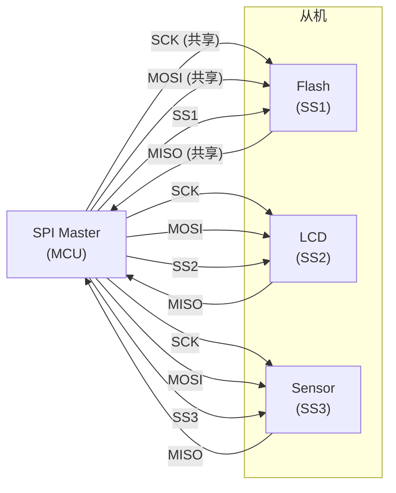
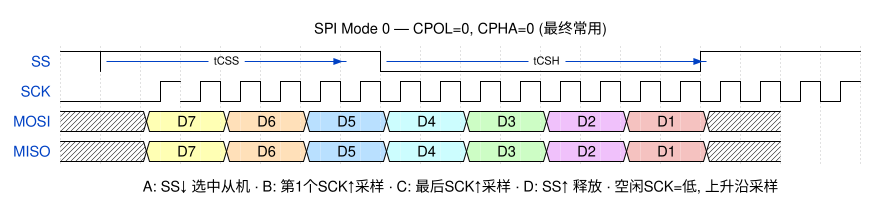
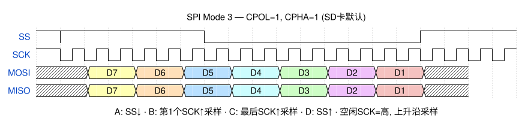
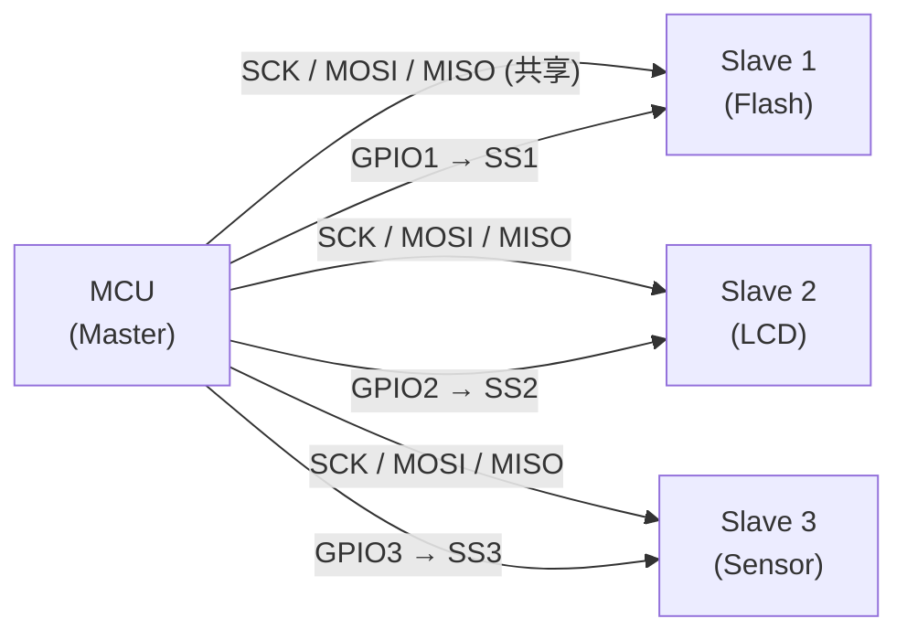
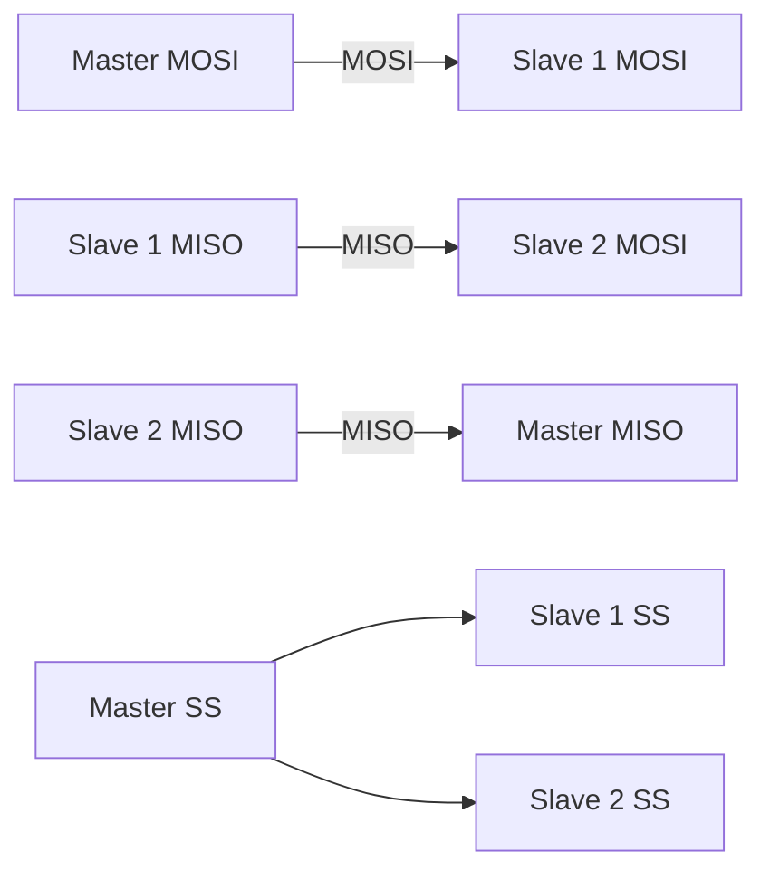

# SPI 总线协议

> SPI (Serial Peripheral Interface) 是 Motorola 于 1980 年代引入的四线全双工同步串行总线。与 I²C 不同，SPI **没有正式的独立标准**——规范分散在 Motorola/NXP 各系列 MCU 参考手册中。这是嵌入式系统中最快的板上总线之一，广泛应用于 Flash、LCD、传感器、SD 卡等。

## 1. SPI vs I²C 速览

| 特性 | SPI | I²C |
|------|-----|-----|
| 线数 | 4 (+ N×SS) | 2 |
| 拓扑 | 主从星型 | 多主多从总线 |
| 全双工 | ✅ 同时收发 | ❌ 半双工 |
| 流控 | ❌ 无 | ✅ ACK/NACK |
| 寻址 | ❌ 片选 (SS) | ✅ 7/10-bit 地址 |
| 最高速率 | ~50 MHz+ | 5 Mbps (UFm) |
| 多主 | ❌ 不支持 | ✅ 仲裁 |
| 标准 | 无独立标准 | UM10204 |

> [!note] 选型口诀：SPI 追求速度，I²C 追求简洁。Flash/SD/LCD → SPI，传感器/PMIC/RTC → I²C。

## 2. 物理层

### 2.1 信号线

| 信号 | 全称 | 方向 | 功能 |
|------|------|------|------|
| **SCK** | Serial Clock | Master → Slave | 时钟，每个脉冲传 1 bit |
| **MOSI** | Master Out Slave In | Master → Slave | 主机发送数据 |
| **MISO** | Master In Slave Out | Slave → Master | 从机发送数据 |
| **SS/CS** | Slave Select / Chip Select | Master → Slave | 低有效，选中目标从机 |



- **SCK/MOSI/MISO 三线共享**，所有从机并联
- **SS 每从机独立**，主机通过拉低对应 SS 线选择通信对象
- 未被选中的从机 MISO 必须处于**高阻态**，避免总线冲突

### 2.2 移位寄存器环

SPI 的核心是一个 **16-bit 循环移位寄存器**（主机 8-bit + 从机 8-bit 串联）：

```
Master: [MSB ... LSB] ←→ [MSB ... LSB] :Slave
            ↑   SCK    ↑
        每时钟交换 1 bit
```

- 每个 SCK 周期，主机和从机**同时**移出 1 bit 并从对方接收 1 bit
- 8 个 SCK 后完成一次字节交换——全双工，无等待

## 3. 四种工作模式 (CPOL + CPHA)

SPI 最核心的配置是两个参数：**时钟极性 (CPOL)** 和 **时钟相位 (CPHA)**。

| Mode | CPOL | CPHA | SCK 空闲电平 | 采样沿 | 数据变化沿 |
|------|------|------|-------------|--------|-----------|
| **Mode 0** | 0 | 0 | 低 | ↑ 上升沿 | ↓ 下降沿 |
| **Mode 1** | 0 | 1 | 低 | ↓ 下降沿 | ↑ 上升沿 |
| **Mode 2** | 1 | 0 | 高 | ↓ 下降沿 | ↑ 上升沿 |
| **Mode 3** | 1 | 1 | 高 | ↑ 上升沿 | ↓ 下降沿 |

**Mode 0 (CPOL=0, CPHA=0) — 最常用：**



**Mode 3 (CPOL=1, CPHA=1) — SD 卡默认：**



> [!note] Mode 0 是嵌入式开发中最常用的配置。如果通信失败，第一件事就是确认 CPOL/CPHA 是否匹配。

## 4. 数据传输

### 4.1 基本流程

1. 主机拉低 **SS** → 选中从机
2. 主机产生 **SCK** 时钟
3. 每个 SCK 周期，MOSI 和 MISO 各传输 1 bit
4. 传输完成后，主机拉高 **SS** → 释放从机

### 4.2 时序参数

| 参数 | 含义 | 典型值 |
|------|------|--------|
| fSCK | SCK 频率 | 1-50 MHz |
| tCSS | SS↓ 到第一个 SCK↑ | ≥ 10 ns |
| tCSH | 最后一个 SCK↓ 到 SS↑ | ≥ 10 ns |
| tSU | 数据建立时间 (MOSI 稳定→SCK 采样沿) | ≥ 5 ns |
| tH | 数据保持时间 (SCK 采样沿→MOSI 可变化) | ≥ 5 ns |

### 4.3 命令-响应模式（以 SPI Flash 为例）

```
主机发: [CMD(1B)] [ADDR(3B)] [DUMMY(1B)] [0x00...]
从机回: [0xFF....] [0xFF.......] [0xFF.....] [DATA...]
```

- 主机发送命令字节同时收到 **垃圾数据 (0xFF)**
- 从机在命令解析完成后才开始驱动 MISO 返回有效数据
- SPI Flash、LCD 控制器、SD 卡均使用此模式

## 5. 多从机方案

### 方案 A：独立片选（标准做法）



- 优点：全速率并行，未被选中的从机 MISO 高阻
- 缺点：每个从机消耗一个 GPIO

### 方案 B：菊花链 (Daisy Chain)



- 优点：只需一个 SS，节约 GPIO
- 缺点：数据必须经过所有从机，延迟累加

## 6. 常见从机

| 设备 | Mode | 最高 SCK | 备注 |
|------|------|----------|------|
| W25Qxx SPI Flash | 0/3 | 80-133 MHz | Dual/Quad SPI 扩展 |
| SD 卡 (SPI 模式) | 3 | 25 MHz | 初始化需 <400 kHz |
| ILI9341 LCD | 0 | 40 MHz | 3 线 (9-bit) 或 4 线模式 |
| nRF24L01 | 0 | 10 MHz | 无线收发器 |
| ENC28J60 | 0 | 20 MHz | SPI 以太网控制器 |

## 7. 扩展变体

| 变体 | 数据线 | 速率倍率 | 场景 |
|------|--------|----------|------|
| **Standard SPI** | MOSI + MISO | ×1 | 通用 |
| **Dual SPI** | MOSI/MISO 双向 | ×2 | SPI Flash 读取 |
| **Quad SPI (QSPI)** | 4 条双向 IO | ×4 | NOR Flash XIP |
| **Octal SPI** | 8 条双向 IO | ×8 | 大容量 Flash |

Dual/Quad/Octal 仅在**数据阶段**启用，**命令和地址阶段**仍使用 Standard SPI。

## 8. 常见问题

| 问题 | 原因 | 对策 |
|------|------|------|
| 读数全 0xFF | SS 未拉低或从机未响应 | 示波器确认 SS 和 SCK |
| 数据错位 | CPOL/CPHA 不匹配 | 依次尝试 4 种 Mode |
| MISO 冲突 | 多从机 SS 同时拉低 | 确保一次只选一个从机 |
| 高速失败 | 线缆过长、无端接 | 降频或加 33Ω 源端串联电阻 |
| SCK 毛刺 | GPIO 翻转不同步 | 使用硬件 SPI 而非 bit-bang |

## 相关页面

- [通讯网络/I²C 总线协议](I²C%20总线协议.md) — 双线低速替代
- [通讯网络/UART 串行通信](UART%20串行通信.md) — 异步异步串行对比
- [嵌入式软件/嵌入式固件开发流程](../嵌入式软件/嵌入式固件开发流程.md) — SPI Flash 固件加载
