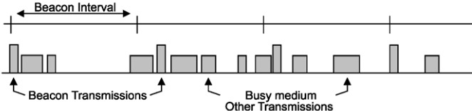
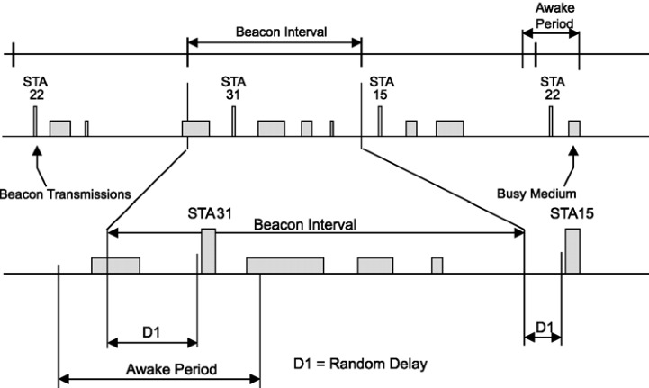

# TSF WiFi 时间同步

> 802.11 标准 §11.1：MAC 层自带的 µs 级时间同步。13 个 ESP32 锁相到 AP 的 Beacon TSF 定时器——零协议、零带宽、±20µs 漂移。

---

## 问题：多源传感器怎么对齐时间

动捕系统有三个不同的传输通道：

```
WiFi 5GHz → ESP32 ×13    TSF 同步 (±20µs)
USB 有线  → STM32 头显    一次校准 (±500µs)
USB 有线  → 双目相机       帧自带时间戳
```

需要一个共同的参考时间线。ESKF 的观测融合要求各传感器的时间戳误差 < 观测噪声的相关时间。100 Hz ODR = 10ms 帧间隔，要求时间误差 ≪ 1ms。

---

## TSF 是什么

802.11 MAC 层定义的功能（§11.1.1-11.1.5），非可选——每台 802.11 设备都必须实现。

| 属性 | 值 | 出处 |
|------|:---:|------|
| 定时器宽度 | 64-bit | §11.1.3.1 |
| 分辨率 | **1 µs** | §11.1.3.1 |
| 频率 | 1 MHz | — |
| 溢出周期 | ~584,942 年 | 2⁶⁴ µs |
| STA 时钟精度 | **±100 ppm** (non-DMG) | §11.1.3.9 |
| 相邻 STA 最差漂移 | ±200 ppm | — |
| Beacon 间隔 | `dot11BeaconPeriod` TU (1 TU=1024 µs) | §11.1.2.1 |

---

## Infrastructure BSS 同步流程 (§11.1.2.1)

```
AP (Timing Master)
│
├─ 每 BeaconPeriod 发 Beacon 帧
│  └─ Timestamp 字段 = TSF_timer 值 (@第一比特传给PHY时)
│     + AP 自己的 PHY TX 延迟 (MAC→天线传播)
│
└─ STA 收到 Beacon:
   1. TS_received = (收到 timestamp 第一比特时) 的本地时钟 - RX延迟
   2. TS_adjusted = Beacon.Timestamp + PHY_RX_delay + 处理延迟
   3. 如果 TS_adjusted ≠ STA.TSF_timer → STA.TSF_timer = TS_adjusted  ← 无条件覆盖
```

> §11.1.3.1 要求发射端在 Timestamp 字段填入"第一个比特传给 PHY 时的 TSF + PHY TX 延迟"。接收端额外补偿自己的 PHY RX 延迟。这个双向补偿是实现 ±100µs 精度的关键。


*Figure 11-1 — 繁忙网络中的信标发送：信道忙时 Beacon 延后发出，但下一个 Beacon 仍按未延迟的名义信标间隔调度（TBTT 不漂移）*

### Timestamp 字段格式 (§9.4.1.10)

8 个 octets，64-bit 无符号整数，单位为 µs。存在于：
- Beacon 帧（每个 BeaconPeriod 发一次）
- Probe Response 帧（响应 Probe Request）
- DMG Beacon / Announce 帧（仅 60GHz）

---

## ±100ppm 对你意味着什么

| Beacon 间隔 | 间隔内最差漂移 (200ppm) | 你的系统影响 |
|:---:|:---:|------|
| 100 TU ≈ 102ms (典型) | **±20.4 µs** | ≪ 10ms 帧间隔，完全无害 |
| 1 秒 | ±200 µs | 仍在 ±500µs 内 |
| 10 秒 | ±2 ms | **开始接近帧间隔** |

> **结论**：Beacon 间隔 100ms 时，漂移在你的 100 Hz ODR 面前完全不可见。即使 AP 不按 100ms 发 Beacon（CSMA 网络忙时会延迟），只要间隔不超过 ~500ms，精度仍在 ±100µs 内。

---

## ESP32 端 API

```c
#include "esp_wifi.h"

// 读取当前 TSF 定时器值 (µs 自 AP 第一帧起)
uint64_t tsf = esp_wifi_get_tsf_time(WIFI_IF_STA);

// 打入数据包
typedef struct {
    uint64_t tsf_timestamp;    // 8B TSF 时间戳
    float    quat[4];         // 16B 四元数
    uint8_t  node_id;         // 1B 节点 ID
    // 总计 25B/packet
} imu_packet_t;
```

在 ESP32 的 UDP 发送回调中：

```c
void send_imu_data(float *q) {
    imu_packet_t pkt;
    pkt.tsf_timestamp = esp_wifi_get_tsf_time(WIFI_IF_STA);
    memcpy(pkt.quat, q, 16);
    pkt.node_id = NODE_ID;
    udp_send(&pkt, sizeof(pkt));
}
```

PC 端收包：每个 ESP32 的 TSF 值本身就是**对齐过的**——不需要做任何变换，直接比较即可。

---

## 为什么不用 NTP

| | NTP | TSF |
|------|------|------|
| 协议层 | 应用层 (UDP 123) | **MAC 层**（硬件/驱动） |
| 精度 | ±1~10 ms | **±20 µs**（100ms Beacon） |
| 带宽 | ~100B/次 × 轮询频率 | **0B**（Beacon 帧自带 Timestamp） |
| 同步方式 | 客户端主动请求 | 被动接收 Beacon |
| 代码量 | NTP 客户端实现 | 1 行 API 调用 |
| 断线恢复 | 需重连 | WiFi 重连后自动恢复 |

> NTP 的 ±1ms 误差在 10ms 帧间隔面前勉强可用，但会污染 EKF 的观测时间戳。TSF 的 ±20µs 完全没有这个问题。

---

## IBSS 的特殊规则

§11.1.2.2 定义了 IBSS（无 AP 的自组网）的 TSF 规则：

- 每个 STA 都发 Beacon
- 只在收到的 TSF **大于**本地 TSF 时才采纳（只向前、不向后）
- 不存在 timing master——分布式选举


*Figure 11-3 — IBSS 中的信标发送：各 STA 在 TBTT 后随机退避竞争发 Beacon，谁先发出谁的时间戳被采纳（仅当更快）*

> 如果你的系统将来考虑 WiFi Direct/IBSS 模式（比如移动场景没用固定 AP），则需要注意这个单向同步规则。基础设施 BSS 不受影响。

---

## STM32 USB 端的补充校准

TSF 只覆盖 WiFi 站点。STM32 头显走 USB 有线，拿不到 Beacon。方案：**一次校准**。

```
开机时: PC → STM32: gettimeofday()
          STM32 记录: T_offset = PC_time - STM32_local_us
每次发数据: STM32 附上 (local_time + T_offset)

PC 收到后: 该时间戳 ≈ PC 系统时间 ≈ TSF 时间线
```

PC 系统时间与 TSF 时间线通过 PC 自己的 WiFi 网卡 TSF 对齐。USB 延迟 ~1ms（稳定），满足精度要求。

---

---

## 关键词

`timing synchronization function` `IEEE 802.11` `beacon timestamp` `PHY compensation` `1MHz timer` `±100ppm` `dot11BeaconPeriod` `ESP32 TSF API` `multi-sensor alignment`
