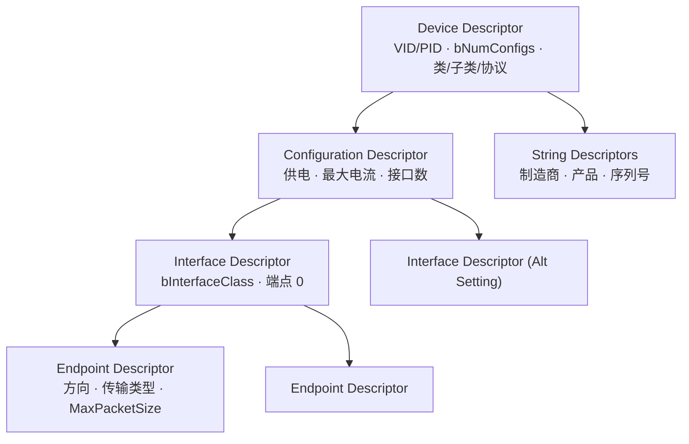
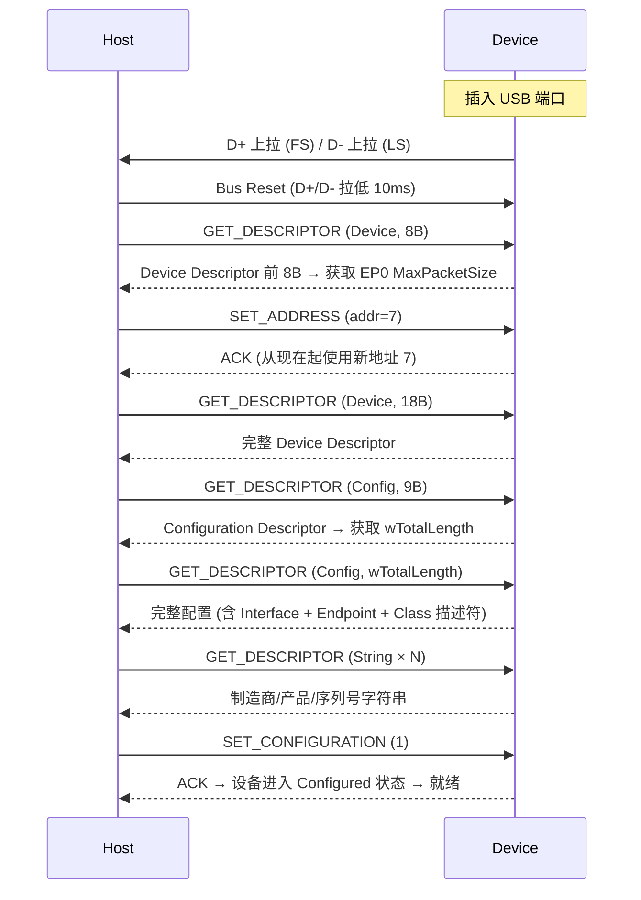
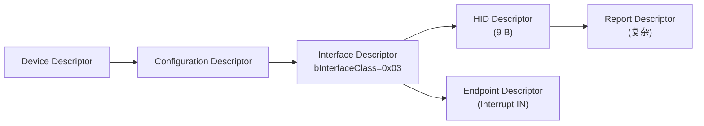

# USB 描述符与枚举

> USB 设备通过层层嵌套的描述符 (Descriptor) 向主机宣告自己的身份、能力和资源需求。枚举 (Enumeration) 是主机在设备插入后读取这些描述符、分配地址、加载驱动的完整过程。此页聚焦 USB 2.0 的描述符体系和枚举流程，协议基础见 [通讯网络/USB 协议基础知识](USB%20协议基础知识.md)。

## 1. 描述符层级

USB 描述符形成严格的树状层级结构：



## 2. 标准描述符详解

### 2.1 Device Descriptor (18 B)

| 偏移 | 字段 | Bytes | 说明 |
|------|------|-------|------|
| 0 | bLength | 1 | = 18 |
| 1 | bDescriptorType | 1 | = 0x01 |
| 2 | bcdUSB | 2 | BCD 版本：0x0200=USB 2.0 |
| 4 | bDeviceClass | 1 | 0x00=接口定义, 0x02=CDC, 0x03=HID, 0xFF=Vendor |
| 5 | bDeviceSubClass | 1 | 子类 |
| 6 | bDeviceProtocol | 1 | 协议 |
| 7 | bMaxPacketSize0 | 1 | EP0 最大包长：8/16/32/64 |
| 8 | idVendor | 2 | VID (USB-IF 分配) |
| 10 | idProduct | 2 | PID (厂商自定) |
| 12 | bcdDevice | 2 | 设备版本号 |
| 14 | iManufacturer | 1 | 制造商字符串索引 |
| 15 | iProduct | 1 | 产品字符串索引 |
| 16 | iSerialNumber | 1 | 序列号字符串索引 |
| 17 | bNumConfigurations | 1 | 配置数量 |

### 2.2 Configuration Descriptor (9 B)

| 偏移 | 字段 | Bytes | 说明 |
|------|------|-------|------|
| 0 | bLength | 1 | = 9 |
| 1 | bDescriptorType | 1 | = 0x02 |
| 2 | wTotalLength | 2 | 此配置返回的总字节数 (含所有 Interface+Endpoint+Class 描述符) |
| 4 | bNumInterfaces | 1 | 接口数量 |
| 5 | bConfigurationValue | 1 | Set_Configuration 用此值 |
| 6 | iConfiguration | 1 | 配置名字符串索引 |
| 7 | bmAttributes | 1 | D7=保留, D6=自供电, D5=远程唤醒, D0-4=保留 |
| 8 | bMaxPower | 1 | 最大电流 = 值 × 2 mA |

### 2.3 Interface Descriptor (9 B)

| 偏移 | 字段 | Bytes | 说明 |
|------|------|-------|------|
| 2 | bInterfaceNumber | 1 | 接口编号 |
| 3 | bAlternateSetting | 1 | 替代设置 (默认 0) |
| 4 | bNumEndpoints | 1 | 使用的端点数量 (不含 EP0) |
| 5 | bInterfaceClass | 1 | **0x02=CDC, 0x03=HID, 0x08=MSC, 0xFF=Vendor** |
| 6 | bInterfaceSubClass | 1 | CDC: 0x02=ACM (虚拟串口) |
| 7 | bInterfaceProtocol | 1 | CDC: 0x01=AT 命令 |

### 2.4 Endpoint Descriptor (7 B)

| 偏移 | 字段 | Bytes | 说明 |
|------|------|-------|------|
| 2 | bEndpointAddress | 1 | D7=方向 (1=IN), D0-3=端点号 |
| 3 | bmAttributes | 1 | D0-1: 00=Control, 01=Isoch, 10=Bulk, 11=Interrupt |
| 4 | wMaxPacketSize | 2 | 最大包长度：FS Bulk=64, HS Bulk=512 |
| 6 | bInterval | 1 | 轮询间隔：Interrupt=ms, Isoch=2^bInterval-1×125µs |

### 2.5 String Descriptor

```
bLength | bDescriptorType=0x03 | wLANGID[0] | Unicode String...
```

- 默认语言 ID = 0x0409 (English-US)
- 字符串以 UTF-16LE 编码
- 至少需要 Product String 和 Serial Number（区分同类设备）

## 3. 枚举流程



### 3.1 设备状态机

```mermaid
stateDiagram-v2
    [*] --> Attached: 插入
    Attached --> Powered: VBUS 上电
    Powered --> Default: Bus Reset
    Default --> Address: SET_ADDRESS
    Address --> Configured: SET_CONFIGURATION
    Configured --> Default: Bus Reset
    Powered --> Attached: 拔出
    Default --> Attached: 拔出
    Address --> Attached: 拔出
    Configured --> Attached: 拔出
```

| 状态 | 说明 | 可用操作 |
|------|------|----------|
| **Attached** | 物理连接 | — |
| **Powered** | VBUS 上电 | — |
| **Default** | Bus Reset 后 | EP0 控制传输 |
| **Address** | 分配地址后 | EP0 控制传输 |
| **Configured** | Set_Configuration 后 | **全功能：所有端点可用** |

## 4. CDC ACM 类驱动（虚拟串口）

CDC (Communication Device Class) 的 ACM (Abstract Control Model) 子类是 USB 虚拟串口的基础：

### 4.1 专用描述符

CDC ACM 需要在标准描述符之外附加：

- **Header Functional Descriptor** — CDC 版本
- **ACM Functional Descriptor** — 支持的 ACM 特性 (Set_Line_Coding, Set_Control_Line_State 等)
- **Union Functional Descriptor** — 控制接口和数据接口的关系
- **Call Management Functional Descriptor** — 呼叫管理能力

### 4.2 端点配置

| 接口 | 端点 | 类型 | 方向 | 功能 |
|------|------|------|------|------|
| 通信接口 (Comm) | EP2 | Interrupt IN | Device→Host | 串口状态通知 (RING/DSR/DCD) |
| 数据接口 (Data) | EP1 | Bulk IN | Device→Host | 串口 TXD → 主机接收 |
| 数据接口 (Data) | EP1 | Bulk OUT | Host→Device | 主机发送 → 串口 RXD |

### 4.3 Class-Specific Requests

| 请求 | 功能 | 关键参数 |
|------|------|----------|
| **SET_LINE_CODING** | 设置波特率/数据位/校验/停止位 | BaudRate(4B) + CharFormat(1B) + ParityType(1B) + DataBits(1B) |
| **GET_LINE_CODING** | 读取当前串口参数 | 同上 |
| **SET_CONTROL_LINE_STATE** | 控制 DTR/RTS | D0=DTR, D1=RTS |

> [!note] 虚拟串口的关键：主机通过 SET_LINE_CODING 设置波特率 → 设备端 USB 栈收到后调用回调 → 用户代码配置硬件 UART。

## 5. HID 类驱动

### 5.1 HID 描述符层级



### 5.2 HID Descriptor (9 B)

| 字段 | 说明 |
|------|------|
| bcdHID | HID 版本 (0x0111) |
| bCountryCode | 0=不指定 |
| bNumDescriptors | ≥1 |
| bDescriptorType | 0x22 = Report Descriptor |
| wDescriptorLength | Report Descriptor 长度 |

### 5.3 Report Descriptor (简述)

Report Descriptor 用 Item 序列描述数据格式：

```
Usage Page (Generic Desktop)
Usage (Keyboard)
Collection (Application)
    Usage Page (Keyboard/Keypad)
    Usage Minimum (0xE0 - Left Control)
    Usage Maximum (0xE7 - Right GUI)
    Report Size (1)
    Report Count (8)
    Input (Data, Variable, Absolute)  ← 8-bit 修饰键掩码
    Report Count (1)
    Report Size (3)
    Input (Constant)                  ← 3-bit 填充
    Report Count (6)
    Report Size (8)
    Usage Page (Keyboard)
    Usage Minimum (0x00)
    Usage Maximum (0x65)
    Input (Data, Array)              ← 6 个按键槽
End Collection
```

## 6. 嵌入式实践 (STM32 USB CDC)

使用 STM32CubeMX 生成 USB CDC 虚拟串口代码：

```
1. CubeMX: USB_OTG_FS → Device Only
2. Middleware: USB_DEVICE → CDC_VCP
3. 生成代码 → 修改 usbd_cdc_if.c:
   - CDC_Receive_FS()    → 主机发来的数据
   - CDC_Transmit_FS()   → 发送给主机
```

VCP (Virtual COM Port) 在 Windows/Linux/Mac 上自动识别为 `/dev/ttyACMx` 或 `COMx`。

## 相关页面

- [通讯网络/USB 协议基础知识](USB%20协议基础知识.md) — USB 协议栈、传输类型、拓扑
- [通讯网络/USB 3.0 信号完整性设计](USB%203.0%20信号完整性设计.md) — SuperSpeed 物理层和 PCB 布线
