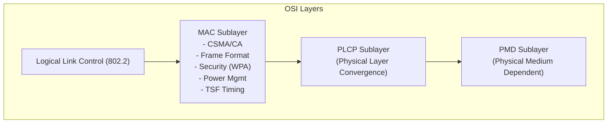
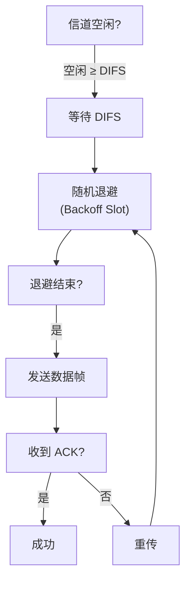
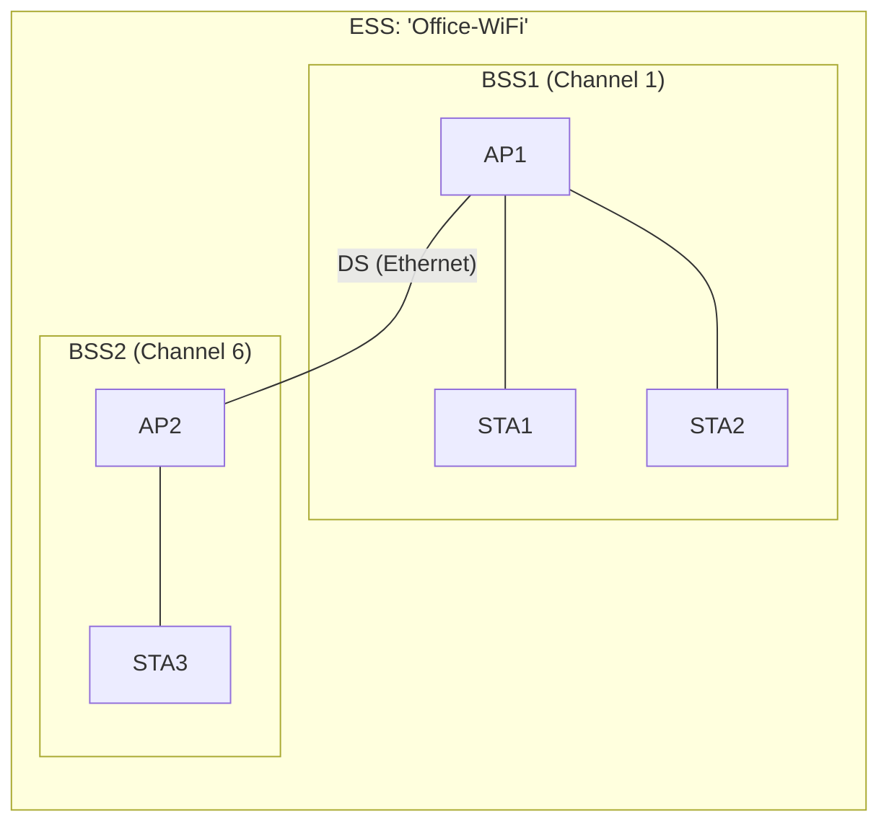

# WiFi 协议概述 (IEEE 802.11)

> IEEE 802.11 是无线局域网 (WLAN) 的国际标准，定义了 MAC (媒体访问控制) 层和 PHY (物理) 层的完整规范。本页覆盖 802.11 协议栈的核心概念：MAC 帧结构、CSMA/CA 接入机制、PHY 演进和安全框架。时间同步细节见 [通讯网络/TSF WiFi 时间同步](../../知识/通讯网络/TSF%20WiFi%20时间同步.md)。

## 1. 协议栈架构



| 子层 | 功能 | 关键内容 |
|------|------|----------|
| **MAC** | 信道接入、帧封装、安全、电源管理、时间同步 | CSMA/CA, DCF/PCF/EDCA, WPA2/WPA3, TSF |
| **PLCP** | 将 MAC 帧适配为 PHY 可传输的 PPDU | 前导码、SIGNAL 字段、调制方案指示 |
| **PMD** | 实际的射频收发 | OFDM, DSSS, MIMO, 波束成形 |

## 2. MAC 帧结构

802.11 MAC 帧由帧头 + 帧体 + FCS 组成：

| 偏移 | 字段 | 长度 | 说明 |
|------|------|------|------|
| 0 | Frame Control | 2 B | Protocol/Type/Subtype/Flags |
| 2 | Duration/ID | 2 B | NAV 设置值或 STA AID |
| 4 | Address 1 | 6 B | RA (接收端 MAC) |
| 10 | Address 2 | 6 B | TA (发送端 MAC) |
| 16 | Address 3 | 6 B | 取决于 To DS / From DS |
| 22 | Sequence Control | 2 B | Fragment Number + Sequence Number |
| 24 | Address 4 | 6 B | 可选 (WDS Mesh) |
| 30 | QoS Control | 0-2 B | 可选 (QoS Data 帧) |
| 30/32 | Frame Body | 0-2312 B | 上层数据 |
| 末尾 | FCS | 4 B | CRC-32 |

### 2.1 帧控制字段

| 字段 | Bits | 说明 |
|------|------|------|
| Protocol Version | 2 | 始终为 0 (当前) |
| Type | 2 | 00=Management, 01=Control, 10=Data |
| Subtype | 4 | Beacon/Probe/ACK/RTS/CTS/Data/QoS Data |
| To DS / From DS | 1+1 | 0/0=IBSS, 0/1=From AP, 1/0=To AP, 1/1=WDS Mesh |
| More Frag | 1 | 更多分片 |
| Retry | 1 | 重传帧 |
| Pwr Mgmt | 1 | STA 将进入省电模式 |
| More Data | 1 | AP 缓存了更多数据 |
| Protected | 1 | 帧体已加密 |
| +HTC/Order | 1+1 | HT Control / Strict Ordering |

### 2.2 地址字段 (To DS / From DS)

| To DS | From DS | Addr1 | Addr2 | Addr3 | Addr4 | 场景 |
|-------|---------|-------|-------|-------|-------|------|
| 0 | 0 | DA (目的) | SA (源) | BSSID | — | IBSS/Ad-Hoc |
| 0 | 1 | DA | BSSID | SA | — | AP → STA |
| 1 | 0 | BSSID | SA | DA | — | STA → AP |
| 1 | 1 | RA | TA | DA | SA | WDS (Mesh) |

> [!note] 802.11 帧有 4 个地址字段，而 Ethernet 只有 2 个（SA/DA）。这是因为无线帧需要区分发送方/接收方/源/目的——帧在空中经过 AP 中转时，发送方不等于源端。

### 2.3 管理帧

| 子类型 | 帧名 | 功能 |
|--------|------|------|
| 1000 | **Beacon** | AP 周期性广播，携带 SSID、速率、TSF 时间戳 |
| 0100 | **Probe Request** | STA 主动扫描请求 |
| 0101 | **Probe Response** | AP 回复扫描请求 |
| 0000 | **Association Request** | STA 请求关联 |
| 0001 | **Association Response** | AP 允许/拒绝关联 |
| 1010 | **Disassociation** | 断开关联 |
| 1100 | **Authentication** | 802.11 认证（非 WPA） |

## 3. CSMA/CA 信道接入

WiFi 不能像有线 Ethernet 一样做碰撞检测（CD），因为无线电收发不能同时进行。因此使用 **CSMA/CA (Collision Avoidance)**：



### 3.1 帧间间隔 (IFS)

| 间隔 | 长度 (802.11g) | 用途 | 优先级 |
|------|---------------|------|--------|
| **SIFS** | 10 µs | ACK、CTS 等最高优先级控制帧 | 最高 |
| **PIFS** | SIFS + 1 slot (19 µs) | PCF 无竞争周期 | 中 |
| **DIFS** | SIFS + 2 slots (28 µs) | 普通数据帧和 RTS | 最低 |

### 3.2 RTS/CTS 握手（解决隐藏节点）

```
STA-A ───RTS───> AP    (请求发送，含 NAV 持续时间)
AP   ───CTS───> A,B   (允许发送，B 收到后静默 NAV 时长)
STA-A ───DATA──> AP    (实际数据)
AP   ───ACK───> A      (确认)
```

- **NAV (Network Allocation Vector)**：虚拟载波侦听，非目标 STA 根据收到的 RTS/CTS 设置静默定时器
- RTS/CTS 可选，通常在帧长度超过 `dot11RTSThreshold` 时启用

## 4. PHY 演进

| 标准 | 年份 | 频段 | 调制 | 最高速率 | MIMO |
|------|------|------|------|----------|------|
| **802.11b** | 1999 | 2.4 GHz | DSSS (CCK) | 11 Mbps | — |
| **802.11a** | 1999 | 5 GHz | OFDM | 54 Mbps | — |
| **802.11g** | 2003 | 2.4 GHz | OFDM | 54 Mbps | — |
| **802.11n** (WiFi 4) | 2009 | 2.4/5 GHz | OFDM | 600 Mbps | 4×4 |
| **802.11ac** (WiFi 5) | 2013 | 5 GHz | OFDM (256-QAM) | 6.9 Gbps | 8×8 MU-MIMO |
| **802.11ax** (WiFi 6) | 2019 | 2.4/5/6 GHz | OFDMA | 9.6 Gbps | 8×8 MU-MIMO |
| **802.11be** (WiFi 7) | 2024 | 2.4/5/6 GHz | OFDMA (4096-QAM) | 46 Gbps | 16×16 |

### 4.1 OFDM 基础

802.11a/g/n/ac/ax 均基于 OFDM (正交频分复用)：

- 将宽带信道（20/40/80/160 MHz）划分为多个子载波（子载波间距 312.5 kHz）
- 802.11a/g 使用 52 个子载波（48 数据 + 4 导频）
- 每个子载波独立调制 (BPSK/QPSK/16-QAM/64-QAM/256-QAM/1024-QAM/4096-QAM)
- 符号周期 4 µs（含 0.8 µs 保护间隔）

## 5. 安全框架

| 协议 | 年份 | 加密 | 密钥管理 | 状态 |
|------|------|------|----------|------|
| **WEP** | 1999 | RC4 (64/128-bit) | 静态密钥 | ❌ 已破解 (2001) |
| **WPA** | 2003 | TKIP (RC4) | 802.1X + 4-Way Handshake | ❌ 不推荐 |
| **WPA2** | 2004 | CCMP (AES-128) | 802.1X / PSK + 4-Way HS | ✅ 广泛使用 |
| **WPA3** | 2018 | GCMP (AES-256) | SAE (Dragonfly) / 802.1X | ✅ 当前标准 |

**4-Way Handshake (WPA2-PSK)**：

1. AP → STA：ANonce (随机数)
2. STA → AP：SNonce + MIC (消息完整性码)
3. AP → STA：GTK (组密钥) + MIC
4. STA → AP：ACK

最终生成 PTK (Pairwise Transient Key) 用于单播加密和完整性保护。

## 6. 网络拓扑

### 6.1 BSS 类型

| 类型 | 架构 | 说明 |
|------|------|------|
| **BSS** (Basic Service Set) | AP + N×STA | Infrastructure 模式，AP 提供时钟参考和路由 |
| **IBSS** (Independent BSS) | 仅 STA | Ad-Hoc 模式，分布式 TSF 同步 |
| **ESS** (Extended Service Set) | 多 BSS 通过 DS 互联 | 企业级 WiFi 覆盖——多 AP 共享同一 SSID |
| **MBSS** (Mesh BSS) | Mesh 节点 | 802.11s 无线 Mesh |



### 6.2 扫描与关联

1. **被动扫描**：STA 在各信道监听 Beacon 帧 → 收集 SSID/RSSI
2. **主动扫描**：STA 发送 Probe Request → AP 回复 Probe Response
3. **认证**：802.11 Open System 或 Shared Key 认证
4. **关联**：STA 发送 Association Request → AP 回复 Association Response (含 AID)
5. **安全握手**：WPA2 4-Way Handshake

## 7. ESP32 WiFi 实践要点

| 操作 | API | 说明 |
|------|-----|------|
| Station 模式 | `esp_wifi_set_mode(WIFI_MODE_STA)` | 连接现有 AP |
| SoftAP 模式 | `esp_wifi_set_mode(WIFI_MODE_AP)` | 自建热点 |
| 扫描 | `esp_wifi_scan_start()` | 主动扫描所有信道 |
| 省电 | `esp_wifi_set_ps(WIFI_PS_MAX_MODEM)` | Modem-sleep，DTIM 间隔唤醒 |
| TSF 时间 | `esp_wifi_get_tsf_time()` | 读取 64-bit TSF 定时器 |

> [!note] ESP32 的 WiFi 硬件自动处理 Beacon 跟踪、速率自适应和 PM 帧应答，上层只需关注连接状态和 IP 层。

## 相关页面

- [通讯网络/TSF WiFi 时间同步](../../知识/通讯网络/TSF%20WiFi%20时间同步.md) — Clock Synchronization (Clause 11.1)
- [通讯网络/Ethernet 协议概述](../../知识/通讯网络/Ethernet%20协议概述.md) — 有线局域网对比
